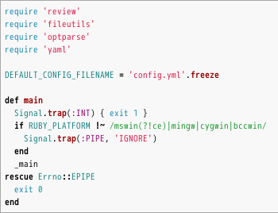
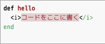

2019/2/11 by @kmuto

# ハイライト内でのインライン命令の処理

コードハイライト内でどうしてもインライン命令を使いたいときに強引に処理するパッチを紹介します。

----

EPUBMaker および WebMaker では、config.yml で以下のように設定すると、コード群に対してコードハイライト（コード内容に基づいて色や字形で装飾し、わかりやすくする）をかけることができます。

```
highlight:
  html: "rouge"
```



## 問題点
しかし、このコードハイライトには1つ大きな問題があります。以下のようなコードはどうなるでしょうか。

```
//emlist[][ruby]{
def hello
  @<i>{コードをここに書く}
end
//}
```



おっと……インライン命令の `@<i>` が HTML の i タグに展開されたところまでは想定どおりだったのですが、さらにエスケープされてリテラルに表示されてしまいました。おまけに、コードハイライタがこの部分をエラーとしてエラー装飾にしています。

## review-ext.rb による挙動の変更
ということで、いささか無理矢理感があるのですが、インライン命令を処理する実装を作ってみました。

[ハイライトエスケープのreview-ext.rb](https://raw.githubusercontent.com/reviewml/reviewknowledge-ja/master/docs/epub/highlight/review-ext.rb) をダウンロードし、作業フォルダに配置することで、EPUBMaker / WebMaker ではハイライト内のインライン命令がそのまま使えるようになります。


内部処理をざっと説明すると、以下のとおりです。

- HTMLBuilder の場合には embed だけでなく list や emlist などのリストブロック命令も、最初の時点ではインライン命令処理を行わないようにする。
- Compiler#textメソッドに2つめの配列引数を追加し、指定があるときにはインライン命令の展開内容をそこに保存し、代替文字として \x01 文字を入れておく。
- HTMLBuilder の各リストブロック命令実装内でインライン命令処理を行い、インライン命令の展開内容は配列に格納しておく。ハイライトの処理が終わったら \x01 の箇所を配列から戻す。
- コードハイライタは \x01 の箇所をエラーにするので、配列から戻す際についでにエラー表現の span タグは消しておく。
- ついでに、リストブロック命令に言語指定がなかった場合はハイライトしないようにしておく。そうではなく明示的に「none」だったらハイライトしない、としたかったら 174 行目をコメントアウト、175 行目のほうのコメントを解除とするとよい。

だいぶ汚いやり方なので、現時点ではこの実装を Re:VIEW 自体に取り込むのは消極的です。入れるとすれば、パーサ自体を書き換えと一緒のタイミングとなるでしょう。

## 余談：PDFMaker でのハイライト内のインライン命令処理
現状、PDFMaker（LaTeX）のほうは、ハイライト内のインライン命令処理についての汎用的な対応は困難です。コードの解析が LaTeX のマクロ処理時に行われるため、HTML のように割り込んで対処するということができないからです。

汎用性には欠けそうですが、アイデアをいくつか示しておきます（一部は実際筆者が特定業務向けに実装したものもあります）。

- plistings 環境で `mathescape=true` とし、`$ $` にインライン命令の内容を書き込むようにする。リテラルな `$` の処理が必要。
- コード表現に minted マクロを使う。minted は内部で `pygmentize` 命令を呼び出すが、代わりに `\MintedPygmentize` マクロで途中で割り込みをかけるコマンドを呼び出すようにし、インライン命令に手当てする。外部コマンド呼び出しのため、texoptions パラメータに `--shell-escape` を追加する必要もある。
- 事前に Re:VIEW 側で `pygmentize` を行って LaTeX 向けにハイライトおよびインライン命令を処理し、これを加工した上で fvextra マクロなどを使って表現する（注：rouge はまだ LaTeX フォーマッタを保有していない）。
