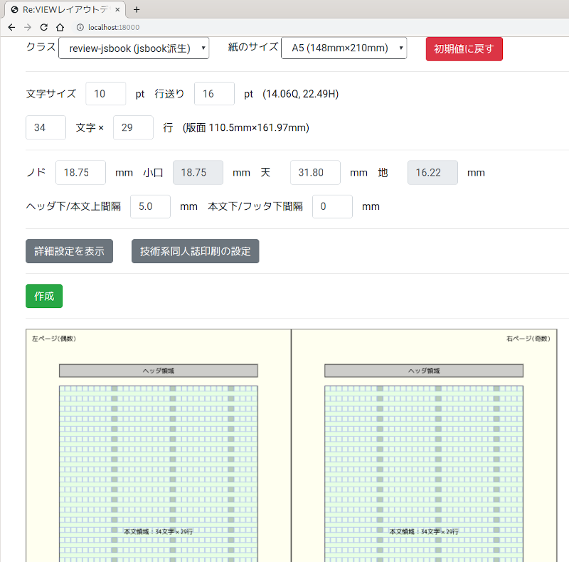

# FAQ - Re:VIEW の使い方について（TeX PDF）

FAQ（よくある質問と回答）のこのセクションは、Re:VIEW の使用方法のうち、TeX を使った PDF 生成に関係する事柄をまとめています。

----

## TeX 環境の構築はどうしたらよいですか？
- [Re:VIEW 向け日本語 TeXLive 環境のセットアップ（Linux、macOS）](../latex/install-tl.html)

## LaTeX を使った PDF に変換するにはどうしたらよいですか？

プロジェクトフォルダで `rake pdf` を実行するか、`review-pdfmaker config.yml` を実行します。

## LaTeX 実行時でのエラーが出ましたが、どのように調べたらよいですか？

LaTeX のコンパイル実行でエラーが生じると、エラーが発生した箇所と行番号が表示されます（エラー時の出力はかなり長くなることがあり、結果をシェルのリダイレクトなどで保存したほうがよいかもしれません）。

デフォルトでは Re:VIEW の re ファイルから LaTeX テキストしたファイルは一時フォルダに置かれており、いちいちこれを参照するのは不便です。

config.yml で
```yaml
debug: true
```
とすると、デバッグモードとなり、一時フォルダの代わりにプロジェクトフォルダ内に「book-pdf」（book の部分は bookname の値に依存）のようなフォルダが作られます。このフォルダは実行後も消去されないので、ここから LaTeX テキストファイルを開き、エラーの行を参照して解析できます。

また、`review-pdfmaker --debug config.yml` のように `--debug` オプションを付けるとconfig.yml の設定に関わらず一時的にデバッグモードになります。

- [TeX 実行時のエラーを読み解く](../latex/tex-error.html)

## LaTeX のエラーの意味がわかりません。

LaTeX でエラーが発生したときには、「!」から始まるエラーメッセージが表示されています（デバッグモードにして実行し、`__REVIEW_BOOK__.log` または `book.log` を参照するのもよいでしょう）。
[TeX Wiki](https://texwiki.texjp.org/?FrontPage#d1cf258f)の「エラーに遭遇したときは」には、代表的な TeX および LaTeX のエラーについて列挙されています。

エラーによっては、示された行でなく、その前の行に問題があることがあります。

コラムなどの囲み要素では、フロートの図表（`//image` や `//table`）に制約があります。Re:VIEW 3 以上のレイアウトでは対策していますが、古いレイアウトおよびサードパーティレイアウトでは対応していないことがあります。

Re:VIEW に起因する問題と思われる場合は issue で報告してください。サードパーティのレイアウトテンプレートを使用している場合にはそのサードパーティに連絡してください。

- [TeX 実行時のエラーを読み解く](../latex/tex-error.html)

## LaTeX の紙面サイズを変更するにはどうしたらよいですか？

Re:VIEW 3 からは、ドキュメントクラスオプションの `paper` で紙面サイズを指定可能です。

```yaml
texdocumentclass: ["review-jsbook", "media=print,paper=a5"]
```

a5 の部分を b5 などに書き換えれば変更されます。

Re:VIEW 2 以前で jsbook ベースのレイアウトを使っている場合は、config.yml の texdocumentclass パラメータに対するオプションで指定できます（正確には、これがドキュメントクラスに直接渡されます）。

デフォルトは以下のようになっています。

```yaml
texdocumentclass: ["jsbook", "uplatex,twoside"]
```

これを A5 にするには次のようにします。

```yaml
texdocumentclass: ["jsbook", "uplatex,twoside,a5j"]
```

jsbook において文字列で指定可能な紙サイズを以下に示します。

- `a3paper`：A3（297mm x 420mm）
- `a4paper` または `a4j`：A4（210mm x 297mm）、デフォルト
- `a5paper` または `a5j`：A5（148mm x 210mm）
- `a6paper`：A6（105mm x 148mm）
- `b4paper` または `b4j`：B4（257mm x 364mm）
- `b5paper`：B5（182mm x 257mm）
- `b6paper`：B6（128mm x 182mm）
- `a4var`：A4変の一例（210mm x 283mm）
- `b5var`：B5変の一例（182mm x 230mm）
- `letterpaper`：レター（8.5in x 11in）
- `legalpaper`：リーガル（8.5in x 14in）
- `executivepaper`：エグゼクティブ（7.25in x 10.5in）

`sty/reviewmacro.sty` に mm などの単位で数値を明示することもできます。

```
\setlength\paperwidth{幅truemm}
\setlength\paperheight{高さtruemm}
```

## LaTeX の紙面レイアウトに満足がいきません。どうやったら置き換えられますか？

標準で提供されているものを変えるには LaTeX および TeX の知識が必要となります。また、場当たりな修正は後々問題になる可能性があります。本当にそのレイアウト調整がすべきことなのかどうかをまず検討したほうがよいでしょう。レイアウトに細かなこだわりを入れたいときには、わざわざ Re:VIEW を経由するよりも、コンテンツを LaTeX 記法で記述し、レイアウト指示もそれに含めるほうが妥当です。

LaTeX はマクロの集合体です。Re:VIEW から読み込まれるカスタムスタイルファイル `sty/review-custom.sty`（Re:VIEW 3 系）または `sty/reviewmacro.sty`（Re:VIEW 2 以前）にマクロを記述することで、それまでに定義されたマクロを上書きできます。

- [pLaTeX2e 新ドキュメントクラス](https://oku.edu.mie-u.ac.jp/~okumura/jsclasses/)

## LaTeX の紙面レイアウトとして他のテンプレートはありますか？

デフォルトのもの以外に広く使われているものとして、TechBooster 提供のテンプレートがあります (Re:VIEW 3 に対応しています)。

- [https://github.com/TechBooster/ReVIEW-Template](https://github.com/TechBooster/ReVIEW-Template)

## 紙面の余白の調整をするにはどうしたらよいですか？

紙面の内容部（版面）の四方の余白は、版面の横幅・縦幅と、紙面の上からの版面の位置・綴じ側からの位置によって決まります。

- [Re:VIEW 3 からの LaTeX 処理](../latex/review3-latex.html) の「基本版面設計」

- [review-jsbook.cls の基本版面設計](../latex/paper-layout.html)

そのため、余白をうまく合わせるには、「本文の文字サイズ・行送り・行あたりの文字数・行数」で版面の縦幅・横幅を決めた上で、上（天）・綴じ側（ノド）を調整する、というステップになります（パラメータについては上記のリンク先を参照）。

この調整は少々試行錯誤が必要ですが、Re:VIEW 4 から Web ブラウザ上で設定する機能を review-init に追加しています。プロジェクトを新規に作成する際に、以下のように `-w` オプションを付けて review-init を実行します。

```
review-init -w プロジェクト名
```

すると、デフォルトではポート 18000 を使った小さな Web サーバが起動します。Web ブラウザで http://localhost:18000 につなげてみると、紙面のレイアウトを GUI のように操作できる画面になります。



残念ながら現時点では既存のプロジェクトを再設定する機能は用意していません。何か新しいプロジェクトを作成して、その texdocumentclass パラメータをコピーする、という方法で対処してください。

## LuaTeX-ja を使うにはどうしたらよいですか？

Re:VIEW 3 以上で LuaTeX への対応を進めています。ただし、現状では LuaTeX を使うユーザーが LaTeX についての十分な知識を持っており、問題を自己解決できるだけの能力があることを前提としています。

1. config.yml の `texdocumentclass` パラメータを LuaTeX-ja のものに変更する（`texdocumentclass: ["ltjsbook", "oneside"]` など）。
2. `texcommand` パラメータを変更する。`texcommand: "lualatex"`
3. `dvicommand` パラメータを null にする（`dvicommand: null`）。これは特に重要です。単にコメントアウトするだけでは、デフォルトの upLaTeX 用の `dvicommand` パラメータ値が有効になってしまいます。
4. プロジェクトの sty フォルダのファイル群で LuaTeX-ja に対応していないところを調整する。

## トンボを付けるにはどうしたらよいですか？

Re:VIEW 3 ではデフォルト（`media=print` のとき）でトンボが付きます。Re:VIEW 2 以前の場合は下記を参照してください。

- [jsbook ベースのドキュメントにトンボおよびデジタルトンボを配置する](../latex/tex-tombow.html)

## 入稿先に PDF/X-1a 形式か PDF/X-4 形式にするよう求められました。どうしたらよいですか？

PDF/X-1a、PDF/X-4 は印刷用 PDF として準拠の求められることの多い標準規格です。安全に印刷するための基準なので、遵守することが望まれます。十分に実績のある、以下のような有償ソフトウェアを利用して変換することを推奨します。

- Adobe 社 Acrobat：[https://acrobat.adobe.com/jp/ja/acrobat.html](https://acrobat.adobe.com/jp/ja/acrobat.html)
- callas 社 pdfToolbox：[https://www.callassoftware.com/en/products/pdftoolbox](https://www.callassoftware.com/en/products/pdftoolbox)

このほかに、[Vibrant](https://vibrant.pub/) というプラットフォームの [press-ready](https://github.com/vibranthq/press-ready) というツールで、フリーソフトウェア (Ghostscript) を通した PDF/X-1a の変換が実装されており、Acrobat での検証も通過する PDF/X-1a ファイルができています。

## 全体をグレースケールにするにはどうしたらよいですか？

LaTeX 自体（および upLaTeX からの PDF 生成に使われる dvipdfmx）にはグレースケール化の機能はありません。

一般には Acrobat または pdfToolbox を使ってグレースケール化します。ただし、Acrobat はグレースケール化によって線の太さが変わったり点線が実践になることがある問題があります。

LaTeX セットにも関連付けてインストールされるフリーソフトウェア Ghostscript を使って PDF をグレースケール化することは可能です。

```
gs -q -r600 -dNOPAUSE -sDEVICE=pdfwrite -o 出力PDF名 -dPDFSETTINGS=/prepress -dOverrideICC -sProcessColorModel=DeviceGray -sColorConversionStrategy=Gray -sColorConversionStrategyForImage=Gray -dGrayImageResolution=600 -dMonoImageResolution=600 -dColorImageResolution=600 入力PDF名
```

ただし、Ghostscript も PDF によっては内容を壊す（文字の欠落や順序の変化）ことがあります。変換後は必ず全体を照合するようにしましょう。

## コンパイルや PDF 生成処理の途中に割り込むにはどうしたらよいですか？

- [フックで LaTeX 処理に割り込む](../latex/tex-hook.html)

## 長い表がはみ出してしまうのですが、ページで分割するにはどうしたらよいですか？

## 等幅の長い文字を入れると文字の間がスカスカになってしまいます。途中で折り返させるにはどうしたらよいですか？

- [見栄えが悪い箇所を「少しだけ」調整する](../latex/modify-abit.html)

## ページの途中で強制的に改ページするにはどうしたらよいですか？

- [見栄えが悪い箇所を「少しだけ」調整する](../latex/modify-abit.html)

## あるページの版面を少しだけ伸ばすにはどうしたらよいですか？

- [見栄えが悪い箇所を「少しだけ」調整する](../latex/modify-abit.html)

## `@<tt>` や `@<code>` の等幅の箇所が段落からはみ出てしまいます。途中で折り返させるにはどうしたらよいですか？

Re:VIEW 4.0 から以下の自動折り返しの機能を標準で採用しています。

[見栄えが悪い箇所を「少しだけ」調整する](../latex/modify-abit.html) で提示しているように、`\allowbreak` または `\linebreak` マクロを `@<embed>` 命令を使って埋め込むことを推奨します。

どうしても「自動で折り返し」をしたいときには、次のようなマクロを `sty/review-custom.sty` に追加することで、`\reviewtt` 等の挙動を変えて分割可能です。

```
\makeatletter
\newif\ifreview@ba@break
\def\review@ba@end{\review@ba@end@}
\DeclareRobustCommand{\reviewbreakall}[1]{%
  \begingroup
    \review@ba@breakfalse
    \review@break@all@a#1\review@ba@end
  \endgroup
}
\def\review@break@all@a{%
  \futurelet\review@ba@tok\review@break@all@b
}
\def\review@break@all@b{%
  \ifx\review@ba@tok\review@ba@end
    \let\next\@gobble
  \else\ifx\review@ba@tok\@sptoken
    \let\next\review@break@all@c
  \else\ifx\review@ba@tok~%
    \let\next\review@break@all@d
  \else\ifx\review@ba@tok\bgroup
    \let\next\review@break@all@e
  \else
    \let\next\review@break@all@f
  \fi\fi\fi\fi
  \next
}
\expandafter\def\expandafter\review@break@all@c\space{%
  \space
  \review@ba@breakfalse
  \review@break@all@a
}
\def\review@break@all@d#1{%
  \review@break@all@f{\mbox{\space}}%
}
\def\review@break@all@e#1{%
  \review@break@all@f{{#1}}%
}
\def\review@break@all@f#1{%
  \ifreview@ba@break
    \hskip0pt plus 0.02em\relax
  \fi
  #1%
  \review@ba@breaktrue
  \review@break@all@a
}

\DeclareRobustCommand{\reviewtt}[1]{{\ttfamily\reviewbreakall{#1}}}
\DeclareRobustCommand{\reviewcode}[1]{{\ttfamily\reviewbreakall{#1}}}
\DeclareRobustCommand{\reviewtti}[1]{{\ttfamily\itshape\reviewbreakall{#1}}}
\DeclareRobustCommand{\reviewttb}[1]{{\ttfamily\bfseries\reviewbreakall{#1}}}
\makeatother
```

## 複数のスペース文字を入れても、1つになってしまいます。どうしたらよいですか？

どうしてもリテラルなスペースを入れたいときには、以下のようにして埋め込みます。

```
3つのスペースを@<embed>{|latex|~~~}@<embed>{|html|&nbsp;&nbsp;&nbsp;}と入れる
```

- 等幅インライン命令での参考 [https://gist.github.com/kmuto/4446c219a12d1ac676dd95c9da4b9e65](https://gist.github.com/kmuto/4446c219a12d1ac676dd95c9da4b9e65)

## PREDEF、POSTDEF で割り当てたファイルで図表を使うと、おかしな番号の振り方になります。

- [前付（PREDEF）、後付（POSTDEF）の図表採番を本章同様にリセットする](../latex/prepost-num.html)

## jsbook ベースのテンプレートで、ページを頭からの通し番号にするにはどうしたらよいですか？

Re:VIEW 3 以降では、`serial_pagination=true` ドキュメントクラスオプションで通し番号になります。

Re:VIEW 2 以前の場合、jsbook.cls では以下の2箇所で暗黙にページ番号を変えているため、マクロを上書きする必要があります。

- titlepage（大扉などで利用）でページ番号を0にリセット
- 前付（frontmatter）でローマ数字、本文（mainmatter）でアラビア数字化。それぞれ `pagenumbering` マクロを使用しており、このマクロで番号は0にリセットされる

単純に頭からの通し番号にするには、`sty/reviewmacro.sty`に次のように書いて jsbook.cls のマクロを上書きします。

```
\renewenvironment{titlepage}{%
    \cleardoublepage
    \if@twocolumn
      \@restonecoltrue\onecolumn
    \else
      \@restonecolfalse\newpage
    \fi
    \thispagestyle{empty}%
%    \setcounter{page}\@ne% リセットを無効化
  }%
  {\if@restonecol\twocolumn \else \newpage \fi
    \if@twoside\else
%      \setcounter{page}\@ne% リセットを無効化
    \fi}
\renewcommand\pagenumbering[1]{% デフォルトのアラビア文字のみとして何もしない
}
```

## 開始ページ番号を変えるにはどうしたらよいですか？

Re:VIEW 3 以降では、ドキュメントクラスオプション `startpage=開始ページ番号` で大扉の開始ページ番号を指定できます。

## 目次を付けるにはどうしたらよいですか？

config.yml の toc パラメータを true にします。

```yaml
toc: true
```

または

```yaml
pdfmaker:
  toc: true
```

## 目次が奇数ページ始まりになってしまいます

jsbook ベースのクラスの場合、目次は「章」のデザインの流用になっています。そのため、章が奇数ページから始まるのと同様の挙動になります。

よって、[章が奇数ページ始まりになっていますが偶数ページからも始まるようにしたいです](#0e0edaa855ee26b9d9503859b50728d5) と同様、ドキュメントクラスオプションに `openany` を付けることでどちらのページからでも目次を始められます。

```yaml
texdocumentclass: ["review-jsbook", "media=print,paper=a5,openany"]
```

## 目次などでリンクに色や囲みが付きます。装飾なしの黒にできませんか？

Re:VIEW 2 系のデフォルトのスタイルなどでは、この状況になります（Re:VIEW 3 以降ではデフォルトでリンクに色や囲みを使わないようにしています）。

`sty/reviewmacro.sty` に以下のように追加することで、リンクを表す表現を取り下げます。

```
\hypersetup{hidelinks}
```

## 表紙を全面に貼り付けるにはどうしたらよいですか？

Re:VIEW 3 以降ではデフォルトで全面貼り付けになっています。

Re:VIEW 2 系では全面に貼り付ける命令をまだ用意していないため、命令の追加および表紙部分の LaTeX ソースを置き換えることで対処します。

表紙の画像ファイルを用意しておきます（実寸・PDF 形式を推奨します）。ここでは `images/cover.pdf` に入れておくとします。

全面貼り付けを提供する LaTeX マクロを `sty/reviewmacro.sty` に追加します。

```
\newcommand*\includecover[2][]{%
 \clearpage
 \thispagestyle{empty}%
\vbox to \textheight{%
  \vskip-\dimexpr\headheight + 1in\relax%
  \vbox to \paperheight{\vss%
    \hbox to \textwidth{%
      \hskip-\dimexpr\oddsidemargin + 1in\relax%
      \hbox to \paperwidth{\hss
        \includegraphics[#1]{#2}%
        \hss}%
    \hss}%
  \vss}%
\vss}%
}
```

表紙部分を差し替える LaTeX 断片ファイルを作成します。ここでは `cover.tex` という名前でプロジェクトフォルダに置いておくことにします。

```
\includecover[width=\paperwidth,height=\paperheight]{images/cover.pdf}
```

この `cover.tex` を使うよう、`config.yml` を設定します。

```
pdfmaker:
  cover: cover.tex
```

これで、表紙が全面貼り付けになります。定義したマクロ自体は、re ファイル内でも embed 命令を使って普通の紙面内に使うことができます。

```
//embed[latex]{
\includecover{images/sashie.pdf}
//}
```

## 挿絵を全面に入れるにはどうしたらよいですか？

Re:VIEW 3 の場合、`\includefullpagegraphics` 命令を利用できます。

```
//embed[latex]{
\includefullpagegraphics{images/sashie.pdf}
//}
```

画像ファイルは実寸で、中央合わせで配置されます。塗り足し領域がある場合にはそれを含めたサイズで用意します。

Re:VIEW 2 の場合は上記の `\includecover` を使ってみるとよいでしょう。

## Illustrator AI ファイルを配置したところ、何かおかしいです

厳密には、TeX（というよりは dvi ウェア）は Illustrator のネイティブ形式である AI ファイルをサポートしているというわけではなく、「PDF 互換ファイル」オプション付きで保存された AI ファイルの PDF 部分を使用しています。このオプションなしで保存されている AI ファイルは表示できないので、Illustrator でオプションを有効にして再保存する必要があります。

また、Illustrator 上でレイヤーをオフにして非表示にしていても、TeX に貼り付けた場合には表示されてしまうため、事前に表示不要なレイヤーを削除しておく必要があります。

## Re:VIEW 3 で表紙が表示されません

texdocumentclass パラメータで review-jsbook (デフォルト) または review-jlreq を使っており、`media=print` が指定されている（または `media=` パラメータ自体指定されていない）場合には、表紙は PDF には入りません。

これは、紙書籍を印刷する場合、表紙は一般に本文 PDF とはまったく別の納品をするからです（通常、表紙+背+裏表紙を1枚にした PDF がそれに相当します）。

- 電子版書籍 PDF に適した形にする `media=ebook` にすると、表紙が PDF の先頭に差し込まれます。
- `media=print` でも、さらに `cover=true` パラメータを追加すると、表紙を差し込むことができます。

## 電子版用の表紙の画像を指定しましたが、はみ出してしまいます（あるいは小さすぎてフチができてしまいます）

デフォルトで、表紙画像は実寸で中央合わせで貼り付けられます。正確に指定どおりの大きさで貼り付けることが印刷では重要なので Re:VIEW のデフォルトはこのような仕様にしていますが、「用意した画像ファイルを紙面サイズに拡縮して貼り込みたい」というカジュアルな用途には不向きです。

このようなときには、sty/review-custom.sty に以下のように指定します。

```
% 拡縮し、紙サイズに合わせて貼り付け
\def\review@coverimageoption{width=\paperwidth,height=\paperheight}
% 縦横比を変えたくない（ずれた部分は白くなる）場合は以下を利用
%\def\review@coverimageoption{width=\paperwidth,height=\paperheight,keepaspectratio}
```

`media=print` で塗り足し領域まで拡大したい場合には、以下のように塗り足し幅×2のサイズ＝通常は6mmを追加します（とはいえ、上記のように紙の書籍印刷用で表紙を PDF に含めることは通常ないはずです）。

```
% 拡縮し、紙サイズに合わせて貼り付け。塗り足しぶんも含める
\def\review@coverimageoption{width=\dimexpr\paperwidth+6mm,height=\dimexpr\paperheight+6mm}
```

## 裏表紙を入れるにはどうしたらよいですか？

裏表紙を含めたいときには、backcover パラメータに TeX 断片ファイルのファイル名を指定します。たとえば以下のような `backcover.tex` ファイルを作成し、プロジェクトフォルダに配置します。

```
% imagesフォルダのcover-hyo4.pdfファイルを裏表紙とする
\includefullpagegraphics{images/cover-hyo4.pdf}
```

これを PDF に含めるように config.yml で設定します。

```
 …
pdfmaker:
  backcover: backcover.tex
  …
```

## Photoshop psd ファイルを配置できません

2019年3月時点では、Photoshop のネイティブ形式である psd ファイルはサポートされていません。

ただし、graphicxpsd パッケージを使うと、sips（macOS のツール）または covert（ImageMagick）を使用して、コンパイル時に psd ファイルを PDF に変換して利用できます。graphicxpsd パッケージは TeXLive 2017 以降に収録されているほか、`tlmgr install graphicxpsd` でインストールすることもできます。

sty/review-custom.sty でスタイルファイルを読み込むよう設定します。

```
\usepackage{graphicxpsd}
```

外部コマンド実行を許容するため、config.yml の texoptions に `--shell-escape` を追加します。

```
texoptions: "-interaction=nonstopmode -file-line-error --shell-escape"
```

## 隠しノンブルを入れるにはどうしたらよいですか？

同人誌印刷では、全ページにページ番号を入れることを求められ、ノドに小さくページ番号を入れる「隠しノンブル」という手法が推奨されることがあるようです。

Re:VIEW 3 以降では、ドキュメントクラスオプション `hiddenfolio=プリセット名` を使い、隠しノンブルを指定できます。

詳細については [Re:VIEW 3からのLaTeX処理](../latex/review3-latex.html) の「ページ番号に関する調整」を参照してください。

## コラム内に image や table を置くとエラーになります

コラムのような囲み内で「フロート」の図表を使うと、TeX のコンパイルエラーになります。Re:VIEW 3 では次のように「必ず指定箇所に置く（H）」を図表に指定することで、エラーを回避できます。

```
\floatplacement{figure}{H}
\floatplacement{table}{H}
```

- [図表のフロートを制御する](../latex/control-flow.html)

## 表内で @\<br\> を使ったときの見た目がよくありません

Re:VIEW 3.0 以降で解消しているはずです（[#1207](https://github.com/kmuto/review/pull/1207)）。

## 奥付を必ず偶数ページにするにはどうしたらよいですか？

Re:VIEW 3 では、`\reviewcolophon` マクロを変更します。デフォルトは単なる `\clearpage`（改ページ）なので、偶数になるように改ページする `\clearoddpage` に置き換えます。これには、sty/review-custom.sty に次のように追加します。

```
\renewcommand{\reviewcolophon}[0]{\clearoddpage}
```

この設定で POSTDEF が空の場合、CHAPS または APPENDIX の章の最後が白ページだと、白ページが連続します。これは `\backmatter` マクロ内で改ページが行われていることが原因なので、`\backmatter` の呼び出し元の `\reviewbackmatterhook` を空にするよう sty/review-custom.sty に次のように追加します。

```
\def\reviewbackmatterhook{}
```

## 章が奇数ページ始まりになっていますが偶数ページからも始まるようにしたいです

ドキュメントクラスオプションに `openany` を付けます。

```yaml
texdocumentclass: ["review-jsbook", "media=print,paper=a5,openany"]
```

## 日本語フォントが埋め込まれません

TeXLive の場合、kanji-config-updmap-sys コマンドで妥当なフォントのマップファイルを指定すれば、埋め込まれます。W32TeX の場合は下記を参照してください。

## Windowsでcould not locate a virtual/phisical font for TFM "uphgothr-h" のようなエラーになります

Windows で TeXLive ではなく、W32TeX を使っている場合、デフォルトの日本語フォント設定がヒラギノフォントを参照するようになっています（厳密には W32TeX では otf パッケージ利用時の設定にヒラギノフォントが参照されています）。W32TeX には TeXLive の kanji-config-updmap-sys コマンド相当がないため、config.yml に以下のようにマップファイルを直接設定します（ここでは MS 明朝・ゴシックを割り当てています）。

```
dvioptions: "-d 5 -z 9 -f msmingoth.map"
```

行頭の#を外すのを忘れないようにしてください。

- システムのデフォルトにする方法としては、W32TeX の dvipdfmx.cfg の末尾に「`f msmingoth.map`」という行を加えます。
- W32TeX で提供されるマップファイル：hiragino.map, hiraginopron.map, hiraginopron04.map, ipa.map, ipaex.map, kozuka.map, kozukapr6n.map, kozukapr6n04.map, morisawa.map, morisawapr6n.map, morisawapr6n04.map, msmingoth.map, noembed.map, noembed04.map, yu-win10.map, yu.map

## システムにインストールされているのにフォントがないと言われます

利用するフォントは「TeX のファイル管理システム」から見えている必要があります。OS やほかのアプリケーションでは見えている、だけではダメなことに注意してください。

`kpsewhich フォントファイル名`（たとえば `kpsewhich HiraMinPro-W3.otf`）で返ってこなかったら、そのフォントは TeX からまだ使えません。`kpsewhich -show-path="opentype fonts"` で表示されるパスのいずれかにフォントを移動・あるいはリンクした後、`mktexlsr` コマンドでファイルデータベースを更新します。

- [使用書体の変更（upLaTeX 編）](../latex/uptex-fonts.html)

## 各書体を変えるにはどうしたらよいですか？

- [使用書体の変更（upLaTeX 編）](../latex/uptex-fonts.html)

## PDF の作成に時間がかかります

よほど遅いプロセッサや少ないメモリでない限り、Re:VIEW 原稿から TeX 形式への変換、TeX コンパイルおよび PDF の生成には時間はあまりかからないはずです。サンプルドキュメントやプロジェクトの初期での PDF 作成時間に比して明らかに遅くなっているという場合、原因としては次のようなことが考えられます。

- eps ファイルの画像が使われている。eps ファイルは内部で Ghostscript により都度 PDF に変換されるので、時間がかかる要因になります。速度および管理の観点で PDF で統一しておくことを推奨します。
- 画像が多い。TeX が生成する dvi ファイルを PDF に変換する dvipdfmx の圧縮で時間がかかっている可能性があります。config.yml の dvioptions パラメータの `-z` に付ける数を小さくしていくと、圧縮の計算作業が減り、より速く結果を得られるようになります（そのぶんファイルサイズは大きくなります）。執筆中で画像の確認は後回しでよいなら、config.yml の texdocumentclass パラメータのドキュメントクラスオプションに `draft` を付けて試してみるとよいかもしれません。このオプションを付けると、画像の領域は仮のボックスで代替されます。
- re ファイル上での相互参照が多い。現状の Re:VIEW の実装では、相互参照が指定されていたときにやや力まかせな方法で都度探索しています。re ファイルから TeX ファイルへの変換に時間がかかる可能性はありますが、TeX のコンパイル時間には関係ありません。
- review-ext.rb で時間のかかる処理を加えている。
- LuaLaTeX を使っている (これは速度面は理解の上で使われていると思いますが)。upLaTeX に比べると、だいぶ高速化してきたとはいえ LuaLaTeX は時間がかなりかかります。

## review-jsbook において、ページ番号を下部中央に配置するには、どうしたらよいですか？

review-jsbook では fancyhdr パッケージの機能を利用してヘッダおよびページ番号を設定しています。sty/review-style.sty で設定されているデフォルトでは、左側のページ（横書きにおいて偶数）の場合は左下、右側のページ（横書きにおいて奇数）の場合は右下に配置されます。

下部中央に変更するには、sty/review-custom.sty にたとえば以下のように記述します。

```
% ページ番号配置を下部中央にする
\fancyfoot{}% 既存の設定をキャンセル
\cfoot{\thepage}% 下部中央に配置

\fancypagestyle{plainhead}{% 章扉も変更
  \fancyfoot{}% 既存の設定をキャンセル
  \cfoot{\thepage}% 下部中央に配置
  \fancyhead{}% 以下はオリジナルのreview-styleと同じ
  \renewcommand{\headrulewidth}{0pt}%
  \renewcommand{\footrulewidth}{0pt}}
```

review-jlreq では fancyhdr ではなく jlreq クラス自体の機能を利用しているので、設定は異なります。review-style.sty の「ヘッダスタイル」の記述および jlreq クラスのドキュメントを参照してください。

## review-jsbook において、章名を左ページ、節名を右ページに配置するには、どうしたらよいですか？

review-jsbook では fancyhdr パッケージの機能を利用してヘッダおよびページ番号を設定しています。sty/review-style.sty で設定されているデフォルトでは、ヘッダ行に章名と節名の両方が配置されます。

希望の形に変更するには、sty/review-custom.sty にたとえば以下のように記述します。

```
% ヘッダをページによって切り替える
\fancyhead{}% 既存の設定をキャンセル
\fancyhead[LE]{\gtfamily\sffamily\bfseries\upshape \leftmark}% 左ページなら左側の見出し情報（一般に章名）
\fancyhead[RO]{\gtfamily\sffamily\bfseries\upshape \rightmark}% 右ページなら右側の見出し情報（一般に節名）
```

review-jlreq では fancyhdr ではなく jlreq クラス自体の機能を利用しているので、設定は異なります。review-style.sty の「ヘッダスタイル」の記述および jlreq クラスのドキュメントを参照してください。

## 行番号付きリストが長いときの折り返しはどう表現したらよいですか？

- [コードブロック内で自動改行する](../latex/linebreak-verbatim.html)

## コラムの脚注をどこに置いたらよいですか？

簡単に言えば、コラムを閉じたあと（`====[/column]`）に置くのが適切です。

```
====[column] …
…@<fn>{column-footnote}…

====[/column]

//footnote[column-footnote][…]
```

LaTeX のモデルにおいて、脚注はやや特殊な扱いを受け、単純には利用できない箇所があります。そのため、Re:VIEW 3 では、キャプション・表・コラム の中に脚注参照があったときには、LaTeX の通常の `\footnote` マクロではなく、`\footnotemark`+`\footnotetext` マクロとなるようにしています。

`\footnotemark` は脚注の採番をして参照記号を打つマクロ、`\footnotetext` は脚注テキストをその位置のページに配置するマクロです。

LaTeX 上でのコラム環境の中に脚注テキストを置いてしまうと、結局コラム環境の制約を受けてしまい、脚注をうまく処理できません。そのため、コラムを閉じたあとに `//footnote` 命令を置くことで回避する必要があります。

`@<fn>` の行よりも前に `//footnote` を置くと、評価順の都合で脚注が消失するので注意してください。

「コラムがページをまたぐときに、前側のページに脚注を配置する」ためには、たとえばフックを使って該当の `\footnotetext` 行をコラムの前に移動し、カウンタを調整する、といったように生成 TeX ソースファイルを加工する必要があります。

```
…
\stepcounter{footnote}% 脚注カウンタを+1
\footnotetext{…コラム内脚注…}

\begin{reviewcolumn}
…

% コラム前側の脚注参照。カウンタを-1し、参照配置
…\addtocounter{footnote}{-1}\footnotemark{}…
…
```

## 数式への番号付けをRe:VIEWのものではなく、LaTeXの番号付けにするにはどうしたらよいですか？
デフォルトでは Re:VIEW での `//texequation` ブロック命令で記述した数式は、LaTeX の `equation*` 環境、つまり「番号なし」になります。その代わりに `//texequation` ブロックに ID およびキャプションを付けた場合には、`式<章>.<数式番号> <キャプション>` のキャプションが入ります。

Re:VIEW の番号付けを使わず LaTeX 流に式の各行に番号付けをしたいというときには、`equation*` から `equation` 環境に一律に書き換えてしまうという手段があります。次のような review-ext.rb を作ります。

```
module ReVIEW
  module LATEXBuilderOverride
    def result
      super.gsub('{equation*}', '{equation}')
    end
  end

  class LATEXBuilder
    prepend LATEXBuilderOverride
  end
end
```

- EPUB 等のほかの形式は諦めることになるでしょう。
- 番号への参照はできなくなります。リテラルに書くか、式側に `\label{ラベル名}` を入れておいて、参照側では `式@<embed>$|latex|\ref{ラベル名}$` のようにする、といった手段はありますが、もう TeX で最初から書いたほうがよいのでは……という気にもなりそうです。
- `equation*` と `equation` を混ぜたい (この場合には `\notag` を使うという手もありますが)、`eqnarray` 環境などを使いたい、といったときには、もう少しまじめに `//texequation` の挙動のほうをオーバライドして判定する必要があるでしょう。

## 記入した絵文字が消えてしまいます!
- [Re:VIEW + upLaTeX で絵文字を使う](../latex/emoji.html)

## review-jsbook の章見出しの上の空きを取るにはどうしたらよいですか？
jsbook 側の設定により、章見出しの前には2行ぶんの空きが入っています。

これを変更するには、章見出しを設定しているマクロごと書き換える必要があります。

具体的には、sty/jsbook.cls に以下の定義があります。

```
 …
\def\@makechapterhead#1{%
  \vspace*{2\Cvs}% 欧文は50pt
  {\parindent \z@ \raggedright \normalfont
    \ifnum \c@secnumdepth >\m@ne
      \if@mainmatter
        \huge\headfont \@chapapp\thechapter\@chappos
        \par\nobreak
        \vskip \Cvs % 欧文は20pt
      \fi
    \fi
    \interlinepenalty\@M
    \Huge \headfont #1\par\nobreak
    \vskip 3\Cvs}} % 欧文は40pt
 …
```

この2行目にある `\vspace*{2\Cvs}` が見出し前2行空きの設定です。このマクロを丸ごと sty/review-custom.sty にコピーし、さらに2行目を `%` でコメントアウトします。

```
% for user-defined macro
\def\@makechapterhead#1{%
%  \vspace*{2\Cvs}% 欧文は50pt →上空きを無効化
  {\parindent \z@ \raggedright \normalfont
    \ifnum \c@secnumdepth >\m@ne
      \if@mainmatter
        \huge\headfont \@chapapp\thechapter\@chappos
        \par\nobreak
        \vskip \Cvs % 欧文は20pt
      \fi
    \fi
    \interlinepenalty\@M
    \Huge \headfont #1\par\nobreak
    \vskip 3\Cvs}} % 欧文は40pt
```

なお、jsbook.cls は各種の調整がやや大きなマクロの中に含まれていることがあり、カスタマイズをしようとするとこのように大掛かりになりがちです。review-jsbook.cls もその制約を受けるので、jsbook.cls / review-jsbook.cls で表現の細かなカスタマイズに手を出そうとすると必然的に TeX 言語および LaTeX マクロの知識が必要になります。

最初から紙面の各要素や見出しの表現などを細かに調整したいという前提があるのであれば、jlreq.cls ベースの review-jlreq.cls を使うほうがよいでしょう。[jlreq.clsのドキュメント](https://github.com/abenori/jlreq/blob/master/README-ja.md) も参照してください。

## 書き進めたところ、ある時点から画像が消えるようになりました！
記法ミスでなければ、TeX のコンパイル結果に実際にフォントや画像ファイルなどを埋め込んで PDF を生成する dvipdfmx ツールの内部計算に何らかの問題が発生し、処理に失敗した可能性があります。config.yml の dvioptions パラメータの行頭コメント `#` を取った上で、`-z` オプションの値を 9 の代わりに 0（圧縮しない）にして試してみましょう。

```
# dvioptions: "-d 5 -z 9"
  ↓
dvioptions: "-d 5 -z 0"
```

これで正常に入るようであれば、dvipdfmx 内部の問題です。ファイルサイズが大きいということを除けば、これで印刷所への入稿は可能です。

電子版配布などのためサイズ圧縮が必要なときには、画像ファイルを PDF 形式にすることを検討しましょう。PDF 形式のファイルは dvipdfmx にとってネイティブファイルであり、変換等の処理がないので比較的安全です。

ビットマップファイルを一度に PDF ファイル化するには、たとえば ImageMagick の mogrify ツールを使って次のように実行します。

```
mogrify -format pdf *.png
mogrify -format pdf *.jpg
```

拡張子以外が同じファイルがあると TeX のコンパイル時に図版サイズの計算がおかしくなるため、古いビットマップファイルは別の場所に移動するようにしてください。

## 印刷版と電子版の設定をうまく管理するにはどうしたらよいですか？
- [PDF（review-pdfmaker）と EPUB（review-epubmaker）、あるいは印刷版 PDF と 電子版 PDF のように出力方法によって若干異なる設定にしたいと思います。重複する内容の yml ファイルを作らずに済みませんか？](../faq/faq-usage.html#6f55737230223b823889cfef3583cce2)

上記のリンク先でヒントを提示しているとおり、config.yml で印刷版ほかひととおりの設定を行い、config-ebook.yml のような名前で `inherit` を使って config.yml を継承しつつ、差異のある箇所だけ上書きします。

```
inherit: ["config.yml"]
bookname: book-ebook
texdocumentclass: ["review-jsbook", "media=ebook,paper=a5"]
```

電子版のみスタイルファイルを変更したいときには、スタイルファイルを統括する `sty/reviewmacro.sty` を別名でコピーし、それに電子版用の設定を加えるとよいでしょう。

```
inherit: ["config.yml"]
bookname: book-ebook
texdocumentclass: ["review-jsbook", "media=ebook,paper=a5"]
texstyle: ["reviewmacro-ebook"]
```

## 一部の文字が康煕部首の文字になります!
dvipdfmx で Adobe CMap ではなく Unicode マップを使ったフォントを設定している場合、dvipdfmx のバージョンによって一部の文字が本来の文字ではなく、康煕部首の範囲の文字（U+2F00〜U+2FDF）に変わってしまうことがあります。

たとえば源の明朝/ゴシック、Noto Serif/Noto Sans で TeXLive 2018 の dvipdfmx を使っている場合は、U+9577 で入れたはずの「長」が U+2FA7 の康煕文字に変わります。表示上はほとんど区別できませんが、検索したときなどに変わっていることがわかります。より古いバージョンでは「見」「入」なども同様の症状が現れます。

現時点での対処方法は以下のとおりです。

- より新しい TeXLive / dvipdfmx バージョンを使う。TeXLive 2018 への本件のパッチは [dvipdfm-x: tounicode for double encoded glyphs (jp-forum:2575)](https://github.com/TeX-Live/texlive-source/commit/946652fdde8194eab2dbb9d9d98ec250fe640d6f#diff-15d628ec10694d391d772238007b653d) で公開されています。
- Unicode マップではない Adobe CMap のフォントを使う (たとえば IPA 明朝/ゴシック)。なお、源の明朝/ゴシックの字形を使った Aodbe CMap 準拠のフォントとして、[原の味フォント](https://github.com/trueroad/HaranoAjiFonts) があります。Docker イメージ vvakame/review の最近のバージョンでは、原の味フォントを採用しています。

## 各ページの固定位置に画像を配置するにはどうしたらよいですか？

「すべてのページ」に何かを配置するには、everypage パッケージを使用できます。review-custom.sty に以下のように記述します。

```
\usepackage{everypage}
\AddEverypageHook{
  \myoverlayimage
}
```

実際に各ページで呼び出すことになる \myoverlayimage ですが、「固定位置」に置く手法はいろいろあるものの、LaTeX のパッケージの中にはトンボの有無によってうまく動作しないものもあります。トンボによらず利用可能な手法として以下に2種類示します。用途に合いやすいものを選びましょう。

手法1は、TikZ パッケージと bxpgfcurpage.sty を組み合わせたものです。bxpgfcurpage.sty は TeXLive にまだ含まれていないので、作者の @zr-tex8r さんの [Gist](https://gist.github.com/zr-tex8r/ee0998a76f90338c935ec8915c44d3d8) から bxpgfcurpage.sty をダウンロードし、sty フォルダに配置します。

ここでは紙面の左下隅から2mmずつ離したところに images/icon.png を幅20mmで配置するものとします。review-custom.sty にさらに次のように記述します。

```
 …
\usepackage{tikz}
\usepackage{pxpgfmark}
\usepackage{bxpgfcurpage}
\newcommand{\myoverlayimage}{
\begin{tikzpicture}[remember picture,overlay]
  \node[anchor=south west,% 原点は左下
        xshift=\dimexpr2truemm, % X方向2mmシフト
        yshift=\dimexpr2truemm] % Y方向2mmシフト
        % inner sep=0pt, draw, rectangle] 囲みとかしたいときはこれらも
     at (current page.south west) {% ページの左下位置に貼り付け
       \includegraphics[width=20mm]{images/icon.png}% 幅20mmの画像貼り付け
     };%
\end{tikzpicture}%
```

\node で原点の移動と方向、current page.でページ上の原点位置を表しています。中身は \includegraphics で画像ファイルとしていますが、文字列など任意な指定が可能です。

手法2は、textpos パッケージを利用します。ただ textpos パッケージはトンボ付きのときにずれてしまうので、この修正をする [pxtextpos.sty](https://github.com/aminophen/plautopatch/blob/master/pxtextpos.sty) をダウンロードし、sty フォルダに配置します。

この手法での review-custom.sty は次のようになります。

```
 …
\usepackage[absolute,overlay]{textpos}
\usepackage{pxtextpos}
\newcommand{\myoverlayimage}{
  \begin{textblock*}{20mm}(2mm,\dimexpr\paperheight-20mm-2mm)
    \includegraphics[height=20mm]{images/icon.png}% 高さ20mmの画像貼り付け
  \end{textblock*}
}
```

\textblock* 環境の引数「{20mm}」は、幅 20mm のボックスを作るという意味です。その後の()内は紙面左上を基準としたX, Y座標です。ここではX座標は左から2mmとし、Y座標は「ページの高さから20mm（画像の高さ）を引いて、さらに2mm上」としています。これで、高さ20mmの画像はページ左下から2mm離れたところに置かれます。

「すべてのページ」ではなく、内容のあるページだけに置きたいときには、review-jsbook を利用している場合 fancyhdr パッケージでヘッダやフッタを作っているので、これを流用するのが手軽です。review-custom.sty は次のようになります。ここでは紙面デザインでは使っていない\chead（中央のヘッダ）を流用しています。

```
\chead{\myoverlayimage}
\fancypagestyle{plainhead}{% 既存の\fancypagestyle{plainhead}のコピー
\chead{\myoverlayimage}% ここを追加
\fancyfoot{} % clear all header and footer fields
\fancyfoot[LE,RO]{\thepage}
\renewcommand{\headrulewidth}{0pt}
\renewcommand{\footrulewidth}{0pt}}
```

- [@doraTeXさんのTweet](https://twitter.com/doraTeX/status/1195404715506319360)
- [@aminophenさんのTweet](https://twitter.com/aminophen/status/1195742904192364544)

## コードリストの箇所をコピーペーストすると、半角の`'が全角の‘’になってしまいます
review-custom.sty に以下のようなトリックを入れることで、コードリスト部の‘’の文字を変更できます（コードリストを verbatim または alltt の環境で表現している場合。Re:VIEW のデフォルトでは alltt を利用しています）。

```
%%[ad-hoc] a trick to put upstyle single quotes literally in PDF
\begingroup
\catcode`'=\active
\catcode``=\active
\g@addto@macro\@noligs{%
  \def\review@tt@textquotesingle{{\fontfamily{\ttdefault}\textquotesingle}}%
  \def\review@tt@textasciigrave{{\fontfamily{\ttdefault}\textasciigrave}}%
  \let'\review@tt@textquotesingle
  \let`\review@tt@textasciigrave}%
\endgroup
```

別解として、本文を含めて、文字の形状をヒゲありのものではない形にし、コピーペースト時も半角になるようにするには、次のような review-ext.rb を使ってすべて置換できます（コードリストを alltt の環境で表現している場合）。いささか乱暴なので、inline_tt, inline_code, common_code_block などに限定したほうが安全かもしれません。

```
module ReVIEW
  module LATEXBuilderOverride
    def result
      super.gsub("'", '\textquotesingle{}').gsub('`', '\textasciigrave{}')
    end
  end

  class LATEXBuilder
    prepend LATEXBuilderOverride
  end
end
```

- [#1419](https://github.com/kmuto/review/issues/1419)

## 奥付に連絡先を入れるにはどうしたらよいですか？
だいぶ昔から標準で提供していたのですが、ドキュメント化していませんでした。config.yml の `contact`  パラメータで連絡先を記載できます。

```
contact: "Re:VIEW Project (https://reviewml.org/)"
```

- [#1425](https://github.com/kmuto/review/pull/1425)

## 奥付の著者・出版社等の順序を変更するにはどうしたらよいですか？
config.yml の `colophon_order` パラメータで順序を指定できます。デフォルトは `["aut", "csl", "trl", "dsr", "ill", "cov", "edt", "pbl", "contact", "prt"]` です。

## 奥付の「著　者」などを変更するにはどうしたらよいですか？
locale.yml を使ってデフォルトの文字列から変えることができます。デフォルトの指定を継承すると次のようになります。

```
locale: ja
aut: "著　者"
csl: "監　修"
dsr: "デザイン"
ill: "イラスト"
cov: "表　紙"
edt: "編　集"
pht: "撮　影"
trl: "翻　訳"
prt: "印刷所"
pbl: "発行所"
contact: "連絡先"
```
- [「図」「リスト」などの一部の固定文字列は locale.yml ファイルで変えられるようですが、どのように書いたらよいですか？](faq-usage.html#c9697680133190dcac2fc9be59c9e97f)
- [Re:VIEW フォーマットガイド](https://github.com/kmuto/review/blob/master/doc/format.ja.md#) の「国際化（i18n）」
- [i18n.yml](https://github.com/kmuto/review/blob/master/lib/review/i18n.yml)

## 奥付のデザインが気に入らないので、根本的に違うものにしたいです

LaTeX ソースのファイルを用意してプロジェクトフォルダに置き、config.yml の `pdfmaker:` の下にある `colophon` パラメータに指定します。

```
 …
pdfmaker:
  colophon: mycolphon.tex
```

ここでは mycolphon.tex を読み込むようになります。このファイル内で LaTeX の表現を駆使して奥付を作成することもできますが、別のソフトを使って PDF を作成しておき、それを貼り付けるのがおそらく課題の解決には妥当でしょう。images フォルダに mycolophon.pdf を用意したとして、次のような内容を mycolophon.tex に記述します。

```
\includefullpagegraphics{images/mycolophon.pdf}
```

## 大扉のデザインが気に入らないので、根本的に違うものにしたいです

config.yml の `titlefile` パラメータに LaTeX ソースのファイルを指定します。PDF を配置したいときには、該当のソースファイル内でたとえば次のようにしておきます。

```
\includefullpagegraphics{images/mytitlepage.pdf}
```

## 大扉ページの後に権利表記のページを入れたいです

config.yml の `creditfile` パラメータに LaTeX ソースのファイルを指定します。PDF を配置したいときには、該当のソースファイル内でたとえば次のようにしておきます。

```
\includefullpagegraphics{images/mycredit.pdf}
```

## プロフィールページを入れたいです

config.yml の `profile` パラメータに LaTeX ソースのファイルを指定します。PDF を配置したいときには、該当のソースファイル内でたとえば次のようにしておきます。

```
\includefullpagegraphics{images/myprofile.pdf}
```

## 広告ページを入れたいです

config.yml の `advfile` パラメータに LaTeX ソースのファイルを指定します。PDF を配置したいときには、該当のソースファイル内でたとえば次のようにしておきます。

```
\includefullpagegraphics{images/myadvertisement.pdf}
```

## Re:VIEW 4.0 で media=ebook を使うと、「! TeX capacity exceeded, sorry [input stack size=5000]」なるエラーになります

見出し内に `@<code>` や `@<tt>` を使っており、かつハイパーリンクを有効にするとマクロの解決に失敗します。

- [#1432](https://github.com/kmuto/review/issues/1432)

次の内容を sty/review-custom.sty に記述することでエラーを回避できます（Re:VIEW 4.1 で反映予定です）。

```
\g@addto@macro\pdfstringdefPreHook{%
  \def\reviewbreakall#1{#1}}
```
