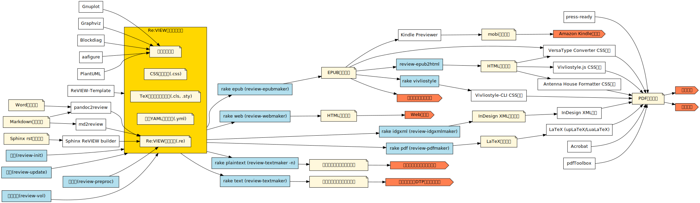

Re:VIEW ナレッジベース
===========================

Re:VIEW 開発者の立場から、Re:VIEW のカスタマイズおよび「よくある質問と回答」をまとめています。

Re:VIEW のセットアップおよび基本的な使い方については、`Re:VIEW <https://reviewml.org/>`_ 公式の `各ドキュメント <https://github.com/kmuto/review/tree/master/doc>`_ をまず参照してください (特に `Re:VIEWクイックスタートガイド <https://github.com/kmuto/review/blob/master/doc/quickstart.ja.md>`_ と `Re:VIEWフォーマットガイド <https://github.com/kmuto/review/blob/master/doc/format.ja.md>`_)。

このナレッジベースへのご意見・ご要望については、 https://github.com/reviewml/reviewknowledge-ja の issue 投稿、または Twitter @kmuto までお寄せください。

.. toctree::
   :maxdepth: 2
   :caption: Contents:

リリースに関する情報
--------------------------
.. toctree::
  :maxdepth: 1

  releases/review410
  releases/review400
  latex/review3-latex

review-ext.rb による拡張
--------------------------
.. toctree::
  :maxdepth: 1

  reviewext/review-ext-basic
  reviewext/other-idxtype
  reviewext/list-exec
  reviewext/nest

LaTeX に関連する長めの Tips
-----------------------------
.. toctree::
  :maxdepth: 1

  latex/control-flow
  latex/modify-abit
  latex/tex-hook
  latex/tex-tombow
  latex/prepost-num
  latex/bookmark-tree
  latex/review3-latex
  latex/uptex-fonts
  latex/install-tl
  latex/paper-layout
  epub/custom-pages
  latex/linebreak-verbatim
  latex/tex-error
  latex/emoji

EPUB に関連する長めの Tips
------------------------------
.. toctree::
  :maxdepth: 1

  epub/esc-highlight
  epub/custom-pages

.. InDesign に関連する長めの Tips
.. ------------------------------
.. .. toctree::
..   :maxdepth: 1

印刷 に関連する長めの Tips
------------------------------
.. toctree::
  :maxdepth: 1

  printing/submit

FAQ（よくある質問と回答）
-------------------------
.. toctree::
  :maxdepth: 2

  faq/faq-trivial
  faq/faq-license
  faq/faq-usage
  faq/faq-tex
  faq/faq-epub
  faq/faq-idgxml
