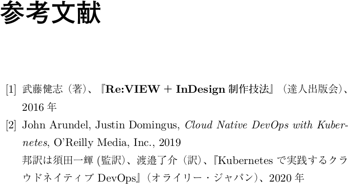
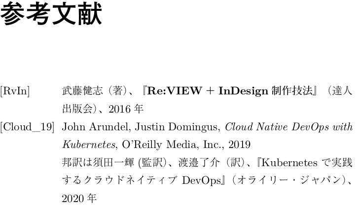
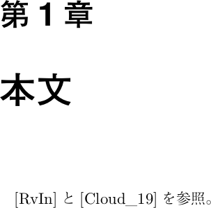

2020/7/24 by @kmuto

# 参考文献にthebibliography環境を利用する

Re:VIEW の //bibpaper 命令を LaTeX の thebibliography 環境に対応付ける例を示します。

---

Re:VIEW の参考文献に使う `//bibpaper` および `@<bib>` 命令は、各ビルダで共通化するためにかなり簡素なものとなっています。LaTeX では参考文献に thebibliography 環境を使うのが一般的なので、これに適合するように変更してみましょう。

## 原稿の例

参考文献の bib.re ファイルは以下のように書くことにします。

```
= 参考文献

//embed[latex]{
\begin{thebibliography}{99}
//}

//bibpaper[RvIn][Re:VIEW+InDesign制作技法]{
武藤健志（著）、@<b>{『Re:VIEW＋InDesign制作技法』}（達人出版会）、2016年
//}

//bibpaper[Cloud_19][Cloud Native DevOps with Kubernetes 2019]{
John Arundel, Justin Domingus, @<i>{Cloud Native DevOps with Kubernetes}, O'Reilly Media, Inc., 2019

邦訳は須田一輝(監訳）、渡邉了介（訳）、『Kubernetes で実践するクラウドネイティブ DevOps』（オライリー・ジャパン）、2020年
//}

//embed[latex]{
\end{thebibliography}
//}
```

参考文献の thebibliography 環境の開始・終了を `//embed` 命令を使って記述しています。`//bibpaper` 命令の記法はデフォルトの Re:VIEW の書き方とは少し変えており、1つめの引数が ID、2つめの引数はメモ（何を書いても無視される）。`{` 〜 `//}` の中に段落形式で書誌情報を記載します。

`\begin{thebibliography}{99}` の `{99}` は、別に99個の何かというわけではなく、参考文献の箇条書き表記をするときに「99」というリテラルな文字の幅をラベル幅に転用するというだけです。参考文献の数が1桁なら `{9}` としてもよいでしょう。

著者名・書籍名・出版社・刊行年月日 などや ISBN や URL を表記するかどうか、およびその順番などは、書き手なり刊行する出版社なりでハウスルールが異なりますので、ルールに従って揃えておきましょう。

参照する re ファイルのほうは、普通に以下のようになります。`//bibpaper` で指定した ID を `@<bib>` 命令に入れるだけです。

```
= 本文

@<bib>{RvIn}と@<bib>{Cloud_19}を参照。
```

## review-ext.rb の変更

`//bibpaper` 命令の記法を変えているので、それに応じて Re:VIEW の挙動を review-ext.rb で変更します。

```
module ReVIEW
  module LATEXBuilderOverride
    def bibpaper(lines, id, caption)
      puts %Q(\\bibitem{bib:#{id}} #{split_paragraph(lines).join("\n\n")})
    end
  end

  class LATEXBuilder
    prepend LATEXBuilderOverride
  end
end
```

参考文献を Re:VIEW の LaTeX ビルダで扱う際に`bib:` + ID としている以外はとりたてて注目するところはありません。LaTeX の bibitem マクロにその ID および段落内容を入れているだけです。

## review-custom.sty の変更

現状では、「参考文献見出しが多重に登場してしまう」「本文の引用側が \cite 命令ではなくリテラルな番号に展開されている」という2つの問題があります。

sty/review-custom.sty ファイルで挙動を変更しましょう。review-jsbook.cls を使っている前提での記述例を示します。

```
% for user-defined macro
\renewenvironment{thebibliography}[1]{%
  %\global\let\presectionname\relax
  %\global\let\postsectionname\relax
  %\chapter*{\bibname}\@mkboth{\bibname}{}%
  %\addcontentsline{toc}{chapter}{\bibname}%
   \list{\@biblabel{\@arabic\c@enumiv}}%
        {\settowidth\labelwidth{\@biblabel{#1}}%
         \leftmargin\labelwidth
         \advance\leftmargin\labelsep
         \@openbib@code
         \usecounter{enumiv}%
         \let\p@enumiv\@empty
         \renewcommand\theenumiv{\@arabic\c@enumiv}}%
   \sloppy
   \clubpenalty4000
   \@clubpenalty\clubpenalty
   \widowpenalty4000%
   \sfcode`\.\@m}
  {\def\@noitemerr
    {\@latex@warning{Empty `thebibliography' environment}}%
   \endlist}

\renewcommand{\reviewbibref}[2]{\cite{#2}}
```

jsbook.cls の thebilbiography 環境の定義をコピーして \renewenvironment で再定義することにし、定義の最初の4行にある見出し設置部分をコメントアウトしています。

\reviewbibref は2つの引数をとるマクロで、#1 にはリテラルな番号、#2 には（bib:付きの） ID が入っています。デフォルトは #1 を利用しているのですが、ここでは \cite マクロで #2 のほうを取るように変更しました。

## 変更結果

これで設定は終わりです。rake pdf の結果を見てみましょう。



うまくいっているようです。参照側は以下のようになっています。


texdocumentclass パラメータで `media=ebook` を有効にしておくと、参照側からクリックしてハイパーリンクも飛ぶようになっているはずです。

## 番号でなくラベルを表記する

上記の例では頭から順に番号を振りましたが、`[RvIn]` のようにラベル文字列を使った表記方法も書籍や論文においてはよく見かけます。`//bibpaper` の ID をそのまま利用する形で実装してみましょう。このときの review-ext.rb は次のとおりです。

```
module ReVIEW
  module LATEXBuilderOverride
    def bibpaper(lines, id, caption)
      puts %Q(\\bibitem[#{escape(id)}]{bib:#{id}} #{split_paragraph(lines).join("\n\n")})
    end
  end

  class LATEXBuilder
    prepend LATEXBuilderOverride
  end
end
```

\bibitem マクロの頭にエスケープした ID 文字列を入れています。

番号でなく文字列のラベルの場合は幅が大きくとるので、bib.re での thebibliography 環境のラベル幅を広げておきましょう。aaaaaaaaa の数は実際のラベルに応じて増減させてください。

```
= 参考文献

//embed[latex]{
\begin{thebibliography}{aaaaaaaaa}
//}

…（略）…
//}
```

結果は以下のとおりです。




