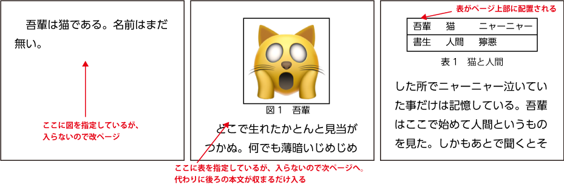

2018/8/9, 2018/11/16, 2019/3/12, 2020/1/5 by @kmuto

# 図表のフロートを制御する

図表のフロートの配置の挙動をデフォルトから変更する例を示します。

----

LaTeX において、キャプション付きの図や表は、「フロート」という1つのかたまりして扱われます。その名のとおり浮動的なもので、本文とはいくぶん切り離されて、版面上に空いている箇所に配置されます。

Re:VIEW のデフォルトのスタイルでは、このフロートは以下の挙動になるように定義しています。

- 図：必ず指定した位置に配置。入らなければ大きな余白を恐れずに改ページして配置
- 表：指定した位置に「配置できそうなら」配置。入らなければ次ページ先頭に配置し、表の後ろにあった文は余白を埋めるまで入る（バージョン 3 まで）。Re:VIEW 4 以降は図と同じ挙動。



この挙動により、たとえば次のような場面で悩むことになるかもしれません。

- 表が次のページに行きやすい（バージョン 4 より前）
- 図の下に余白ができやすい（バージョン 4.0 以降は表も）
- デザイン上、図表は必ず版面上端に揃えたいのにできない

スタイルの図表のフロートの挙動を定義し直すことで、これらの問題に対処することができます。

## Re:VIEW 3 以降の場合

Re:VIEW 3 以降では、図表の設定を review-style.sty で指定できます。プロジェクトの sty/reiew-style.sty ファイルを見ると、次のように記述されているはずです。

Re:VIEW 4 以上の場合、

```
\floatplacement{figure}{H}
\floatplacement{table}{H}
```

Re:VIEW 3 の場合、

```
\floatplacement{figure}{H}
\floatplacement{table}{htp}
```

table が表の指定、figure が図の指定で、「H」や「htp」となっているのが位置指定です。

- H：絶対に指定箇所に置く（float.sty の効果）
- h：できれば指定箇所に置く。少しでも無理ならあきらめて次の候補へ
- t：版面上端に置く
- b：版面下端に置く
- p：単独のページに置く

たとえばフロートは必ず上端に置く、という設定にしたければ次のようになります。

```
\floatplacement{table}{t}
\floatplacement{figure}{t}
```

あるいは図表はたとえ空きができても必ずそこに置くというのであれば、次のようにします。

```
\floatplacement{figure}{H}
\floatplacement{table}{H}
```

## Re:VIEW 2 以前の場合

Re:VIEW 2 ベースの場合は `table_header` メソッドに `[h]` が決めうちで記述されてしまっているので、次のような review-ext.rb をプロジェクトフォルダに置いて上書きします。

```
module ReVIEW
  module LATEXBuilderOverride
    def table_header(id, caption)
      # \begin{table}[h]の[h]を削除
      if id.nil?
        if caption.present?
          @table_caption = true
          @doc_status[:caption] = true
          puts "\\begin{table}%%#{id}"
          puts macro('reviewtablecaption*', compile_inline(caption))
          @doc_status[:caption] = nil
        end
      else
        if caption.present?
          @table_caption = true
          @doc_status[:caption] = true
          puts "\\begin{table}%%#{id}"
          puts macro('reviewtablecaption', compile_inline(caption))
          @doc_status[:caption] = nil
        end
        puts macro('label', table_label(id))
      end
    end
  end

  class LATEXBuilder
    prepend LATEXBuilderOverride
  end
end
```

そしてプロジェクトフォルダの sty/reviewmacro.sty に以下のように記述します。

```
\renewenvironment{reviewimage}{%
  \begin{figure}
    \begin{center}}{%
    \end{center}
  \end{figure}}

\floatplacement{table}{H}
\floatplacement{figure}{H}
```

## 調整したいときは

箇所によって調整したい場合、いくつかの方法（ID を見て TeX ソースファイルでの配置指定を書き換えるなど）がありますが、「一時的に floatplacement を変更し、配置を終えたら元に戻すような生 LaTeX コードを埋め込む」という方法が最も簡単です。たとえば次のようにします（fig1-1 図版を紙面の上＝tに配置し、元の H に戻します）。

```
…

//embed[latex]{
\floatplacement{figure}{t}
//}

//image[fig1-1][上に配置したい図]{
//}

//embed[latex]{
\floatplacement{figure}{H}
//}

…
```

フロートの挙動はなかなか厄介で、少し文字の調整をしたつもりが後続のフロート要素に影響して調整し直しになってしまうことがままあります。印刷の結果を最優先にするのであれば、図も表もどちらも「H」に設定しておき、re ファイル側で図表の位置を変えてしまったほうが扱いやすいでしょう。

また、h・t・b・p指定による自動配置の場合、たまに流れが詰まって章の最後で吐き出されてしまったりすることがあります。途中で強制的に吐き出すには、次のように `\clearpage` 命令を適宜埋め込む必要があります。

```
//embed[latex]{
\clearpage
//}
```
