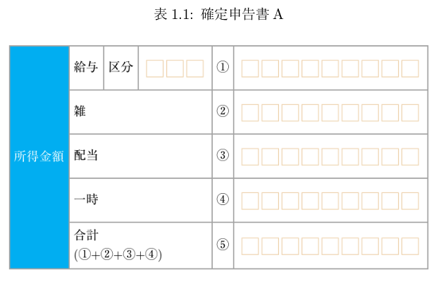

2020/12/20 by @kmuto

# 表の自由度をHTMLを使って掴み取る

Re:VIEW および LaTeX の記述方法では難しい表を、HTML 化して Web ブラウザから画像化することで対処します。

---

以前から述べている「日本人の表好きすぎる問題」はいまだとどまるところを知りませんが、かといって Re:VIEW の記法上の理由と、LaTeX の表表現の根幹思想による制約という2つの問題があり、なかなか完璧な解決方法というものは思い付きません。

LaTeX ではどうにも解決の糸口が見えないので、もう少し表については柔軟な HTML を使うことを考えました。re ファイル内の表にいろいろと擬似タグによる指示を入れておいたものを HTML 化して、Web ブラウザによるレンダリングを画像化して受け取り、表の代わりに貼り付けておこうというアイデアです。

使いすぎは健康を損ねるので、説明はざっくりにしておきます。

## まずは実行例

ひとまず完成した review-ext.rb を挙げておきます。

- [https://github.com/reviewml/reviewknowledge-ja/blob/master/codes/htmltable/review-ext.rb](https://github.com/reviewml/reviewknowledge-ja/blob/master/codes/htmltable/review-ext.rb)

```
# -*- coding: utf-8 -*-
# ブラウザで動的にTeX用表画像を作成するための //htmltable, //rawhtmltable
# Copyright 2020 Kenshi Muto
module ReVIEW
  require 'review/htmlbuilder'

  module BuilderOverride
    Compiler.defblock :htmltable, 0..3
    Compiler.defblock :rawhtmltable, 0..3

    def htmltable(lines, id = nil, caption = nil, metrics = nil)
      table(lines, id = nil, caption = nil)
    end

    def rawhtmltable(lines, id = nil, caption = nil, metrics = nil)
      table(lines, id = nil, caption = nil)
    end
  end

  class Builder
    prepend BuilderOverride
  end

  module IndexBuilderOverride
    def htmltable(lines, id = nil, caption = nil, metrics = nil)
      check_id(id)
      if id
        item = ReVIEW::Book::Index::Item.new(id, @table_index.size + 1, caption)
        @table_index.add_item(item)
      end
    end

    def rawhtmltable(lines, id = nil, caption = nil, metrics = nil)
      check_id(id)
      if id
        item = ReVIEW::Book::Index::Item.new(id, @table_index.size + 1, caption)
        @table_index.add_item(item)
      end
    end
  end

  class IndexBuilder
    prepend IndexBuilderOverride
  end

  module CompilerOverride
    def initialize(builder)
      super(builder)
      @non_parsed_commands += %i[rawhtmltable]
    end
  end

  class Compiler
    prepend CompilerOverride
  end

  module HTMLBuilderOverride
    def htmltable(lines, id = nil, caption = nil, metrics = nil)
      if id
        puts %Q(<div id="#{normalize_id(id)}" class="table htmltable">)
      else
        puts %Q(<div class="table htmltable">)
      end
      super(lines, id, caption)
      puts '</div>'
    end

    def rawhtmltable(lines, id = nil, caption = nil, metrics = nil)
      if id
        puts %Q(<div id="#{normalize_id(id)}" class="table rawhtmltable">)
      else
        puts %Q(<div class="table rawhtmltable">)
      end
      puts lines.join("\n")
      puts '</div>'
    end

    def cellattr(str)
      return [str, ''] if str !~ /\A<\?dtp table/
      attr = []
      str.match(/<\?dtp table (.+) \?>/) do |m|
        str = $'
        m[1].split(',').each do |kv|
          k, v = kv.split('=', 2)
          k = 'class' if k == 'cellstyle'
          attr.push(%Q(#{k}="#{v}"))
        end
      end
      return [str, ' ' + attr.join(' ')]
    end

    def th(str)
      return '' unless str.present?

      str, attr = cellattr(str)
      "<th#{attr}>#{str}</th>"
    end

    def td(str)
      return '' unless str.present?

      str, attr = cellattr(str)
      "<td#{attr}>#{str}</td>"
    end
  end

  class HTMLBuilder
    prepend HTMLBuilderOverride
  end

  module LATEXBuilderOverride
    def make_htmlimgtable(type, id)
      @book.config['builder'] = 'html'
      chapterlink = @book.config['chapterlink']
      @book.config['chapterlink'] = nil
      compiler = Compiler.new(HTMLBuilder.new)
      File.write('__REVIEW_HTMLTABLE__.html', compiler.compile(@book.chapter(@chapter.name)))
      @book.config['chapterlink'] = chapterlink
      @book.config['builder'] = 'latex'

      require 'puppeteer'

      unless Dir.exist?(File.join('images', '__htmltable__'))
        Dir.mkdir(File.join('images', '__htmltable__'))
      end

      Puppeteer.launch(headless: true) do |browser|
        page = browser.pages.first || browser.new_page
        page.viewport = Puppeteer::Viewport.new(width: 1400, height: 1200, device_scale_factor: 2)
        page.goto("file://#{Dir.pwd}/__REVIEW_HTMLTABLE__.html##{id}")
        page.focus("div.#{type}##{id} table")
        overlay = page.S("div.#{type}##{id} table")
        overlay.screenshot(path: File.join('images', '__htmltable__', "#{@chapter.name}-#{id}.png"))
      end
    end

    def common_htmltable(type, lines, id, caption, metrics)
      blank
      if caption.present?
        puts "\\begin{table}%%#{id}"
      end

      error "#{type} needs id." unless id

      make_htmlimgtable(type, id)

      begin
        if caption_top?('table') && caption.present?
          table_header(id, caption)
        end
      rescue KeyError
        error "no such table: #{id}"
      end

      puts '\begin{reviewtable}{c}'
      command = 'reviewincludegraphics'

      if metrics.present?
        puts "\\#{command}[#{metrics}]{images/__htmltable__/#{@chapter.name}-#{id}.png}"
      else
        puts "\\#{command}[scale=0.4]{images/__htmltable__/#{@chapter.name}-#{id}.png}"
      end
      puts '\end{reviewtable}'

      if caption.present?
        unless caption_top?('table')
          table_header(id, caption)
        end
        puts '\end{table}'
      end
      blank
    end

    def htmltable(lines, id = nil, caption = nil, metrics = nil)
      common_htmltable('htmltable', lines, id, caption, metrics)
    end

    def rawhtmltable(lines, id = nil, caption = nil, metrics = nil)
      common_htmltable('rawhtmltable', lines, id, caption, metrics)
    end

    def result
      File.unlink('__REVIEW_HTMLTABLE__.html') if File.exist?('__REVIEW_HTMLTABLE__.html')
      super
    end
  end

  class LATEXBuilder
    prepend LATEXBuilderOverride
  end
end
```

かなり大きい時点で、不吉な臭いがしますね。Re:VIEW 5.0 向けですが、以降のバージョンで使えなくなる可能性もあります。

解説は後にするとして、次のようなreファイルを用意しました。

```
= htmltableのテスト

//htmltable[kakuteiA][確定申告書A]{
-----------------
@<dtp>{table rowspan=5,cellstyle=earning}所得金額	給与	区分	@<dtp>{table cellstyle=input}□□□	①	@<dtp>{table cellstyle=input}□□□□□□□□□
.	@<dtp>{table colspan=3}雑	.	.	②	@<dtp>{table cellstyle=input}□□□□□□□□□
.	@<dtp>{table colspan=3}配当	.	.	③	@<dtp>{table cellstyle=input}□□□□□□□□□
.	@<dtp>{table colspan=3}一時	.	.	④	@<dtp>{table cellstyle=input}□□□□□□□□□
.	@<dtp>{table colspan=3}合計@<br>{}(①+②+③+④)	.	.	⑤	@<dtp>{table cellstyle=input}□□□□□□□□□
//}
```

style.css は次のようにしています。

```
div.htmltable table, div.rawhtmltable table {
  padding-right: 0.25em;
  padding-bottom: 0.25em;
  margin-right: 0.5em;
  margin-bottom: 0.5em;
}

td.input {
  font-size: 1.2em;
  color: #efd4af;
}

td.earning {
  background-color: #02b4f2;
  color: white;
}
```

Ta-da! 結果は次のとおりです。


reファイル側を先に解説しておくと、

- 表セルの先頭で `@<dtp>` 命令を使い、`table 〜` でその表セルについての指示を入れておく。複数の指示があるときには `,` で区切る。
- `colspan=数字` で右方向のセル結合、`rowspan=数字` で下方向のセル結合を行う。結合「される」側のセルは、「`.`」を入れておく (空扱いになる)。なお、結合ではなく本当に「空欄」のセルを用意したいときには全角スペース（`　`）を入れておくとよい。
- `cellstyle=スタイル名` でセルのスタイル名を入れる。実際にはここでは HTML の class 属性の値にそのまま置き換えている。

cellstyle で class に置換されるので、実のところ CSS 側で何でもやりたい放題ですね。

## review-ext.rb の説明

実行の流れとしては、以下のとおりです。

1. `//htmltable` が登場したら、その章を HTML ビルダによって `__REVIEW_HTMLTABLE__.html` として書き出す。
2. Web ブラウザを操作する Puppeteer を実行する。Ruby で閉じたかったので、ここでは google-chrome-stable または chromium を操作できる puppeteer-ruby gem パッケージを採用した。
3. puppeteer-ruby で 1. の HTML ファイルをブラウザに開き、htmltable の表要素を ID に基づいて探す。
4. 3. で見つかった要素範囲を画像キャプチャし、`images/__htmltable__章-ID.png` に保存する。
5. TeX ファイル側には 4. の画像ファイルを指定した `\reviewincludegraphics` を書き込む。
6. 1. に戻り、`//htmltable` が終わるまで繰り返す。全部終わったら `__REVIEW_HTMLTABLE__.html` を削除する。

手順2.にあるとおり、お手元での実行には puppeteer-ruby gem パッケージ、およびブラウザ環境が必要です (Debian GNU/Linux 以外での実行は不明です)。

```
gem install puppeteer-ruby
```

- `page.viewport` で解像度・および画質を設定しています。うまく収まらない場合にはこのあたりを調整してみるとよいでしょう。
- `//htmltable` はキャプションは省略できますが、ID は必須です (これに基づいて探すので)。
- 今は PNG にしていますが、スクリーンショットではなく、PDF を「印刷」するように変えれば検索可能なものにはなりそうです。ただ Chrome/Chromium で OTF 混じりのものを PDF 化すると Type3 になって印刷所に送れないものになるので気乗りしないのと、要素だけを印刷する方法がすぐにはわからなかったので手を付けませんでした。
- `//htmltable` でメトリックを指定しなかったときには `scale=0.4` を指定しています。本文および `page.viewport` で指定したスケールの兼ね合いではこのくらいがおおむね合っているのではないかと思います。
- セル内は普通の re ファイルなので、`@<b>` や `@<chap>` など任意のインライン命令を記述できます。
- `@<dtp>{table 〜}` の指定では、cellstyle を除いて「キー=値」をそのまま HTML の th, td 要素に渡しているだけなので「`@<dtp>{table align=right}`」なども可能です。valign は CSS でないとできないですし、結局 CSS でやったほうが自然ですが。
- で、実は EPUB のほうもこれで普通にセル結合やセルスタイル設定できるようになりますね。
- CSS の div.htmltable の妙なマージン、パディングですが、これを入れないと要素を切り出しキャプチャしたときに切れてしまうことがあります。入れてもダメなときもあり、謎ですね……。
- `//htmltable` が呼ばれるたびに毎回 HTML を作り直して Puppeteer を呼び出すのは明らかにパフォーマンスが悪いです。よりまじめに作るなら、`IndexBuilder` で `//htmltable` があるというフラグを立てたら、`builder_init_file` で HTML および Puppeteer インスタンスを作成する、という具合でしょうか。
- なお、執筆時点ではまだリリース前で今のGitHub master にある Re:VIEW 5.1(?) を使うと、config.yml に `math_format: mathjax` とするだけで表中の `@<m>` や `//texequation` の TeX 数式も綺麗に入れられます。

CSS スタイルの div.htmltable のフォントを TeX 側で使っているフォントに合わせれば、より近い見た目になるでしょう (文字組の手法が異なるので完全に一致することはありませんが)。たとえば筆者の環境では TeX 組版のデフォルトを「Latin Modern + モリサワリュウミン」としているので、CSS を以下のようにします。

```
div.htmltable {
  font-family: "Latin Modern Roman", "A-OTF Ryumin Pr6N";
  …
}
```



TeX で作られたキャプション部分と表の書体で違和感がなくなりました。

## もっと自由を!?

もっと自由に書きたいというときのために、`//rawhtmltable` 命令も使えます。

```
//rawhtmltable[freedom][自由すぎる表]{
<table>
<tr><th rowspan="2"></th><th colspan="2">データMAX 5G with Dazon</th></tr>
<tr><th>通常</th><th>2GB以下の場合</th></tr>
<tr><th>2年契約 適用時 <b>[1]</b></th><td>9,180円</td><td>7,700円</td></tr>
<tr><th>家族割プラス</th><td colspan="2"><table>
  <tr><th>2人</th><td>-500円</td></tr>
  <tr><th>3人</th><td>-1,000円</td></tr>
  <tr><th>4人 <b>[2]</b></th><td>-2,020円</td></tr>
  </table></td></tr>
<tr><th>スマートバリュー <b>[3]</b></th><td colspan="2">-1,000円</td></tr>
<tr><th>スマホ応援割 <b>[4]</b><span class="note">※翌月から6カ月間</span></th><td colspan="2">-1,400円</td></tr>
<tr><th>5Gスタート割 <b>[5]</b><span class="note">※翌月から12カ月間</span></th><td colspan="2">-1,000円</td></tr>
</table>
```


re 形式からは離れるので、Re:VIEW のインライン命令・ブロック命令は使えません。

LaTeX 上では table 環境で囲んではいるものの、実はHTML のほうでは `<table>` を使う必要すらなく、本当に任意です。使いすぎにはご注意ください。
