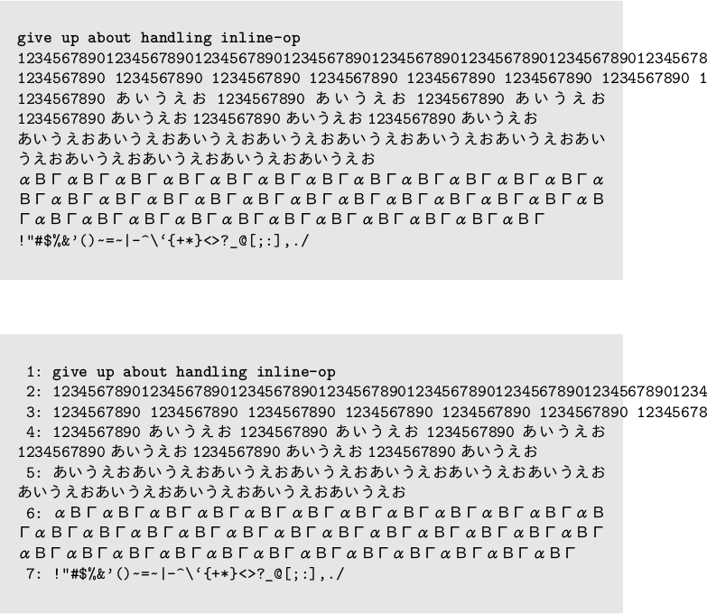
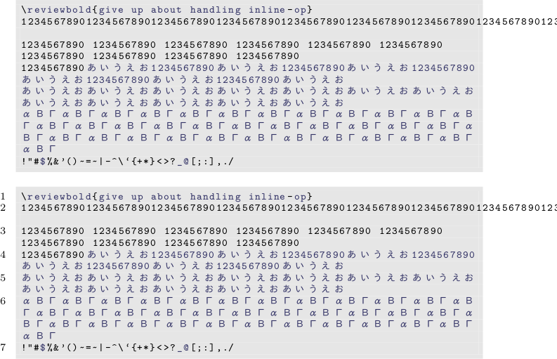
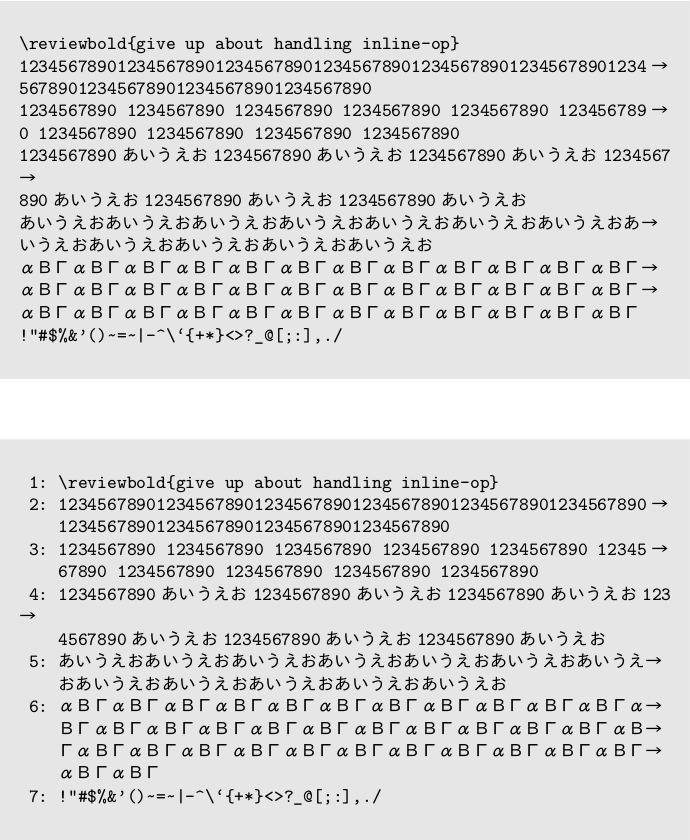
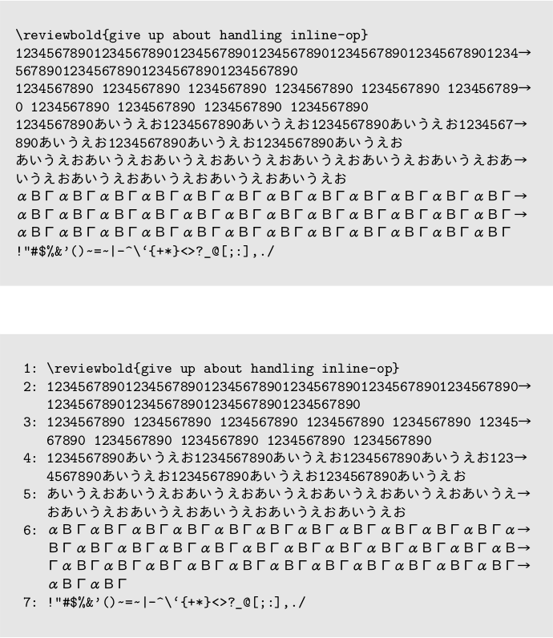

2019/8/16 by @kmuto

# コードブロック内で自動改行する

emlist などのコード系のブロック命令内で自動で折り返し改行する方法を示します。

----

list や emlist、listnum などのコード系のブロック命令内で1行が長いとき、折り返されずに紙面からはみ出してしまうことがよくあります。Web ブラウザのように自動で判断して紙面の妥当なところで折り返してほしいところですが、TeX でこれに対処するのは極めて困難です。

次のコードを例に、いくつかの回避策を示します。

```
//emlist{
@<b>{give up about handling inline-op}
1234567890123456789012345678901234567890123456789012345678901234567890123456789012345678901234567890
1234567890あいうえお1234567890あいうえお1234567890あいうえお1234567890あいうえお1234567890あいうえお1234567890あいうえお
あいうえおあいうえおあいうえおあいうえおあいうえおあいうえおあいうえおあいうえおあいうえおあいうえおあいうえおあいうえお
αΒΓαΒΓαΒΓαΒΓαΒΓαΒΓαΒΓαΒΓαΒΓαΒΓαΒΓαΒΓαΒΓαΒΓαΒΓαΒΓαΒΓαΒΓαΒΓαΒΓαΒΓαΒΓαΒΓαΒΓαΒΓαΒΓαΒΓαΒΓαΒΓαΒΓαΒΓαΒΓαΒΓαΒΓαΒΓαΒΓ
!"#$%&'()~=~|-^\`{+*}<>?_@[;:],./
//}

//emlistnum{
@<b>{give up about handling inline-op}
1234567890123456789012345678901234567890123456789012345678901234567890123456789012345678901234567890
1234567890あいうえお1234567890あいうえお1234567890あいうえお1234567890あいうえお1234567890あいうえお1234567890あいうえお
あいうえおあいうえおあいうえおあいうえおあいうえおあいうえおあいうえおあいうえおあいうえおあいうえおあいうえおあいうえお
αΒΓαΒΓαΒΓαΒΓαΒΓαΒΓαΒΓαΒΓαΒΓαΒΓαΒΓαΒΓαΒΓαΒΓαΒΓαΒΓαΒΓαΒΓαΒΓαΒΓαΒΓαΒΓαΒΓαΒΓαΒΓαΒΓαΒΓαΒΓαΒΓαΒΓαΒΓαΒΓαΒΓαΒΓαΒΓαΒΓ
!"#$%&'()~=~|-^\`{+*}<>?_@[;:],./
//}
```



## 物理的に改行を入れる

最も単純な方法は、コードに直接改行を入れることです。

明確で、インライン命令も利用可能なので、可能であればこの手法が最も妥当です。

しかし、「自動的に折り返したい」というこの記事の趣旨に合わないのと、`//emlistnum` や `//listnum` のように各行頭に行番号が付く場合は普通に改行するとそこにも行番号が付いてしまって困るという問題があります。

ただし、行番号が付いていてもこの物理改行の方法で対処する場合は、「強制改行して行番号の幅だけスペースを入れる」という方法があります。強制改行には `@<br>{}` を使えますが、EPUB も作る場合はそちらにも影響してしまうので、以下のように `@<embed>` 命令を使うのがよいでしょう。

```
//emlistnum{
12345678901234567890123456789012345678901234567890123456789012345678901234@<embed>$|latex|\linebreak\hspace*{5ex}$56789012345678901234567890
//}
```

`\hspace*{5ex}` は、行頭であってもかまわず（`*`）、「x」の文字幅5つぶん（`5ex`）の水平方向スペース（`hspace`）を作る LaTeX マクロです。`5ex` の部分は実際のレイアウトに合わせて調整する必要があるかもしれません。

## コードハイライトの副次的な機能で自動改行する

コードハイライト (キーワード太字にしたりするなど) の listings マクロを使うと、その副次的な機能として単語間で折り返しをしてくれます。

コードハイライトを有効にするには、config.yml の以下の箇所を有効にします。

```
highlight:
  latex: "listings"
```

行の折り返しはマクロが勝手に行いますが、ある程度指示したいときには、行の途中に空白文字を埋め込むとよいでしょう。

```
//emlistnum{
1234567890 1234567890 1234567890 1234567890 1234567890 1234567890 12345@<embed>{|latex| }67890 1234567890 1234567890 1234567890
//}
```

listings マクロは行番号表現も提供しています。



コードハイライトを有効にする代償として、コード内のインライン命令は動かず、すべてエスケープされた文字となってしまいます（図中の `\reviewbold`）。

対策のヒントは以下の記事に少し示しています。

- [ハイライト内でのインライン命令の処理](../epub/esc-highlight.html)

また、行中に単語の区切りが見つからないと、折り返しできずにやはりはみ出してしまいます。

## 文字数を見て折り返す

Re:VIEW [PR#1368](https://github.com/kmuto/review/issues/1368) が反映された Re:VIEW 3.3 以上が必要ですが、コードの各行の処理部分に割り込み、文字の幅を数えて折り返し位置になったら折り返し文字を入れて改行するという方法があります。

Re:VIEW のデフォルトでは、各行の処理部分は `code_line` (行番号なし)、`code_line_num` (行番号あり) として以下のように定義されています。

```
def code_line(_type, line, _idx, _id, _caption, _lang)
  detab(line) + "\n"
end

def code_line_num(_type, line, first_line_num, idx, _id, _caption, _lang)
  detab((idx + first_line_num).to_s.rjust(2) + ': ' + line) + "\n"
end
```

各行の処理部分を書き換えるには、以下のような review-ext.rb ファイルをプロジェクトに置きます。

```
module ReVIEW
  module LATEXBuilderOverride
    # gem install unicode_display_width
    require 'unicode/display_width'
    require 'unicode/display_width/string_ext'

    CR = '→' # 送り出し文字。LaTeXコードも可
    ZWSCALE = 0.875 # 和文・欧文の比率。\setlength{\xkanjiskip}{\z@} しておいたほうがよさそう

    def split_line(s, n)
      # 文字列を幅nで分割
      a = []
      l = ''
      w = 0
      s.each_char do |c|
        cw = c.display_width(2) # Ambiguousを全角扱い
        cw *= ZWSCALE if cw == 2
        
        if w + cw > n
          a.push(l)
          l = c
          w = cw
        else
          l << c
          w += cw
        end
      end
      a.push(l)
      a
    end

    def code_line(type, line, idx, id, caption, lang)
      # _typeには'emlist'などが入ってくるので、環境に応じて分岐は可能
      n = 64
      n = 60 if @doc_status[:column]
      a = split_line(unescape(detab(line)), n)
      # インラインopはこの時点でもう展開されたものが入ってしまっているので、escapeでエスケープされてしまう…
      escape(a.join("\x01\n")).gsub("\x01", CR) + "\n"
    end

    def code_line_num(type, line, first_line_num, idx, id, caption, lang)
      n = 60
      n = 56 if @doc_status[:column]
      a = split_line(unescape(detab(line)), n)
      (idx + first_line_num).to_s.rjust(2) + ': ' + escape(a.join("\x01\n    ")).gsub("\x01", CR) + "\n"
    end
  end

  class LATEXBuilder
    prepend LATEXBuilderOverride
  end
end
```

ここでは紙面はA5、emlist 等の TeX 側のスタイルはデフォルトから変えていないものとします。

別の紙サイズを使用していたりスタイル変更をしている場合は、`code_line`、`code_line_num` の `n` の値を適宜調整する必要があります。

Unicode での文字の幅の判定のために `unicode_display_width` という gem を使っているので、`gem install unicode_display_width` でインストールしておきましょう。

この文字折り返しの結果は次のとおりです。



だいぶいい感じになりましたね！

ただ、和文欧文が入り交じった箇所では、ずれてしまっています。これは、コード内でも和欧間のスペースが効いているためです。

たとえば以下のように sty/review-base.sty に xkanjiskip をゼロにする設定（`\setlength{\xkanjiskip}{\z@}`）を加えることで、この和欧間スペースをなくせます。

```
\newenvironment{reviewemlist}{%
  \medskip\small\begin{shaded}\setlength{\xkanjiskip}{\z@}\setlength{\baselineskip}{1.3zw}\begin{alltt}}{%
  \end{alltt}\end{shaded}}
```



コードハイライトと同様の理由で、インライン命令は利用できません。とはいえ、少し工夫すれば（汎用的ではないにせよ）エスケープされたインライン命令を復帰させることもできるでしょう。

`code_line` や `code_line_num` のメソッドの1つめの引数 `type` には、`emlist` などのブロック命令名が渡ってきているので、命令ごとに異なるレイアウトを使っているときには、`type` の値に応じて `n` の値を調整するということも可能です。

定数 `CR` には折り返し文字を入れますが、TeX マクロをここに入れることもできます。行末ではなく行頭側に入れる、あるいは両方に別々の折り返し文字を入れる、といったことも工夫次第ですので、挑戦してみるのもよいでしょう。

## 番外編
逆に、たとえば id の情報を見て、特定の id であれば `\scalebox{倍率}[1]{`〜`}` で囲んで長体にして収める、という方法も思いつきますね。

```
def code_line(type, line, idx, id, caption, lang)
  if id == 'list1' # IDがlist1だったら、80%長体をかける
    '\scalebox{0.8}[1]{' + detab(line) + "}\n"
  else
    super(type, line, idx, id, caption, lang)
  end
end
```
