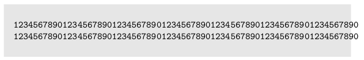
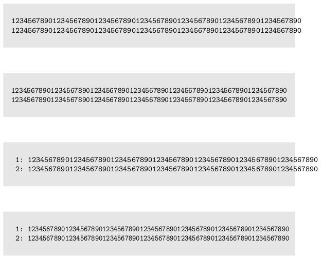

2020/8/16 by @kmuto

# コードブロックに長体（横方向の縮小変形）をかける

//emlist などのコードブロックに縮小変形をかけて1行に収める方法を紹介します。

---

[コードブロック内で自動改行する](linebreak-verbatim.html)で少しだけ触れたのですが、LaTeX の `\scalebox` マクロを使うとコードブロックに長体、つまり横方向の縮小変形をかけて行あたりの文字数を増やすことができます。

ハイライトが有効になっている場合は listings マクロに関わらないといけないのでここでは説明を省略し、ハイライトは使わない前提で話を進めます。

## 原稿の例

```
//emlist{
1234567890123456789012345678901234567890123456789012345678901234567890
1234567890123456789012345678901234567890123456789012345678901234567890
//}
```

これをビルドすると、次のように少しあふれています。そしてこれは1行であることに意味があり、自動改行はしたくないとしましょう。



## //listscale 命令の導入

そこで、コードブロックの長体率を指定するために、新たに `//listscale` 命令を追加することにします。review-ext.rb は次のとおりです。

```
module ReVIEW
  module BuilderOverride
    Compiler.defsingle :listscale, 1
    def listscale(scale) # 何もしない
    end
  end

  class Builder
    prepend BuilderOverride
  end

  module LATEXBuilderOverride
    def listscale(scale)
      # 長体率を指定
      @list_scale = scale
    end

    def common_code_block(id, lines, command, caption, _lang)
      @doc_status[:caption] = true
      captionstr = nil
      unless @book.config.check_version('2', exception: false)
        puts '\\begin{reviewlistblock}'
      end
      if caption.present?
        if command =~ /emlist/ || command =~ /cmd/ || command =~ /source/
          captionstr = macro(command + 'caption', compile_inline(caption))
        else
          begin
            if get_chap.nil?
              captionstr = macro('reviewlistcaption', "#{I18n.t('list')}#{I18n.t('format_number_header_without_chapter', [@chapter.list(id).number])}#{I18n.t('caption_prefix')}#{compile_inline(caption)}")
            else
              captionstr = macro('reviewlistcaption', "#{I18n.t('list')}#{I18n.t('format_number_header', [get_chap, @chapter.list(id).number])}#{I18n.t('caption_prefix')}#{compile_inline(caption)}")
            end
          rescue KeyError
            error "no such list: #{id}"
          end
        end
      end
      @doc_status[:caption] = nil

      if caption_top?('list') && captionstr
        puts captionstr
      end

      body = ''
      lines.each_with_index do |line, idx|
        if @list_scale # ここで//listscaleの値を利用して長体化
          body.concat(yield("\\scalebox{#{@list_scale}}[1]{#{line}}", idx))
        else
          body.concat(yield(line, idx))
        end
      end
      @list_scale = nil
      puts macro('begin', command)
      print body
      puts macro('end', command)

      if !caption_top?('list') && captionstr
        puts captionstr
      end

      unless @book.config.check_version('2', exception: false)
        puts '\\end{reviewlistblock}'
      end
      blank
    end
  end

  class LATEXBuilder
    prepend LATEXBuilderOverride
  end
end
```

だいぶ長いですが、ポイントは以下のとおりです。

- `BuilderOverride` モジュールで single 命令の `//listscale` を定義し、基底ビルダ では何もしない（LATEXBuilder 以外のビルダ、つまり HTMLBuilder などのほかのビルダで単に無視するようにする）。
- LATEXBuilder 用の `LATEXBuilderOverride` モジュールで、`//listscale` の効果の実体を定義する。といっても、`@list_scale` に指定の縮小率を入れるだけ。
- コードブロックの共通メソッドである `common_code_block` をコピーし、書き換える。提示のものは Re:VIEW 4.2 時点のもので、ちょっと大きめになっている。具体的に書き換えるのは `lines.each_with_index` の中で、`@list_scale` が定義されていれば `\scalebox{縮小率}[1]{行の内容}` と書き出すようにする。`[1]` は縦方向の縮小率で、1はつまり縮小をかけないということ。なお、`//listscale` の値もそうだが、1より大きいものを入れれば縮小ではなく「拡大となる。
- `lines.each_with_index` のブロックが終わったら `@list_scale` を nil にして、次のコードブロックに影響が及ばないようにする。

## 変更結果

これで、`//listscale[縮小率]` という命令が誕生しました。普通の emlist、長体 95%（0.95）にした同じ emlist、普通の emlistnum (行番号付き)、長体 90%（0.9）にした同じ emlistnum でどうなるか見てみましょう。

```
//emlist{
1234567890123456789012345678901234567890123456789012345678901234567890
1234567890123456789012345678901234567890123456789012345678901234567890
//}

//listscale[0.95]
//emlist{
1234567890123456789012345678901234567890123456789012345678901234567890
1234567890123456789012345678901234567890123456789012345678901234567890
//}

//emlistnum{
1234567890123456789012345678901234567890123456789012345678901234567890
1234567890123456789012345678901234567890123456789012345678901234567890
//}

//listscale[0.9]
//emlistnum{
1234567890123456789012345678901234567890123456789012345678901234567890
1234567890123456789012345678901234567890123456789012345678901234567890
//}
```



うまくいきました!
