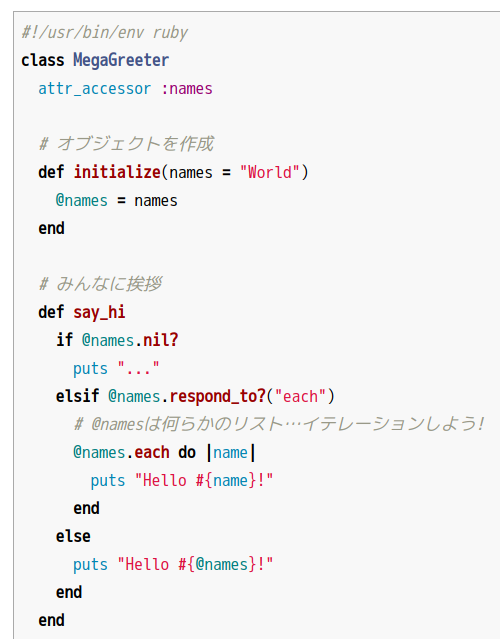

2020/12/23 by @kmuto

# mintedを使ったコードハイライト

minted パッケージを利用して LaTeX 上でも精緻なコードハイライトを施します。

---

## コードハイライト
今やプログラミングにおいて、メソッド名や変数、キーワードといった種類に応じてコードに色付け・書体変更などを行う「コードハイライト」は、エディタやビューアに当たり前の機能となっています。

Re:VIEW でのコードハイライトは、`highlight` パラメータを有効にし、HTML/EPUB の場合は `html: "rouge"` または `html: "pygments"` を使えば Rouge gem または pygments.rb gem パッケージのおかげでかなり良い感じのコードハイライトになります。



これに対し、PDFMaker (LaTeX) のほうは `latex: "listings"` をすれば一応 plistings および listings パッケージの働きによってハイライトはされますが、HTML のほうに比べると物足りない感じがあります。


これがすべて TeX のマクロで、文字列を解析してハイライトを実現しているというのは賞賛に値するのですが、カスタマイズを挟み込むのは至難です。

LaTeX でコードハイライトを行う別の方法として、「minted」というパッケージがあります。このパッケージは、Python プログラムのコードハイライタ [Pygments](https://pygments.org/) を内部で呼び出します。HTML で利用していた pygments.rb も内部で Pygments を呼び出しているので、合わせておけば同じ結果を得られることになります。

## 準備

minted パッケージは TeXLive に標準でインストールされているので、追加インストールは不要です。

Pygments は、Python 環境をセットアップ済みであれば、`pip install pygments` でインストールできます (Debian GNU/Linux などでは `apt-get install python3-pygments` でもインストールできますが、だいぶ古いものが入ってしまいます)。

また、この記事では GitHub と同じコードハイライトスタイルを使いたいので、pygments-style-extras Python パッケージも pip コマンドでインストールします。が、手元ではこのパッケージについて pip コマンドでうまくインストールできなかったので、[開発リポジトリ](https://github.com/thecodechef/pygments-style-extras) から `styles/github.py` を取得して直接 Pygments ライブラリのフォルダにコピーしてしまいました。

Pygments がインストールできたかは、次のように確認できます。

```
$ pygmentize -V
Pygments version 2.4.2, (c) 2006-2019 by Georg Brandl.
```

次に、プロジェクトの `config.yml` の変更です。

minted は TeX コンパイル中に内部で外部コマンドを呼び出します。TeX では信頼できない外部コマンド呼び出しを推奨しておらず、そのままではエラーになってしまうので、コンパイラにこの制約を緩めてもらいます (セキュリティ的にはよくないのでしょうが、Re:VIEW のビルドができる時点ですでにやりたい放題の環境ですよね)。`texoptions` パラメータにコンパイラからの任意の外部コマンド呼び出しを許可する設定 `-shell-escape` を追加します。

```
texoptions: "-interaction=nonstopmode -file-line-error -halt-on-error -shell-escape"
```

コードハイライトも有効にしておきます。highlight/latex に何かが入っていればよいので、`listings` のままで構いません。

```
highlight:
  html: "rouge"
  latex: "listings"
```

## スタイルの設定

コードハイライトスタイルにはいろいろな流派があります。GitHub スタイルもそうですし、Visual Studio Code、XCode、Emacs、Vim などのエディタのハイライトもそれぞれ違っています。Pygments は各種のハイライトスタイルに対応しており、次のコマンドで調べられます。

```
$ pygmentize -L styles
```

なお、先に GitHub スタイルを追加したと述べましたが、この一覧には出てこないようでした。スタイル名は「github」です。ちなみに、Jupyter Notebookには「manni」が近い気がしています。

minted パッケージの読み込みと、スタイルの設定を プロジェクトの `sty/review-custom.sty` に定義します。

```
% for user-defined macro
\usepackage{minted}
\usemintedstyle{github}
```

minted のデフォルトのルールに従ってコードは適当に整形されますが、サンプルとして Ruby、Python、Emacs Lisp のコードハイライトについて明示的に `sty/review-custom.sty` に定義しておくことにします。minted には多数のオプション指定があるので、詳細については `texdoc minted` を参照してください。最初の色設定 (`\definecolor`) は minted 固有ではなく、背景色に使いたい明るい灰色を定義しています。

```
 …

\definecolor{lightshadecolor}{gray}{0.95}

% Rubyリスト環境の事前定義
\setminted[ruby]{fontsize={\fontsize{8pt}{12pt}},breaklines=true,breakanywhere=true,frame=single}
% Pythonリスト環境の事前定義
\setminted[python]{fontsize={\fontsize{9pt}{14pt}},showspaces=true,breaklines=true,breakanywhere=true,bgcolor=lightshadecolor}
% Emacs Lispリスト環境の事前定義
\setminted[elisp]{breaklines=true,breakanywhere=true,frame=lines}
```

## review-ext.rb の配備

では、毎度おなじみ、プロジェクトフォルダに置く `review-ext.rb` です。

```
# -*- coding: utf-8 -*-
# リストをpygments + mintedでハイライトする
# Copyright 2020 Kenshi Muto
module ReVIEW
  module CompilerOverride
    def non_escaped_commands
      if @builder.highlight?
        # デフォルトは %i[list emlist listnum emlistnum cmd]
        # cmdをハイライトから除外してみる
        %i[list emlist listnum emlistnum]
      else
        []
      end
    end
  end

  class Compiler
    prepend CompilerOverride
  end

  module LATEXBuilderOverride
    def builder_init_file
      super
      @predefined_mint_style = %w[python ruby]
    end

    def cmd(lines, caption = nil, lang = nil)
      # cmdについてはハイライトなし版のみを使う
      blank
      common_code_block(nil, lines, 'reviewcmd', caption, lang) { |line, idx| code_line('cmd', line, idx, nil, caption, lang) }
    end

    # リスト環境をcommon_minted_codeに任せる。言語のデフォルトにshを設定しておく
    def emlist(lines, caption = nil, lang = 'sh')
      common_minted_code(nil, 'emlist', nil, lines, caption, lang)
    end

    def emlistnum(lines, caption = nil, lang = 'sh')
      common_minted_code(nil, 'emlist', line_num, lines, caption, lang)
    end

    def list(lines, id, caption, lang = 'sh')
      common_minted_code(id, 'list', nil, lines, caption, lang)
    end

    def listnum(lines, id, caption, lang = 'sh')
      common_minted_code(id, 'list', line_num, lines, caption, lang)
    end

    def common_minted_code(id, command, lineno, lines, caption, lang)
      blank
      puts '\\begin{reviewlistblock}'
      if caption.present?
        if command =~ /emlist/ || command =~ /cmd/ || command =~ /source/
          captionstr = macro('review' + command + 'caption', compile_inline(caption))
        else
          begin
            if get_chap.nil?
              captionstr = macro('reviewlistcaption', "#{I18n.t('list')}#{I18n.t('format_number_header_without_chapter', [@chapter.list(id).number])}#{I18n.t('caption_prefix')}#{compile_inline(caption)}")
            else
              captionstr = macro('reviewlistcaption', "#{I18n.t('list')}#{I18n.t('format_number_header', [get_chap, @chapter.list(id).number])}#{I18n.t('caption_prefix')}#{compile_inline(caption)}")
            end
          rescue KeyError
            error "no such list: #{id}"
          end
        end
      end
      @doc_status[:caption] = nil

      if caption_top?('list') && captionstr
        puts captionstr
      end

      body = lines.inject('') { |i, j| i + detab(j) + "\n" }
      args = ''
      if lineno
        args = "linenos=true,firstnumber=#{lineno}"
      end
      puts %Q(\\begin{minted}[#{args}]{#{lang}})
      print body
      puts %Q(\\end{minted})

      if !caption_top?('list') && captionstr
        puts captionstr
      end

      puts '\\end{reviewlistblock}'
      blank
    end
  end

  class LATEXBuilder
    prepend LATEXBuilderOverride
  end
end
```

コードハイライトは `//list`、`//listnum`、`//emlist`、`//emlistnum` に適用されるようにしました。コマンド実行例に使うことを想定している `//cmd` については、インライン命令で `@<b>` を使うことが多いなどの理由でハイライトから外しています。

インライン命令とコードハイライトはとても相性が悪く、ハイライトルールをインライン命令の内容が壊してしまうほか、インライン命令の命令部分がそのまま出力に出てしまいます。これを回避しようとすると pygmentize のラッパーを書くといった作業が必要になり、記事の範疇を超えてしまうので省略します。インライン命令とコードハイライトの問題は HTML でも同じです。

元々の Re:VIEW のメソッド実装から変えていることとしては、

- `Compiler#non_escaped_commands` メソッド定義でハイライト対象コードブロックから cmd を除外
- `LATEXBuilder#cmd` はハイライト判定を無視して、ハイライトなしのほうのロジックだけを実装
- `LATEXBuilder#emlist` などそれ以外のコードリストメソッドは `common_minted_code` メソッドの呼び出しに変更。省略時のデフォルト言語は元々では nil だが、今回の実装では何らかの明示が必要なので `sh` (シェルスクリプト) に
- `LATEXBulder#common_minted_code` で minted 環境でコードを出力する。`\begin{minted}[オプション]{Lexer名} 〜 \end{minted}` が基本形。num 付きのときには `\begin{minted}[linenos=true,firstnumer=最初の番号]` というオプションを付けることで行番号が自動で付くようになる

minted 環境の「Lexer名」は、Re:VIEW のコードリストの「言語名」として渡します。

```
//emlist[][ruby]{ ←rubyがLexer名として渡される
//list[auctexel][auctex.el][elisp]{ ←elispがLexer名として渡される
```

Pygments にどのような Lexer名が用意されているかは、次のコマンドで調べられます。

```
pygmentize -L lexer
```

`sty/review-custom.sty` で事前定義したスタイルは、この Lexer名と対応しています。

## 実行！

サンプルとして次のような `minted.re` ファイルから PDF を作ってみます。

```
= mintedによるコードハイライト

//cmd[コマンドラインはエスケープなしで普通にRe:VIEWタグ利用]{
> @<b>{ls デスクトップ/test}
file1  file2  {}_  @<chap>{minted}
//}

//embed[latex]{
%\clearpage
//}

//emlist[Pythonのハイライトコード(GitHubフレーバー)][python]{
def f(x):
  y = x ** 2
  return y
//}

//firstlinenum[3]
//emlistnum[行番号付きのハイライトコード][python]{
def f(x):
  y = x ** 2
  return y
//}

//emlist[][ruby]{
#!/usr/bin/env ruby
class MegaGreeter
  attr_accessor :names

  # オブジェクトを作成
  def initialize(names = "World")
    @names = names
  end

  # みんなに挨拶
  def say_hi
    if @names.nil?
      puts "..."
    elsif @names.respond_to?("each")
      # @namesは何らかのリスト…イテレーションしよう!
      @names.each do |name|
        puts "Hello #{name}!"
      end
    else
      puts "Hello #{@names}!"
    end
  end

  # みんなにさよなら
  def say_bye
    if @names.nil?
      puts "..."
    elsif @names.respond_to?("join")
      # カンマでリスト要素を結合
      puts "Goodbye #{@names.join(", ")}.  Come back soon!"
    else
      puts "Goodbye #{@names}.  Come back soon!"
    end
  end
end
//}

//list[auctexel][auctex.el][elisp]{
;;; auctex.el
;;
;; This can be used for starting up AUCTeX.  The following somewhat
;; strange trick causes tex-site.el to be loaded in a way that can be
;; safely undone using (unload-feature 'tex-site).
;;
(autoload 'TeX-load-hack
  (expand-file-name "tex-site.el" (file-name-directory load-file-name)))
(TeX-load-hack)
//}

//listnum[tssample][TypeScriptのサンプル][ts]{
class Car {
  drive() {
    // hit the gas
  }
}
//}
```

結果は次のとおりです。


良い感じです。言語に基づいてコードハイライトがそれぞれ変わっていることがわかります。また、Python・Ruby・Emacs Lisp は先にスタイルをカスタマイズしているので、フォントサイズ・スペースの明示化・囲みや背景などもそれぞれ違っていますね。

繰り返しますが、minted には多数のオプション指定があるので、詳細については `texdoc minted` を参照して、好みの形に合わせていくとよいでしょう。

## 余談とヒント

Re:VIEW のインラインコード表現である `code`、`tt` についても、`\mintinline` を使うようにすればいちおうハイライトはできるでしょう。ただ、Re:VIEW記法レベルでは言語の指定方法がありません。言語が決めうちであれば簡単ですが、任意のものを使いたいというときには `@<code>{|python|print(x**2)}` のように言語指定したものを解析するロジックを作る必要があるでしょう。

minted は中で都度 pygmentize を呼び出しているので、リストの個数が多くなるとかなり遅くなります。一度解析したものはキャッシュされるので、複数回の TeX コンパイル実行のうち遅いのは1回目だけのはずですが、それでも大きな本になるとわりと辛くはなります。ドキュメントシステムの Sphinx では Python ネイティブであるほかに TeX ソースを作る時点でハイライト適用済みなものに変換するという手段を取っていて高速なので、似たような形にできればもっと高速化を図れそうです。

ハイライトのスタイルによっては、白黒化したときにとても見辛くなる可能性があります。また、スタイルの色は RGB ですが、CMYK 刷り、あるいは2色刷りにするときには許容される CMYK 値になるように pygments / minted に割り込んで変更する必要があります。
