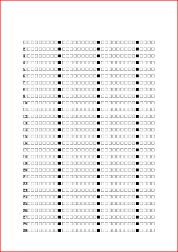
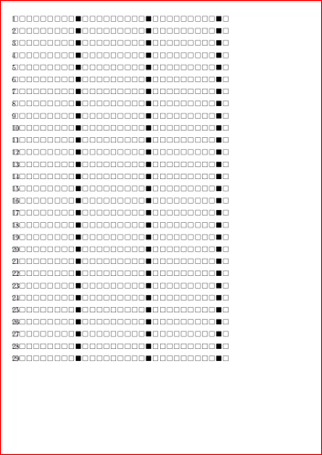
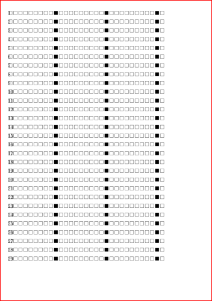
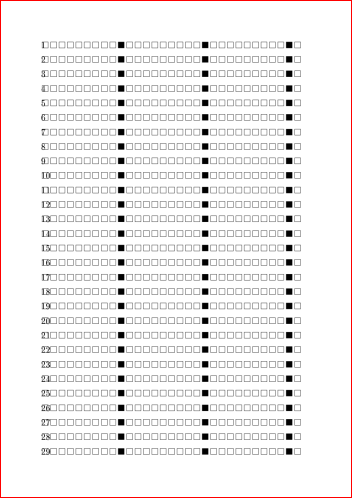
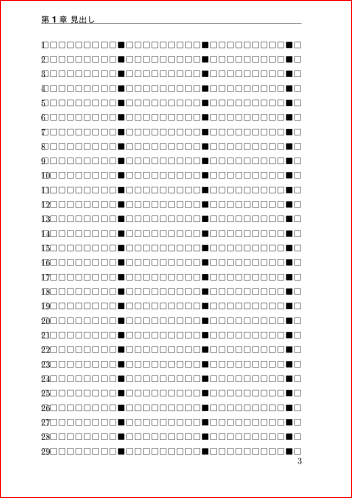
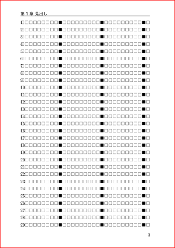
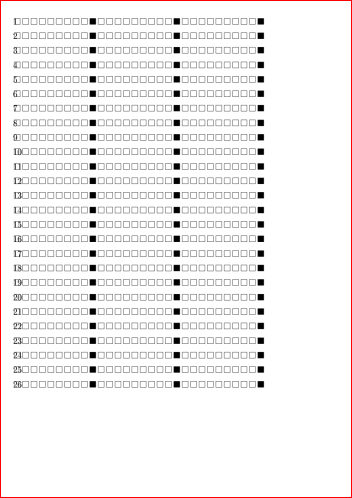
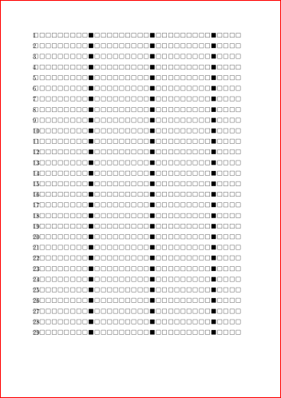
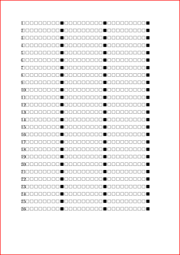

2018/12/24 by @kmuto

# review-jsbook.cls の基本版面設計

Re:VIEW 3 で導入した review-jsbook.cls クラスでの版面設計の算出方法を紹介します。

----

[Re:VIEW 3 からの LaTeX 処理](review3-latex.html) の「基本版面設計」で言及したとおり、新しく導入された review-jsbook.cls クラスでは、パラメータで本文領域である版面を設計できます。デフォルトでは jsbook そのままの余白が広い紙面となっているため、これを変えたいというときには版面設計が必要になります。

## 版面設計の考え方

版面設計の基本的な考え方はいくつかあります。

ページあたりの文字数が重要であれば、次のようになるでしょう（プランA）。

1. 1行あたりの文字数と行数を任意に決める（行あたりの文字数×行数で1ページあたりの文字数が求められる）。
2. 本文文字サイズと行送り（行のベースラインとベースラインの間隔）を任意に決める。
3. 上記から求められる長方形の版面を紙面内のどこに配置するかを、天およびノドからの相対位置で任意に決める。
4. ヘッダ領域やフッタ領域を任意に決める。

本文の文字サイズから決めるのであれば、次のとおりです（プランB）。

1. 本文文字サイズと行送り（行のベースラインとベースラインの間隔）を任意に決める。
2. 1行あたりの文字数と行数を任意に決める。
3. 長方形の版面を紙面内のどこに配置するかを、天およびノドからの相対位置で任意に決める。
4. ヘッダ領域やフッタ領域を任意に決める。

余白から決めていきたいなら、少々ややこしいですが次のようになります（プランC）。

1. 天・ノド・地・小口を任意に決める。
2. 本文文字サイズと行送り（行のベースラインとベースラインの間隔）を任意に決める。
3. 仕上がり紙面サイズ・文字サイズ・行送り・天・ノド・地・小口から、1行あたりの文字数と行数の近似値を算出する。
4. ヘッダ領域やフッタ領域を任意に決める。

版面の位置および余白をどの程度にするのが妥当かというだけでもデザイン論議になるほどの内容であるため、ここでは行送りや余白の値の妥当さについては考えないことにしています。いろいろな本を見てみて、気に入ったものがあればそのサイズを計測して真似してみるところから始めるのがよいでしょう。

## Re:VIEW での版面設計の設定
ではそれぞれのプランに基づいた Re:VIEW での設定手順を考えます。ここでは紙面は A5（`paper=a5`）を使うことにします。何も指定をしていない状態では、次のような版面になっています。



プランA〜Cのそれぞれのアプローチを進めてみましょう（あえて結果は同じにしています）。

とその前に、Re:VIEW 3.0 の review-jsbook.cls には jsbook.cls 固有の理由で行数計算が1行不足してしまいます。sty/review-jsbook.cls の334行を以下のように変更してください（3.1 で修正予定です）。

```
  \addtolength\textheight{1H}
    ↓
  \addtolength\textheight{\dimexpr\topskip-\Cht}%%adjustment for jsbook.cls's \topskip
```

- [#1237](https://github.com/kmuto/review/pull/1237/commits/44e13cb83a032a63c26cab9e9c9eb27344d4f879)

### ページあたりの文字数から設計（プランA）

最初に、ページあたりおよそ900文字を収めたいと考えました。

ただ、実際には行あたり文字数×行数を考えると、うまい具合にバランスのよい長方形ができて900に近いという値を求めるには少々経験が必要になります。Web などでサンプルを見ながら考えると、「行あたり31文字×29行」だと899文字、許容範囲になりそうです。

指定すべきこのパラメータとしては `line_length=31zw,number_of_lines=29` となります。zw はいわゆる全角幅で、日本語での文字数を考えるのに便利なのでここではこの単位を使っています。



次に紙面で許容される範囲の文字サイズと行送りを考えます。標準は文字サイズ 10pt・行送り16pt ですが、少し大きくして文字サイズ 11pt、行送り 17.5pt（`fontsize=11pt,baselineskip=17.5pt`）としてみます。



（実はこの「文字サイズ」には暗部があります。詳しくはプランCで説明します。）

版面ができたので、紙面のどこに置くかを考えます。中心合わせとさして変わりませんが、天15mm、ノド17mmとしてみました（`head_space=15mm,gutter=17mm`）。



ヘッダ領域に柱、フッタ領域にノンブル（ページ番号）も置いてみました。



版面を調整した結果、版面とノンブルとの間が狭く感じられます。逆に柱はページの上に置かれすぎているようにも感じます。ヘッダ下部と版面上部の間を2mm、フッタ上部と版面下部の間を7mmに設定してみます（`headsep=2mm,footskip=7mm`）。



完成です！ config.yml のパラメータは次のようになります（印刷物用には `media=print` としてください）。

```
texdocumentclass: ["review-jsbook", "media=ebook,paper=a5,line_length=31zw,number_of_lines=29,fontsize=11pt,baselineskip=17.5pt,head_space=15mm,gutter=17mm,headsep=2mm,footskip=7mm"]
```

### 本文の文字サイズから設計（プランB）

標準は文字サイズ 10pt・行送り16pt ですが、少し大きくして文字サイズ 11pt、行送り 17.5pt（`fontsize=11pt,baselineskip=17.5pt`）とすることにしました。



デフォルトよりもう少し広げて、行あたり31文字×29行にします（`line_length=31zw,number_of_lines=29`）。


紙面のどこに置くかを考えます。天15mm、ノド17mmとします（`head_space=15mm,gutter=17mm`）。


これでプランAと同様になったので、同じようにヘッダとフッタの間隔を調整します（`headsep=2mm,footskip=7mm`）。


config.yml のパラメータは次のようになります（印刷物用には `media=print` としてください）。実際にはパラメータの順序は問わないので、プランAのように書いても同じことです。

```
texdocumentclass: ["review-jsbook", "media=ebook,paper=a5,fontsize=11pt,baselineskip=17.5pt,line_length=31zw,number_of_lines=29,head_space=15mm,gutter=17mm,headsep=2mm,footskip=7mm"]
```

### 余白から設計（プランC）

ここまできたら、プランCもおおよそ予測がつくのではないでしょうか。

版面の天を15mm、ノドを17mmとし、地は17mm、小口は21mm程度にしたいとします。地と小口は厳密にその値になるとは限りません。今パラメータとして指定できるのは天とノドだけです（`head_space=15mm,gutter=17mm`）。



文字サイズ 11pt、行送り 17.5pt（`fontsize=11pt,baselineskip=17.5pt`）とすることにしました。



1行あたりの文字数と行数を近似値で算出します。横書きなので、次のように計算します。

- 1行あたりの文字数＝（（仕上がり紙面横幅）−（ノド）−（小口））÷（文字サイズ）＝（（148mm）-（17mm）−（21mm））÷（11pt×0.962216×0.961≒10.17pt＝3.56967mm）≒30.815文字
- 行数＝（（仕上がり紙面縦幅）−（天）−（地））÷（行送り）＝（（210mm）−（15mm）−（17mm））÷（17.5pt＝6.1425mm）≒28.978行

よって、おおむね1行あたり31文字、29行にするとよさそうです（`line_length=31zw,number_of_lines=29`）。


さて、「文字サイズ」には暗部がある、と先述したとおり、文字サイズの式が異様ですね。実は 11pt と指定したつもりでも、一般的なDTPソフトウェアで作る 11pt とは違うのです。

- 0.962216という謎の係数その1は、和文文字に掛けられる縮小です。11ptと指定したのはあくまでも欧文文字の値であり、和欧間でバランスよくなるように和文文字（私たちがここで文字数と考えたいもの）には縮小がかけられます。よって、和文のほうは11ptではなく、約10.584376ptになります。
- さらに続く0.961という謎の係数その2は、jsbook で和文文字に掛けられる縮小です（これもバランスが理由です）。上記の係数その1にさらに加えて縮小されます。よって、11ptと指定しましたが、和文文字（文字数として考えたいもの！）は約10.17ptになります。
- また、TeXのpt値は、DTPで一般的な「1pt＝72分の1インチ、0.353mm」ではなく、英米ポイントの「1pt＝72.27分の1、0.351mm」です。ややこしい。よって、もともと通常のDTPソフトよりもわずかに小さくなります。

最後の pt 値の違い以外は、TeX というよりも jsbook クラス側の設計によるものであることに注意してください。たとえば jlreq / review-jlreq クラスの場合、和欧のデフォルトの比率は1になっています。

jsbook クラスで作成した従来のデータとの互換性を考え、ややこしいことはやむを得ないとして review-jsbook クラスでも jsbook のこの単位系をそのまま使っています（より厳密にはそのまま jsbook クラスに任せています）。

ヘッダとフッタの間隔を調整し（`headsep=2mm,footskip=7mm`）、完成です。


config.yml のパラメータは次のようになります。

```
texdocumentclass: ["review-jsbook", "media=ebook,paper=a5,head_space=15mm,gutter=17mm,fontsize=11pt,baselineskip=17.5pt,line_length=31zw,number_of_lines=29,headsep=2mm,footskip=7mm"]
```

このように、プランA〜Cは異なるアプローチをとりましたが、いずれも最後は同じパラメータとなりました。
