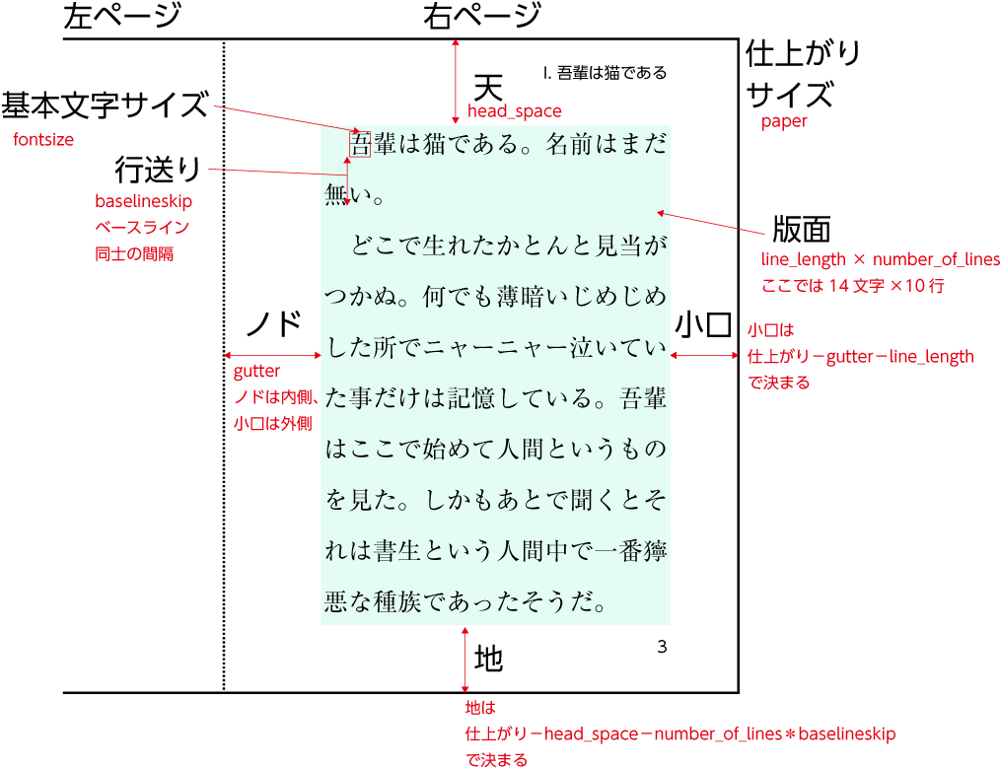

2018/11/17 by @kmuto

# Re:VIEW 3 からの LaTeX 処理

Re:VIEW 3 で最も大きく変更した LaTeX まわりの処理について解説します。

----

Re:VIEW は定期的に機能向上のためのリリースを続けてきましたが、2018年11月にリリースした★メジャーバージョン改訂となる Re:VIEW 3 では、特に LaTeX の対応について大きな変更を加えました。

同人誌の制作などで Re:VIEW が採用されることが増えてきたものの、印刷仕様を無視してそのまま印刷所に出してしまってトラブルになっていたり、場当たりの対策が一部に広まってしまったりなど、憂慮する事態を見聞きするようになっています。「目的のために十分な背景知識のある人が書き換えて利用する」という Re:VIEW ユーザーの当初の想定から、より一般化されて特に手軽な印刷入稿データ制作ツールとして普及している状況を鑑み、Re:VIEW+LaTeX で制作される PDF のデフォルトの設定を「印刷入稿に（おおむね）安全」となるように改訂しています。

- 安全な入稿方法については、[生成した PDF の印刷所入稿](../printing/submit.html) もご覧ください。

## 過去との互換性

大きく変えるとはいえ、商業印刷用途に使うことも前提としている Re:VIEW では、過去との互換性を壊すことについては慎重に考えています。

config.yml パラメータの `review_version` が `2` （Re:VIEW 2 のプロジェクト）のときには、バージョン2のモードとして動作するようにし、できるだけ生成結果がこれまでと変わらないようにしています。

ですので、バージョン2モードでは、以下の内容のほとんどは当てはまりません。

バージョン2→バージョン3の更新は、`review-update` コマンドで実施できます。重要なプロジェクトの場合は慎重に更新し、生成結果に不都合な差異が発生していないか、再調整が必要かどうかを確認しましょう。

## review-jsbook クラスファイルの導入

Re:VIEW 3 では、@munepixyz さんの尽力により、従来使われていた素の jsbook クラスファイルに代わり、それを機能拡張する review-jsbook クラスを導入しました。

config.yml でのデフォルトの設定は次のとおりです。

```
texdocumentclass: ["review-jsbook", "media=print,paper=a5"]
```

設定のほとんどは、TeX マクロを書かずとも `"media=print,paper=a5"` のところを調整するだけで済みます。たとえば電子配布用の PDF を作りたいなら次のようにします。

```
texdocumentclass: ["review-jsbook", "media=ebook,paper=a5"]
```

jsbook を使っていた既存のプロジェクトは、パラメータを含め、`review-update` コマンドで review-jsbook に移行できます。

### メディア指定
`media=<メディア>` で出力形式を指定します。

`print`（デフォルト）の場合は印刷用の出力になります。「デジタルトンボ・トンボあり」「表紙なし」「ハイパーリンクなし」「隠しノンブル指定の場合は隠しノンブル配置」

`ebook` の場合は電子配布用の出力になります。「デジタルトンボ・トンボなし」「表紙あり」「ハイパーリンクあり」「隠しノンブルなし」

### 紙サイズ指定
`paper=<紙サイズ>` で仕上がりの紙サイズを指定します。一般的な同人誌制作であれば `a5` または `b5` になるでしょう。規定しているサイズは a3〜a6、b4〜b6（JIS 寸法）、a4var、b5var、letter、legal、executive です（そのまま jsbook に渡されます）。

変形判を使いたいときには、`paperwidth=<横幅>,paperheight=<縦幅>` を指定します（`paperwidth=182mm,paperheight=235mm` など）。ただし、`paperwidth` と `paperheight` を使った場合には、jsbook の自動設計に委ねられないため、版面設計オプションも必要です。

### トンボ指定
`media=print` のときには、印刷のために、トンボおよびデジタルトンボが配置されます（gentombow.sty によって処理されます）。

トンボのオプションは2つあります。

- `tombopaper=<紙サイズ>`（デフォルトはひとまわり大きな定型）
-  塗り足し幅 `bleed_margin=<幅>`（デフォルトは 3mm）

紙サイズはデフォルトで `paper` 指定の紙サイズのひとまわり大きな定型サイズが選定されます。任意で、a0〜a10、b0〜b10（JIS 寸法）、c0〜c10、a4var、b5var、letter、executiveも指定できます。

トンボについて詳しくは、[jsbook ベースのドキュメントにトンボおよびデジタルトンボを配置する](tex-tombow.html) を参照してください。

### 基本版面設計
デフォルトでは版面（本文領域）の設計は jsbook に委ねられますが、jsbook の見た目を変えたいという声はよく見聞きします。一般的な書籍紙面のデザイン手法と同じやり方で、版面設計をパラメータ指定できます。省略したパラメータの扱いは jsbook に委ねられます。

- `fontsize=<文字サイズ>` - 基本の本文の文字サイズ（デフォルトは 10pt）
- `baselineskip=<行送り>` - 基本の本文の行送り
- `line_length=<字詰>` - 基本の本文の1行あたりの文字数
- `number_of_lines=<行数>` - 基本の本文のページあたりの行数
- `head_space=<天>` - 仕上がり上から版面までの幅
- `gutter=<ノド>` - 仕上がり綴じ側から版面までの幅



`fontsize` の文字サイズは pt、Q、mm といった単位付きで指定できます。ただし、jsbook の挙動に合わせるため、8pt, 9pt, 10pt, 11pt, 12pt, 14pt, 17pt, 20pt, 21pt, 25pt, 30pt, 36pt, 43pt のいずれか近いサイズに丸められます（丸めが望ましくなければ、本文や見出しのサイズを review-custom.sty にマクロで指定する必要があります）。

`line_length` の字詰には単位が必要です。一般的な全角文字の文字数で表すなら、`35zw`（35文字ぶん）のように指定します。

どのように設計するかは、センスと経験が必要です。特に行間や天・地・ノド・小口の余白をあまり狭くすると、読みづらいものになりがちです。

その他、次のようなオプションパラメータもあります。

- `linegap=<幅>` - `baselineskip` の代わりに、基本の本文の文字サイズに指定の幅を加算したものを行送りとする
- `headheight=<幅>` - ヘッダ部の高さ
- `headsep=<幅>` - ヘッダの下端と版面上端の間隔
- `footskip=<幅>` - 版面下端とフッタ下端の間隔

### ページ番号に関する調整

ページ番号の付け方には同人誌固有の状況があるため、調整のためのパラメータを設けました。

`startpage=<ページ番号>` で大扉からの開始ページ番号を指定できます（デフォルトは1）。たとえば 3（iii）ページからにしたければ、`startpage=3` とします。

大扉からアラビア数字にしなければいけないという指定がある場合は、`serial_pagination=true` を指定します。これで、大扉がアラビア数字1（`startpage` で数値は変更可能）となり、書籍の最後までアラビア数字で通します。

さらに、同人誌印刷所によっては「隠しノンブル」を要求されることがあります。これは、製本確認のために、全面画像や白ページであっても通しのページ番号をノドなどに小さく隠して入れることを意味します。`hiddenfolio` パラメータで隠しノンブルの設置の有無を指定できます。なお、`hiddenfolio` パラメータは `media=ebook` のときには無視されます。

`hiddenfolio` パラメータの値は印刷所名のプリセットとして用意しています。塗り足しの調整も含めています。

- `hiddenfolio=default` - ノド上部（トンボの外）にページ番号を小さく配置
- `hiddenfolio=nikko-pc` - ノド中央にページ番号を小さく配置
- `hiddenfolio=marusho-ink` - 塗り足し5mm、ほかは日光企画に同じ
- `hiddenfolio=shippo` - ねこのしっぽ社用。設定は日光企画に同じ


これ以外のものが必要であれば、review-jsbook.cls を参照し、`\@namedef{@makehiddenfolio@…}` といった箇所を見て、review-custom.sty にコピーして書き換えるとよいでしょう。

隠しノンブルのページ番号はアラビア数字で通す必要があるのが普通と思われるため、`hiddenfolio` を使うときには、`serial_pagination=true` も一緒に指定する必要があるでしょう。

### 表紙
印刷入稿のときには、表紙は背や裏表紙を含めたファイルとして、本文とは別に入稿するのが一般的です。そのため、`media=print` のときには表紙を付けないようにしています。表紙込みでの入稿 PDF を作成したいときには、`cover=true` を指定します。

```
texdocumentclass: ["review-jsbook", "media=print,paper=a5,cover=true"]
```

現実にあるかどうかはともかく、同様に電子版で表紙なしにしたいときには次のようにします。
```
texdocumentclass: ["review-jsbook", "media=ebook,paper=a5,cover=false"]
```

従来の Re:VIEW では、表紙に画像を指定している場合、その画像を紙面に合わせて拡縮していました。しかし、この方法では、「フチなしで仕上げるために、トンボ付きのときに塗り足し領域まで含めて配置する」といったページ全面を使うときの印刷の常道を利用できません。

そのため、Re:VIEW 3 では指定画像は原寸と見なし、そのまま中央合わせで貼り付けます。


既存の画像が原寸でない場合は、大きくはみ出してしまったり、あるいは小さくなってしまったりすることがあるため、適宜調整が必要です。

EPUB と TeX PDF で表紙画像を分けたいときには、config.yml で個別に指定できます。

```
coverimage: EPUB用の画像
 ...
pdfmaker:
  coverimage: TeX PDF用の画像
```

### 便利マクロ
いくつかの便利マクロも review-jsbook で提供しています。

表紙の中央配置でも使用しているのが、`\includefullpagegraphics` マクロです。

```
\includefullpagegraphics[オプション]{images/画像ファイル}
```

オプションは LaTeX の graphicx パッケージの `\includegraphics` と同じです。該当ページを白ページにして、中央合わせで全面に貼り付けます。挿絵などで利用するとよいでしょう。

```
#@# 挿絵を配置
//embed[latex]{
\includefullpagegraphics{images/sasie.pdf}
//}
```

印刷仕様に合わせた塗り足し付きの PDF を指定するのが最も妥当です。Illustrator AI ファイルも指定できますが、PDF 互換機能を有効にしたものであること、隠しレイヤーを使っていないことという条件が付きます。

ページを合わせるための空のページを作るマクロを用意しています。

- `\oneblankpage` - 指定箇所で改ページし、白ページを1つ作って改ページする
- `\clearoddpage` - 次のページが偶数ページになるように、必要なら改ページする（次のページが奇数ページになるようにするのは `\cleardoublepage`）

`//tsize` で表の幅を明記する際に、セルの段落表現として既存の p（左寄せ・均等配置あり）のほかに L（左寄せ・均等配置なし）、C（中央寄せ）、R（右寄せ）を使えます。

```
//tsize[|latex||p{25mm}|L{25mm}|C{20mm}|R{15mm}|]
//table{
普通の左寄せ・均等あり   左寄せ・均等なし   中央寄せ    右寄せ
//}
```

## review-jlreq クラスファイルの導入

review-jlreq.cls は、[日本語組版処理の要件](https://www.w3.org/TR/jlreq/ja/) の仕様に基づくクラスファイル [jlreq.cls](https://github.com/abenori/jlreq) を Re:VIEW 向けに拡張したものです。

`review-init --latex-template=review-jlreq プロジェクト名` とすると review-jlreq クラスを使用するプロジェクトが用意されます。

前述の review-jsbook のドキュメントクラスオプションはほぼ同じものが利用できます。

元となる jlreq.cls 自体がまだ開発段階であることやフォント設定等も必要なことから、review-jsbook と異なり、jlreq.cls はセットではインストールされません。別途 jlreq クラスファイルの [GitHub](https://github.com/abenori/jlreq) から展開する（2018年11月時点では abenori_dev ブランチ推奨）などしてインストールする必要があります。

「開発段階」と書いたように、jlreq.cls および review-jlreq.cls は review-jsbook ほどの完成度はありません。LuaLaTeX 対応や紙面表現のカスタマイズ性など、jlreq.cls が jsbook に優れる点は多くあります。ただ、現時点では使用にあたっては TeX の十分な知識が必要であり、また「日本語組版処理の要件の実装」という性質上、要件から外れるような機能は対応されない（review-jlreq 側で対応できそうなものであれば可能性はありますが）ことに注意が必要です。

## レイアウトファイルのマクロ化

従来の `layout.tex.erb` は、Ruby の埋め込みコード、Re:VIEW マクロと TeX マクロの紐付け、装飾、TeX コンパイラやスタイルの分岐など、あらゆるものが混在していました。内容を書き換えるのはわかりづらく、LuaLaTeX などのほかのモダンなコンパイラに変えたりするのも大きな苦難となります。

Re:VIEW 3 の layout.tex.erb は全面的に書き換えられました。Ruby の埋め込みコードが利用できることに変わりはありませんが、ほとんどの設定は TeX のマクロで表現されるようになります。そのため、TeX の知識は必要となるものの、値の判定・分岐や、後からの書き換えなどは以前よりもずっと容易です。

また、書籍におけるいくつかの文書構造の段階で割り込める「フック」のマクロも準備しており、ユーザーが任意に定義して挙動を調整できるようになっています。

layout.tex.erb の Ruby の埋め込みコード部分はプリアンブルの以下の箇所だけとなりました。

```
\documentclass[<%= @documentclassoption %>]{<%= @documentclass %>}
<%= latex_config %>
<%- if @config['texstyle'] -%>
<%-   [@config['texstyle']].flatten.each do |x| -%>
\usepackage{<%= x %>}
<%-   end -%>
<%- end -%>

\begin{document}
```

`latex_config` は、config.yml の内容を TeX マクロに変換する Re:VIEW の内部メソッドです。変換ルールは Re:VIEW の `templates/latex/config.erb` に記述されていますが、config.yml のうち TeX やメタ情報に関する設定内容を `\review@〜` という名前のマクロで定義しています（通常は単純な文字列です）。

`\begin{document}` から書籍内容を構成するマクロ呼び出しが始まります。マクロは次の順序で（定義されていれば）呼ばれていきますが、実際の内容は sty/review-base.sty に定義されています。

1. `\reviewbegindocumenthook` - 文書開始直後に実行するフック。デフォルトは空
2. `\reviewcoverpagecont` - 表紙の配置処理
3. `\reviewfrontmatterhook` - 前付直前のフック。デフォルトは章番号の消去と `\frontmatter` の呼び出し
4. `\reviewtitlepagecont` - 大扉の配置処理
5. `\revieworiginaltitlepagecont` - 原書大扉の配置処理
6. `\reviewcreditfilecont` - 権利表記の配置処理
7. `\reviewprefacefiles` - 前付（PREDEF）の TeX ファイル呼び出し
8. `\reviewtableofcontents` - 目次の配置処理
9. `\reviewmainmatterhook` - 本文直前のフック。デフォルトは章番号の装飾と `\mainmatter` の呼び出し
10. `\reviewchapterfiles` - 本文（CHAPS）の TeX ファイル呼び出し
11. `\reviewappendixhook` - 付録直前のフック。デフォルトは章番号の付録化と `\reviewappendix`（実体は `\appendix`）の呼び出し
12. `\reviewappendixfiles` - 付録（APPENDIX）の TeX ファイル呼び出し
13. `\reviewbackmatterhook` - 後付直前のフック。デフォルトは `\backmatter` の呼び出し
14. `\reviewpostdeffules` - 後付（POSTDEF）の TeX ファイル呼び出し
15. `\reviewprintindex` - 索引の配置処理
16. `\reviewadvfilepagecont` - 広告ページの配置処理
17. `\reviewcolophonpagecont` - 奥付の配置処理
18. `\reviewbackcovercont` - 裏表紙の配置処理
19. `\reviewenddocumenthook` - 文書終了直前に実行するフック。デフォルトは空

なお、プロジェクトの layouts フォルダに layout.tex.erb を置けば任意に書き換えられることに変わりはありません。TeX の挙動に悩んでしまうようであれば、埋め込み Ruby コード側で処理するようにしてもよいでしょう。

## クラスファイルやスタイルファイルをプロジェクトにコピー

上記のマクロ化とあわせ、Re:VIEW バージョンが変わったときに生成結果が変わるということを防ぐため、Re:VIEW のクラスファイルやスタイルファイルはプロジェクトの sty フォルダにコピーするようにしました。

新しい Re:VIEW バージョンがリリースされ、望んでその更新に追従したいときには、プロジェクト内で `review-update` コマンドを実行すれば最新のものに更新されます。

`review-init` コマンド実行時にプロジェクトの sty フォルダには次のようなファイルが作成されます。

- クラスファイル（`*.cls`。review-jsbook.cls や jsbook.cls など）
- 支援スタイルファイル（gentombow.sty, istings.sty, jumoline.sty など）
- reviewmacro.sty - 下記3ファイルを束ねるスタイルファイル
- review-base.sty - Re:VIEW 固有マクロと TeX マクロとを結び付ける定義
- review-style.sty - 主に見た目の設定
- review-custom.sty - ユーザーが任意にマクロの定義などをする場所

どのファイルを書き換えても構いませんが、`review-update` コマンドで上書きされることがあるため、一般にはその対象外となる review-custom.sty で既存のマクロの置き換えなどをするのがよいでしょう（`\renewcommand`, `\renewenvironment`, `\def` などを使用）。

## その他の LaTeX まわりの改良
### 一時生成ファイル名を変更

これまでレイアウトファイル `layout.tex.erb` をもとに一時生成ファイルは `book.tex` という名前にしていたのですが、これだとプロジェクトに `book.re` というファイルがあると失敗するという恥ずかしい不具合がありました。

そのため、`__REVIEW_BOOK__.tex` という新たな名前に置き換えています。フックなどで `book.tex` を書き換えていた場合には変更が必要です。

なお、`__REVIEW_BOOK__.re` というファイル名を使われるとまた同じ問題が発生しますが、良い子は真似をしないはずです！

### コマンド名とコマンドオプションを明確に分離
Windows 環境などのために、config.yml における外部コマンド指定の `texcommand`, `dvicommand`, `makeindex_command` パラメータに空白文字を許容するようにしています。

この影響で、これらのパラメータ内にコマンドオプションも入れてしまうという横着はできなくなりました。`texoptions`, `dvioptions`, `makeindex_options` に正しく設定する必要があります。

### @<m> 前後のスペースを除去
`@<m>` で数式の前後にスペースを入れていたのを止めました。スペースを入れなくても文字間のグルー（空き）は TeX が適切に判断しますし、スペースを入れてしまうと前後が句読点だったときに奇妙な空きができてしまいます。

なお、まだあまり知られていないようなのですが、Re:VIEW バージョン 2.4 から導入済みの `@<m>$〜$` または `@<m>|〜|` という記法で、`〜` 内で `}` をエスケープせずにリテラルに利用できます。つまり、`@<m>{\frac{1\}{2\}}` とせずに `@<m>$\frac{1}{2}$` という書き方ができます。`@<m>` に限らず任意のインライン命令でこの記法は利用可能です。

### 正常動作時のログメッセージの非表示
従来のバージョンでは PDFMaker 実行時にどばっと TeX コンパイラからのコンパイルログが出ていましたが、正常動作時にはログを出さないようにしました。

また、エラーが起きたときにそこで止まってユーザーの判断を待つのではなく（プロンプトを出したところで解決はできず意味がない）、そのまま終了にするモードをデフォルト設定としました。

エラーのときにはログが出ますが、このログから原因がいまいちわかりにくいというのは LaTeX の仕様もあり、Re:VIEW 側ではどうにもならないところではあります。PDFMaker の `--debug` フラグまたは config.yml の `debug: true` でデバッグモードにして、保持される一時フォルダ（`book-pdf` など）の中身を追う必要があるかもしれません。

### インライン装飾の抽象化
たとえば `@<b>` から `\textbf` のように直接に LaTeX の装飾表現マクロに変換するのではなく、`@<b>` を `\reviewbold` とし、`\reviewbold` と `\textbf` のデフォルトの紐付けは sty/review-base.sty で行うようにしました。装飾表現は、以下の抽象化されたマクロ名となります。

- `\reviewkw`, `\reviewami`, `\reviewem`, `\reviewstrong`, `\reviewballoon`, `\reviewunderline`, `\reviewit`, `\reviewbold`, `\reviewcode`, `\reviewtt`, `\reviewtti`, `\reviewttb`

sty/review-custom.sty で `\renewcommand` を使って任意のものに置き換えることができます。

### コードリストの変更
`//emlist` や `//list` などから変換されるコード類を、`\begin{reviewlistblock}` 〜 `\end{reviewlistblock}` 環境で囲むようにしました。任意の前後空きの調整に使うことを想定していますが、デフォルトのスタイルではこの環境自体は何もしません。

また、コードハイライタとして入手やライセンスが不明瞭だった jlistings ではなく、plistings パッケージを採用しています。

### 表紙と大扉の設定の分離
config.yml には `cover`（表紙）と `titlepage`（大扉）のパラメータがありますが、従来のバージョンでは独立しておらず、`titlepage` を null にすると表紙も出なくなる、という問題がありました。

従来バージョンと非互換の変更ではありますが、普通に考えるとこの仕様のほうが妥当でしょう。

### note などの囲み要素の個別環境化

`//note` や `//caution` などに対し、従来はすべて `reviewminicolumn` という環境マクロに割り当てていましたが、個別の環境を用意してそれらに割り当てるようになりました。

- `reviewnote`, `reviewmemo`, `reviewtip`, `reviewinfo`, `reviewwarning`, `reviewimportant`, `reviewcaution`, `reviewnotice`

ただし、sty/review-base.sty のデフォルトでは、いずれも `reviewminicolumn` を使うだけの設定になっています。必要に応じて固有の内容に置き換える必要があります。

### ハイパーリンク有効時の装飾

ドキュメントクラスファイルオプションで `media=ebook` としたときには相互参照やURLインクなどがハイパーリンク化されますが、従来はデフォルトで色囲み付きになっていました。

Re:VIEW 3 ではデフォルトで一切の装飾なしにしています。これは sty/review-style.sty の以下の設定に基づきます。

```
\hypersetup{hidelinks}
```

必要なら sty/review-custom.sty で再度 `\hypersetup` を使って変更も可能です。

### dvi ウェア実行のスキップ対応

review-jsbook, review-jlreq ともに現時点では upLaTeX コンパイラの使用を前提としています。しかし、レイアウトファイルの項でも述べたとおり、（クラスファイルやスタイルファイルなども変更する前提ですが）ユーザーの判断で LuaLaTeX などの別のコンパイラを使用可能にすることは Re:VIEW 3 で対応したい機能の1つでした。

upLaTeX では PDF を生成するのに dvi ウェア（通常 dvipdfmx）を必要としますが、LuaLaTeX のように PDF を自前で生成できる場合には、`dvicommand: null` とすれば dvi ウェアの呼び出しをスキップできるようにしました。

Re:VIEW が内包する TeX のコンパイル〜PDF 生成の外部コマンド呼び出し実装はあまり満足のいくものではないため、今後は [llmk](https://github.com/wtsnjp/llmk) などのルールベースの外部ツールに委ねていく可能性があります。

### 図表の配置指定

`//image` や `//table` で作成される図表をその場に置くのかフロートで移動するのを許容するのかを変更するのに、従来は review-ext.rb で挙動を書き換える必要がありましたが、`\floatplacement` マクロで定義できるようにしました。デフォルトは sty/review-style.sty で以下のように設定しています。

```
\floatplacement{figure}{H}
\floatplacement{table}{htp}
```

- [図表のフロートを制御する](control-flow.html)

### 式キャプションと参照

`//texequation` に `//texequation[ID][キャプション]{ 〜 //}` の記法を追加しました。ID とキャプションを指定すると、式番号が付き、「式1.1 キャプション」のように展開されます。参照するには `@<eq>{ID}` あるいは `@<eq>{章|ID}` です。

キャプション+式は `reviewequationblock` 環境で囲まれます。デフォルトはあまり綺麗な見た目とは言い難いので、適宜置き換えるとよいでしょう。

この式番号表現は、式の横に「(1)」のように入れる TeX の標準の式番号表現方法とは異なることに注意してください。TeX の式番号表現を使いたいときには、review-ext.rb で `//texequation` 命令を書き換えるか、あるいはそもそも TeX で原稿を作ることを検討しましょう。

### 部の中の見出し

従来は部の中で下位の見出しを許容していなかったため、下位見出しを使うとレベルにかかわらず新たな部見出しとなってしまっていました。Re:VIEW 3 では下位見出しを使ったときに「I.1」のようになるようにしました。

これは部の場合には内容を `reviewpart` 環境で囲むことで対処しています。

## おわりに

Re:VIEW 3 では、前提知識がなくても印刷入稿における最低限の安全を確保すべく改良をしました。実際の入稿においては印刷所の入稿仕様をよく読み込むなど、さらに注意が必要ですが、少しでも入稿事故が防がれ、良い本が作られればと思います。ご安全に！
