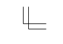
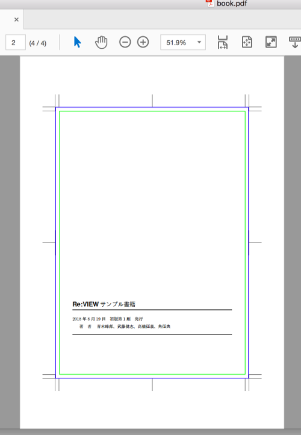

2018/8/20 by @kmuto

# jsbook ベースのドキュメントにトンボおよびデジタルトンボを配置する

jsbook クラス由来の PDF に正しいトンボを設定する方法を示します。

----

## ざっくり結論から

背景などどうでもいいのでともかく正しいデジタルトンボを入れる方法を示せ、というせっかちな方のために、jsbook ベースのレイアウトに以下の手順でデジタルトンボを配置できます。

1. プロジェクトの sty フォルダの `review-custom.sty`（Re:VIEW 3 以降）または `reviewmacro.sty`（Re:VIEW 2 以前）に、以下を追加します。

    ```
    \usepackage[pdfbox]{gentombow}
    ```

2. gentombow パッケージがすでに入っている環境であれば、これだけで正しいデジタルトンボが入ります。
3. 不幸にして `! LaTeX Error: File 'gentombow.sty' not found.` と返されてしまったら、以下のいずれかの方法でパッケージまたは sty ファイルをインストールします。

- 方法A：TeXLive 環境であれば、`tlmgr` コマンドを使い、`tlmgr install gentombow` を実行してインストールする。
- 方法B：[https://github.com/aminophen/gentombow](https://github.com/aminophen/gentombow) から `gentombow.sty` をダウンロードし、プロジェクトの sty フォルダにコピーする。

### jsbook の tombow オプションは？

jsbook クラスにも tombow オプションがありますが、これだけでは単に紙面に「トンボのような画像」を入れているにすぎません。正しいデジタルトンボを入れるには上記のように gentombow パッケージなどを使う必要があります。

## デジタルトンボとは

「デジタルトンボ」は DTP ソフトウェアなどの正式な用語ではないのですが、組版関係では一般に使われる俗語です。

印刷用の紙面には、以下の2つの矩形サイズが関わってきます。

- 実際の書籍の紙サイズ（仕上がりといいます）。A5 や B5 といったよく耳にするサイズです。商業刊行では B5 から縦などの一部を切り詰めた B5 変というサイズもあります（B5 変には明確な規定はなく、出版社によって任意です）。
- その周囲数 mm 外側の矩形（塗り足し領域、裁ち落とし、ドブなどといいます）。家庭用プリンタと異なり、印刷所では大きな紙に複数のページを印刷し、そこから仕上がりサイズに合わせて断裁します。印刷・断裁の精度にもよりますが、物理的な紙というものを相手にしている都合上、すべてのページが必ずミクロな単位で同じ位置になるとは限らず、若干のずれが生じることがあります（一般にオフセット印刷のほうが精度が高く、オンデマンド印刷のほうが低くなります）。この誤差を吸収するのが塗り足し領域で、いわゆる「ふちなし印刷」のようなことを実現するには、ふちなしにしたい対象をこの領域まで配置しておく必要があります。通常 3mm です。

人間向けにこの2つのサイズ情報を紙に表したのが、以下のマークです。



その形状から「トンボ」（英語では trim mark）と呼び、角の内側で判型、外側で塗り足し領域の範囲を示しています。形状が違ったり縦横の中央を表すセンタートンボが入ったりすることもありますが、人間用の位置見当情報であるということに変わりありません。

デジタルトンボは、このトンボの情報をデジタルデータとして PDF 内で表現したものです。印刷所の印刷処理においてこのデジタルトンボ情報が解釈されることで、入稿者・印刷所双方で紙面の置き方に齟齬が生じないようになります。

デジタルの紙面データ、つまり PDF の場合はもう1つ、ビューアで表示するときの領域もあります。よって、デジタルトンボは以下の3つの矩形情報で構成されます。

- TrimBox：仕上がり領域の矩形
- BleedBox：塗り足し領域の矩形
- MediaBox：ビューアでの表示、およびビューアから素朴に「印刷」を実行したときの用紙サイズとなる矩形。このほかに ArtBox というのもあるが通常は同一値

デジタルトンボは PDF のメタ情報として埋め込まれているものであり、gentombow パッケージで見える紙面上のトンボは単に人間向けの画像にすぎません。

デジタルトンボは Acrobat の表示設定で「アートサイズ、仕上がりサイズ、裁ち落としサイズを表示」を有効にすることで確認できます。



poppler ライブラリの `pdfinfo` コマンドで調べることもできます（単位は point なので、mm にするには 0.352778 を掛けます）。

```
$ pdfinfo -box book.pdf
Title:          Re:VIEWサンプル書籍
 …
Page size:      515.91 x 728.5 pts
Page rot:       0
MediaBox:           0.00     0.00   515.91   728.50
CropBox:            0.00     0.00   515.91   728.50
BleedBox:          39.68    58.11   476.22   670.39
TrimBox:           48.19    66.61   467.72   661.89
ArtBox:             0.00     0.00   515.91   728.50
File size:      147227 bytes
 …
```

## トンボのカスタマイズ

再び gentombow パッケージに戻ると、いくつかのオプションで設定をカスタマイズできます。

```
\usepackage[pdfbox]{gentombow}
```

最初から pdfbox オプションを示したとおり、このオプションはデジタルトンボを付けることを意味します。これがなければ単にトンボ画像を配置するのみでデジタルトンボ情報は埋め込まれません。よって、オプションといっても実際には必須の指定と言えます。

オプションは `,` で区切って複数指定できます。

以下の3つのオプションはいずれか1つを選びます。

- `tombow`：デフォルトに同じ。トンボおよびジョブ情報を出力する。
- `tombo`：トンボのみを出力し、ジョブ情報は出力しない。
- `mentuke`：トンボ・ジョブ情報ともに出力しない。

MediaBox のサイズはもともとの仕上がりサイズからひと回り大きな定型サイズが自動で選定されるようになっていますが、別のサイズを使いたいときには、上記の `tombow`、`tombo`、`mentuke` と組み合わせてサイズを指定します。

```
% ジョブ情報なしのトンボで、A4をMediaBoxとする
\usepackage[pdfbox,tombo-a4]{gentombow}
```

サイズは `a0` 〜 `a10`、`b0` 〜 `b10`（ISO ではなく JIS 寸法）、`c0` 〜 `c10`、`letter`、`executive`、`a4var`、`b5var` が用意されています。

塗り足しの幅はデフォルトで 3mm になっています。これを 5mm にする場合は以下のような設定マクロを加えます。

```
\settombowbleed{5mm}
```

塗り足しの幅を含め、印刷所によってそれぞれに規定があるので、入稿仕様は必ず確認しましょう。
