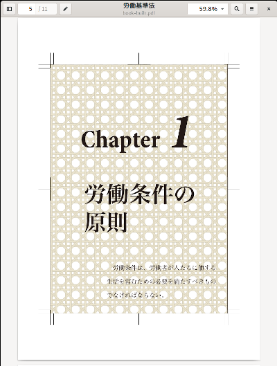

2021/9/30 by @kmuto

# 章扉を画像で差し替える

凝った章扉にしたいときに、TeX でがんばるのではなく、別途作成しておいた AI ファイルや PDF ファイルで差し替える方法を紹介します。

---

review-jsbook、review-jlreq はいずれもデフォルトの章の表現はシンプルで、商業書籍によくあるような1ページ独立のページ (章扉) にもなっていません。章扉にすること自体はさほど難しくはないのですが、それでも商業書籍のような凝った見た目の章扉にしようとTeXでがんばろうとすると、考えないといけないことが多すぎて挫折することになるでしょう。

このようなときには、WYSIWYG なツール、たとえば Illustrator や Photoshop などを使って PDF を作成し、それで差し替えるのが最も手軽です（ほかのツールでもよいのですが、ピクセル値ではなく実寸のmm単位を使って作成できる必要があります）。

- [奥付のデザインが気に入らないので、根本的に違うものにしたいです](https://review-knowledge-ja.readthedocs.io/ja/latest/faq/faq-tex.html#267fc6c93007b15ad7535688d7fbf422)

もちろん、TeX で全体 PDF を作ってから手動で差し替えることもできますが、ビルドのたびに差し替え作業をするのは手間ですよね。

## 実装

実装サンプルとして、[chaptobira](https://github.com/reviewml/reviewknowledge-ja/tree/master/codes/chaptobira) を用意しています。この中の book-built.pdf が実際にビルド済みの PDF なので、確認してみてください。



### 章扉ファイルの用意

章扉は、Illustrator で作成し、本文の1〜3章に合わせて images フォルダに chapter1.ai、chapter2.ai、chapter3.ai という3つを作りました。ここでは仕上がりサイズが A5 としたので、Illustrator で A5 用紙を選択し、印刷用に塗り足し 3mm も付けています。

ここで、見出しの文字列やリード文も ai ファイル内に直接入れています。このため、文字を修正したいときには re ファイルではなく Illustrator で ai ファイルを修正する必要があります。その代わりとして、TeX の制約に囚われることなく自由な表現ができます。

説明が後になりましたが、実際には取り込み時には Illustrator の ai ファイルのネイティブな情報ではなく、ai ファイル内の互換表示用 PDF 情報が使われています。おおむねこれで問題ないのですが、レイヤーで非表示にしていたものは無視して表示されるなどの現象があるので、そのような構成になっている場合は横着せずに pdf ファイルを書き出す必要があります。

Photoshop の場合は、psd ファイルは TeX ドライバ側が対応していないので、pdf ファイルで書き出す必要があります。

### クラスファイルの選択とマクロ設定

Re:VIEW には jsbook を基底とする review-jsbook と、jlreq を基底とする review-jlreq の2つのクラスがありますが、見出しの変更などカスタマイズをするには review-jlreq のほうがずっと容易です。本実装でも review-jlreq を採用しています。

もし手元で新規に review-jlreq を使ったプロジェクトを作りたいときは、`review-init --latex-template=review-jlreq プロジェクト名` のように指定してください。

次に、sty/review-custom.sty において、章表現マクロの `\chapter` を jlreq が用意している TobiraHeading 形式に変更します。TobiraHeading の中では format パラメータで紙面表現を設定するのですが、ここで章番号（`\thechapter`）に基づいて用意済みの章扉ファイルを紙面全体に貼り付けるようにします。

```
\RenewTobiraHeading{chapter}{0}{
  type = han,
  label_format={第\thechapter 章},
  format = { \ifnum \thechapter>0 \includefullpagegraphics{images/chapter\thechapter.ai} \else #2 \fi }
}
```

章扉が PDF ファイルであれば、format パラメータの `chapter\thechapter.ai` を  `chapter\thechapter.pdf` にするだけです。

ifnum は章番号が1以上であれば章扉ファイルを、そうでなければそのまま見出しを書き出すようにしていますが、あくまで念のためです（実際、そのまま見出しを書き出すだけでは困りますし）。

これで実際ビルドしてみると、章扉は確かに置き換えられます。が、目次タイトルが「そのまま書き出す」ことに気付くでしょう。現時点の jlreq では目次タイトルを `\chapter` で表現しているため、変更のあおりを受けてしまうのでした（ちなみに章番号は0です。ifnum 定義がなければファイルがないエラーになるところでした）。

この対策として、TobiraHeading に変える前の、もともとの chapter 表現内容をバックアップし、目次内ではそれをリストアして使うようにしておきます。

```
% \chapterを書き換える前に現在のをバックアップ
\SaveHeading{chapter}{\restoreoldchapter}

\RenewTobiraHeading{chapter}{0}{
 …
}

% 目次のchapterは昔のを使う
\let\orgtableofcontents\tableofcontents
\renewcommand{\tableofcontents}{\restoreoldchapter\orgtableofcontents}
```

### ビルド

ここまでできたら、以降はとり立てて変わることはありません。`rake pdf` で PDF が生成されます。当然ながら、用意している数以上に章が増えると、TeX のコンパイルエラー（画像が見つからない）になります。

## ヒント
- format パラメータには番号や見出し文字列も引数で渡されているので、章扉ファイルを使わない、あるいは章扉ファイルは背景だけにして、あとは TeX でがんばることも可能ではあります。`\textpos` を使って絶対位置指定する方法や、TikZ を利用する方法も考えられます。
- たとえばエピグラフを入れたいというとき、jlreq.cls の見出しは副題をサポート（`\chapter{見出し}[副題]`）していて format パラメータにも渡されるので、これを活用するのがよいかもしれません。Re:VIEW からこれにどう展開するかについては、review-ext.rb で headline メソッドを書き換えることになるでしょう。副題に入れるエピグラフ文字列群は review-ext.rb でついでに定義してしまうか、テキストファイルで用意しておいて読み込むことが考えられます。
