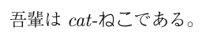

2018/11/18, 2022/3/29 by @kmuto

# 使用書体の変更（upLaTeX 編）

ここでは Re:VIEW+upLaTeX に限定して書体の変更方法を説明します。

----

書体を変えると独自性を出せますが、CSS や InDesign とは違い、TeX の書体変更はなかなか深遠……というよりも調べるほどによくわからなくなり、「そのままでいいか」となりがちです。

LuaTeX コンパイラで LuaLaTeX-ja 環境を使えば任意の TrueType/OpenType のフォントを利用できますが、一般に使われているテンプレートの review-jsbook は upLaTeX コンパイラ向けです。ここでは、upLaTeX で簡易にフォントを変更できる pxchfon パッケージを使います。

## 利用するフォントの準備

さて、フォントを差し替えるにあたっては、利用するフォントは「TeX のファイル管理システム」から見えている必要があります。OS やほかのアプリケーションでは見えている、だけではダメなことに注意してください。

`kpsewhich フォントファイル名`（たとえば `kpsewhich HiraMinPro-W3.otf`）で返ってこなかったら、そのフォントは TeX からまだ使えません。`kpsewhich -show-path="opentype fonts"` で表示されるパスのいずれかにフォントを移動・あるいはリンクした後、`mktexlsr` コマンドでファイルデータベースを更新します。

なお、フォントファイル名は英数字にしておくのが無難です。

- 当然ながらフォントの配布ライセンスは守る必要があります。
- 埋め込み禁止のフォントは使用できません。
- 等幅であることを前提としており、プロポーショナルフォントは利用できません。

## pxchfon パッケージの基本

pxchfon パッケージは、dvipdfmx の実行時に埋め込むべきフォントを設定することで、フォントを切り替えます。TeXLive には `kanji-config-updmap-sys` というデフォルトの埋め込み和文フォントを設定するツールがありますが、pxchfon パッケージは TeX ソース個別に設定できます。

なお、vvakame/review Docker イメージでは、デフォルトで「原の味」フォントを和文埋め込みフォントとしています。

### プリセットを使う

最も簡単なのは、`kanji-config-updmap-sys` と同等のプリセットを指定する方法です。フォントファイル名はプリセットの内容に合わせる必要があります。プリセットで想定しているファイル名の詳細は、`texdoc pxchfon` でドキュメントを参照してください。sty/review-custom.sty に次の書式で追加します。

```
\usepackage[プリセット名]{pxchfon}
```

- `haranoaji`:原の味フォント
- `ms-hg`：MS系フォント+HGフォント
- `ipa-hg`：IPAフォント+HGフォント
- `ipaex-hg`：IPAexフォント+HGフォント
- `moga-mobo`：Mogaフォント+Moboフォント
- `moga-mobo-ex`：MogaExフォント+MoboExフォント
- `moga-maruberi`：Mogaフォント+モトヤLマルベリ
- `ume`: 梅フォント
- `kozuka-pro`：小塚フォントPro
- `kozuka-pr6`：小塚フォントPr6
- `kozuka-pr6n`：小塚フォントPr6N
- `hiragino-pro`：ヒラギノ6書体Pro/Std+明朝W2
- `hiragino-pron`：ヒラギノ6書体ProN/StdN+明朝W2
- `hiragino-elcapitan-pro`：ヒラギノ（macOS El Capitan版）Pro/Std+明朝W2
- `hiragino-elcapitan-pron`：ヒラギノ（macOS El Capitan版）ProN/StdN+明朝W2
- `morisawa-pro`：モリサワ7書体Pro
- `morisawa-pr6n`：モリサワ7書体Pr6N
- `yu-win`：遊書体（Windows 8版）
- `yu-win10`：遊書体（Windows 10版）
- `yu-osx`：遊書体（macOS版）
- `sourcehan`：源ノ明朝+源ノ角ゴシック（otf）。TeXLive 2017 の dvipdmfx が必要
- `sourcehan-otc`：源ノ明朝+源ノ角ゴシック（otc）。TeXLive 2017 の dvipdmfx が必要
- `sourcehan-jp`：源ノ明朝+源ノ角ゴシック（JP otf）。TeXLive 2017 の dvipdmfx が必要
- `noto`：Noto（otf）。TeXLive 2017 の dvipdmfx が必要
- `noto-otc`：Noto（otc）。TeXLive 2017 の dvipdmfx が必要

### 個別に指定する

プリセットの代わりに、以下の書体について個別に設定することもできます。

- `\setminchofont`：明朝・デフォルト（`\mcfamily`）
- `\setlightminchofont`：明朝・細ウェイト（`\mcfamily\ltseries`）
- `\setmediumminchofont`：明朝・中ウェイト（`\mcfamily\mdseries`）
- `\setboldminchofont`：明朝・太ウェイト（`\mcfamily\bfseries`）
- `\setgothicfont`：ゴシック・通常ウェイト（`\gtfamily`）
- `\setmediumgothicfont`：ゴシック・中ウェイト（`\gtfamily\mdseries`）
- `\setboldgothicfont`：ゴシック・太ウェイト（`\gtfamily\bfseries`）
- `\setxboldgothicfont`：ゴシック・極太ウェイト（`\gtfamily\ebseries`）
- `\setmarugothicfont`：丸ゴシック（`\mgfamily`）

いずれも設定の記法は次のとおりです。

```
\set〜font{フォント名.otf}% 単一OpenTypeの場合
\set〜font{フォント名.ttf}% 単一TrueTypeの場合
\set〜font[番号]{フォント名.ttc}% TTC形式の場合はフォント番号
```

## Re:VIEW 側の設定

review-jsbook のデフォルトの文字装飾設定では、明朝・ゴシックのシンプルなものしか利用していません。本文に「明朝・通常ウェイト（`\setminchofont`）」、見出しや強調（`@<b>`）などには「ゴシック・通常ウェイト（`\setgothicfont`）」が使われます。

本文以外を調整するには、各装飾設定でファミリおよびウェイトを指定する必要があります。上記の `\set〜font` の列挙で「（`\gtfamily\bfseries`）」のように記載していたのがその指定です。

### @\<i\> に丸文字を割り当て

和文にはイタリックがかからないので、代わりにモリサワの「じゅん101」の丸文字を割り当ててみます。sty/review-custom.sty には次のように追加します。

```
\setmarugothicfont{A-OTF-Jun101Pro-Light.otf}
\renewcommand{\reviewit}[1]{\textit{\mgfamily #1}}
```



### 見出しのフォント変更

ゴシック・極太ウェイトにモリサワの UD 新ゴPr6N Heavy を割り当て、それを見出しで使うには、以下のようにします。

```
\setxboldgothicfont{A-OTF-UDShinGoPr6N-Heavy.otf}
\renewcommand{\headfont}{\sffamily\gtfamily\ebseries}
```


実際には欧文も変更しないと見た目に一貫性がありません。とはいえ、まじめに妥当な欧文書体を探して変更するのもいささか面倒です。

和文フォント内にある従属欧文を使うことはあまりお勧めされませんが、見出しに限るなら使ってもさほど違和感はないでしょう。pxchfon パッケージの読み込み時に `relfont` オプションを付けておき、従属欧文フォント使用前に `\userelfont` を使って使用宣言します。

```
\usepackage[relfont]{pxchfon}
 …
\setxboldgothicfont{A-OTF-UDShinGoPr6N-Heavy.otf}
\renewcommand{\headfont}{\userelfont\sffamily\gtfamily\ebseries}
```


## さらなる沼へ

さらに深みに挑みたい方向けに、いくつかのポインタを挙げておきます（以下にもあるとおり pxchfon パッケージ開発者 @zr_tex8r さんの[ブログ](http://d.hatena.ne.jp/zrbabbler/)は特に参考になります）。

- [TeXとフォント](https://texwiki.texjp.org/?TeXとフォント)
- [欧文フォントのインストール](http://d.hatena.ne.jp/eggtoothcroc/20110906/p1)
- [LaTeX に新しいフォントを持ち込む話](http://d.hatena.ne.jp/zrbabbler/20110911/1315737566)
- [dvipdfmx で OpenType する件について (1)](http://d.hatena.ne.jp/zrbabbler/20110926/1317041905)
