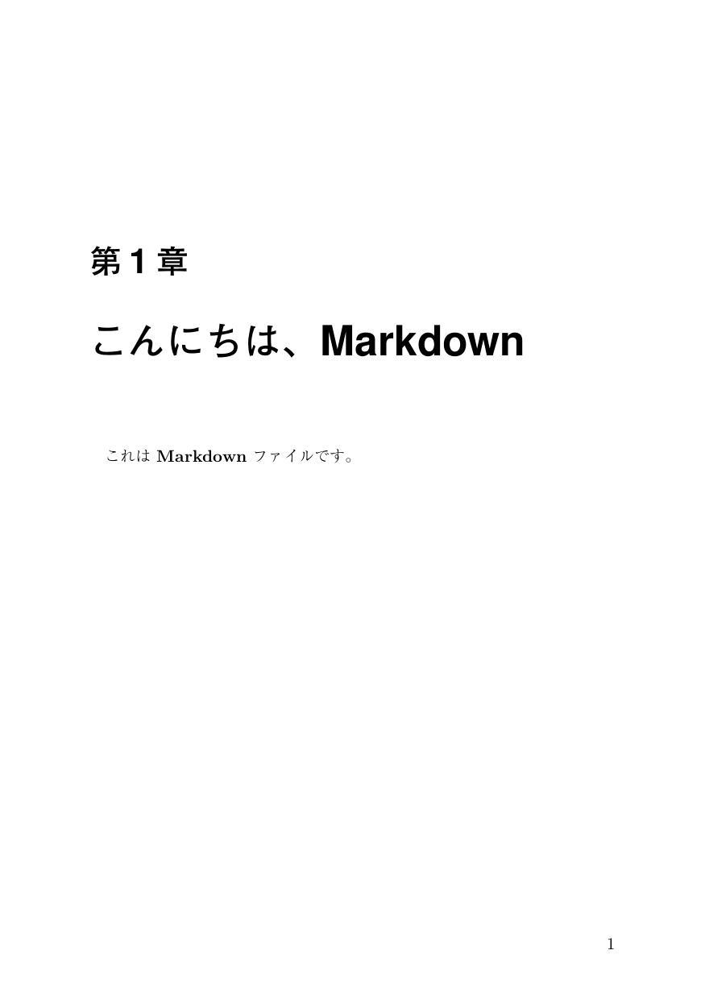
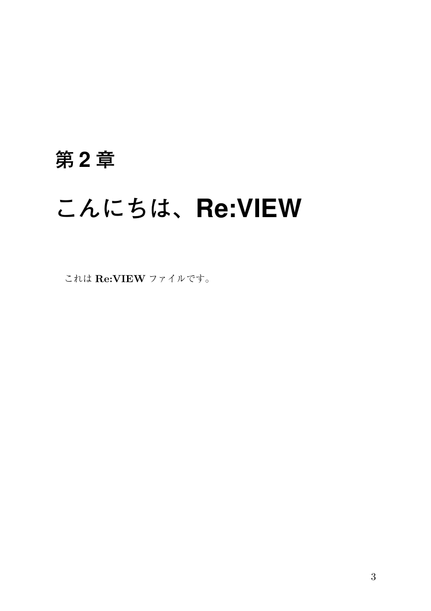

2021/2/1 by @kmuto

# pandoc2review による Markdown ファイルの併用

pandoc2review ツールを使って、Markdown ファイルを原稿形式としたまま Re:VIEW の作業プロジェクトに取り込む手法を紹介します。

----

## pandoc2review とは
Markdown や docx などの文書形式から HTML や TeX などに変換する汎用文書変換ツールとして著名なのが [Pandoc](https://pandoc.org/) というオープンソースソフトウェアです。この変換出力形式を Re:VIEW に対応させた [pandoc2review](https://github.com/kmuto/pandoc2review) というツールを作ってみました。

Ruby と Pandoc をセットアップした状態で、`gem install pandoc2review` を実行すれば pandoc2review がインストールされます。

## 単純な変換

Markdown や docx などのファイルを、次のように変換できます。

```
pandoc2review 入力ファイル名 > 出力ファイル名
```

たとえば、次のように使います。

```
pandoc2review article.md > article.re
pandoc2review document.docx > document.re
```

Markdown ファイル形式から Re:VIEW ファイル形式に変換するツールとしては [md2review](https://github.com/takahashim/md2review) がすでに存在しますが、pandoc2review は docx なども含めて汎用的に利用できるほか、Markdown ファイル側の解析を強化しています。md2review では構造が誤認識されていた Markdown ファイルも、かなり良い精度で Re:VIEW ファイル化できるでしょう。

## Re:VIEW プロジェクトとの組み合わせ

さて、本題に入ると、Re:VIEW プロジェクト内で Markdown ファイルをそのまま Re:VIEW の章ファイルとして扱うことができます。章ファイル単位であれば Markdown ファイルと Re:VIEW ファイルを混在させることも可能です。

準備作業は次のとおりです。

1. 既存の Re:VIEW 作業プロジェクト、または `review-init` で新規プロジェクトを用意します。
2. Rakefile ルールファイル [z01_pandoc2review.rake](https://raw.githubusercontent.com/kmuto/pandoc2review/main/samples/reviewsample/lib/tasks/z01_pandoc2review.rake) をダウンロードし、プロジェクトの `lib/tasks` フォルダに配置します。
3. プロジェクトの `config.yml` ファイルに `contentdir: _refiles` 行を追加します。

次に、Markdown ファイルを用意します。`ch01.md` を示します。

```
# こんにちは、Markdown

これは **Markdown** ファイルです。
```

プロジェクトの `catalog.yml` には、拡張子の `.md` を `.re` に変えたファイル名で登録します。

```
PREDEF:

CHAPS:
  - ch01.re

APPENDIX:

POSTDEF:
```

Re:VIEW 形式で記述した `ch02.re` は以下です。

```
= こんにちは、Re:VIEW

これは@<b>{Re:VIEW}ファイルです。
```

当然これは `catalog.yml` に登録できます。

```
PREDEF:

CHAPS:
  - ch01.re
  - ch02.re

APPENDIX:

POSTDEF:
```

これで rake の各コマンドを実行すると、最初に `pandoc2review` の呼び出しと Re:VIEW 形式への変換が行われます。`rake pdf` で変換した例を以下に掲載します。





このように、Markdown ファイルをそのまま利用し続けられる仕組みが、簡単に実現できました。

内部的には、`rake` の実行時に `lib/tasks/z01_pandoc2review.rake` ルールが解釈され、Re:VIEW ファイルがあればそのまま `_refiles` フォルダにコピーします。Re:VIEW ファイルがなかったときには、もし Markdown ファイル（`.md` 拡張子）のほうがあれば、`pandoc2review` を使って Re:VIEW 形式に変換し、`_refiles` フォルダに書き出します。

　

pandoc2review は、Markdown ファイルの記法（pandoc が提供している Makrown 拡張記法）を逸脱しない範囲で、Re:VIEW の各命令にできるだけ対応させています。

div や span のタグを使って Re:VIEW のブロック命令・インライン命令に展開できるので、相互参照や索引なども無理なく表現できます。各対応および表現サンプルについては、[pandoc2review における Markdown 形式処理の注意事項](https://github.com/kmuto/pandoc2review/blob/main/markdown-format.ja.md) を参照してみてください。

- [pandoc2review](https://github.com/kmuto/pandoc2review)
- [pandoc2review における Markdown 形式処理の注意事項](https://github.com/kmuto/pandoc2review/blob/main/markdown-format.ja.md)
- [Re:VIEW プロジェクト内でシームレスに Markdown ファイルを使う](https://github.com/kmuto/pandoc2review/blob/main/samples/reviewsample/ch01.md)
