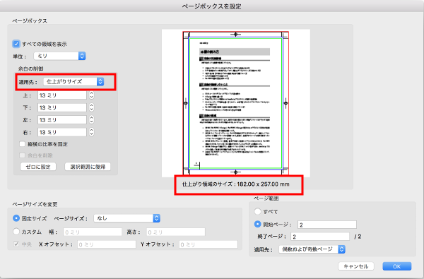
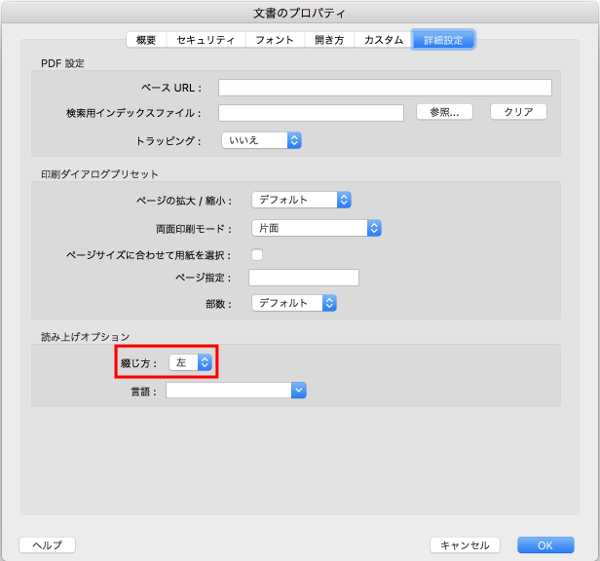
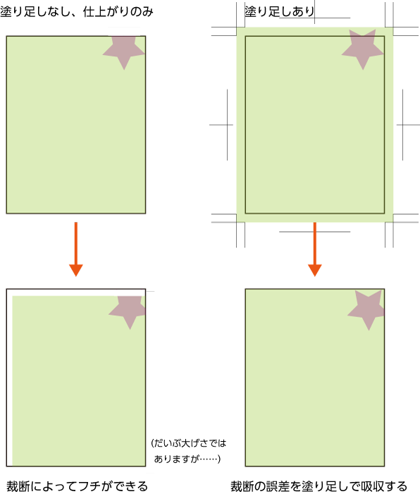
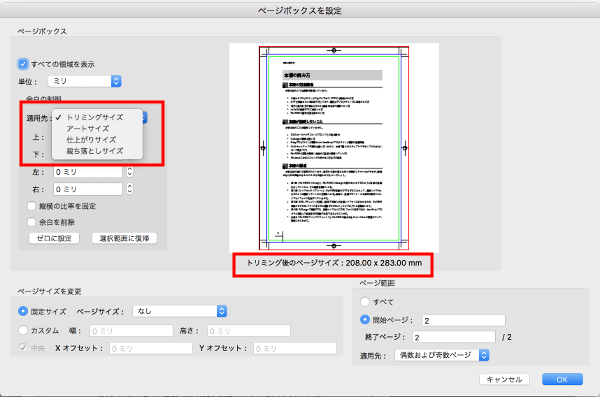
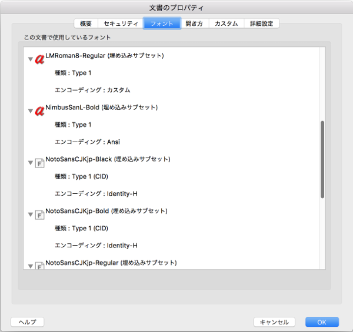
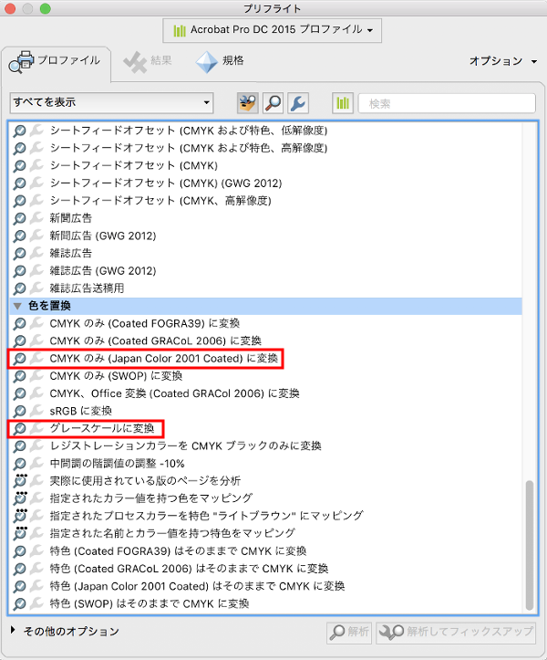
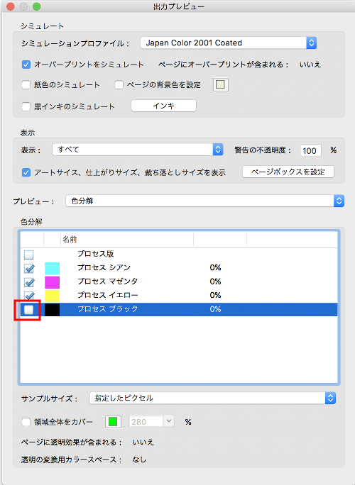
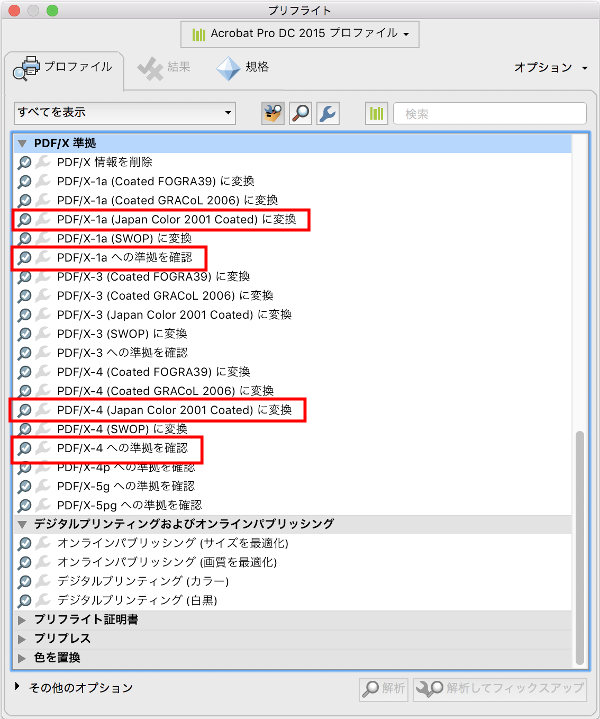
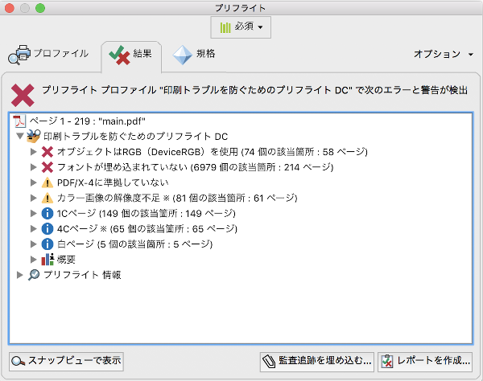

2018/9/29, 2018/12/15 by @kmuto

# 生成した PDF の印刷所入稿

Re:VIEW を使って PDF を気軽に生成することはできますが、印刷所で印刷してもらって製本するという場合は、家庭用のプリンタで印刷してコピー本を作るのとは異なり、十分な注意と配慮が必要です。

----

## 「入稿」ということ

（主に書籍にまつわる）何らかのデータを誰かから引き渡されるという「入稿」という言葉は、作業者の立場や状況によってさまざまに変わりますが、本記事では書籍のデータを印刷（および製本）してもらうために印刷所に渡すことを **入稿** と表現することにします。

印刷所での印刷、製本は、家庭用のプリンタで印刷してコピー本を作るのとは異なる世界です。よく理解しないまま入稿すると、印刷所を困らせるだけでなく、想定していたのと全然違う、とても売りに出せない本が出来上がってしまうかもしれません。

Re:VIEW を使った書籍の入稿においては、1冊ぶんのまとまった PDF を印刷所に入稿するのが普通です。これを **PDF 入稿** と一般に呼んでいます。LaTeX（pdfmaker）や CSS（ブラウザ出力など）を使った組版の場合は、もともと1冊ぶんのまとまった PDF が作成されるはずです。InDesign の場合は章単位でドキュメントファイルが分かれることがありますが、ブック機能などを使って1冊ぶんにまとめた PDF を作ります。

なお、背も付くようなボリュームの場合は、表紙・背・裏表紙を1枚にした PDF も別途入稿しますが、本記事ではこれについては説明を省略します。

## 印刷所の入稿仕様に従う

どの印刷所も、入稿にあたってはそれぞれのハウスルールを定めています。これを **入稿仕様** といいます。入稿にあたっては、この仕様を正しく守っていることが大前提です。

主な入稿仕様としては、たとえば以下のようなものがあります。

- PDF のバージョンおよび対応標準形式
- 色の持ち方
- 推奨解像度
- 塗り足し範囲やトンボの設置
- ページ番号の付け方

入稿仕様に違反しても印刷所でなんとかしてくれることはありますが、それはあくまでも印刷所の善意に乗っかっているに過ぎません。皆さんも、設計で整数型としているのに文字列型の値を渡されたらイラッとしますし、保証できませんよ？と思いますよね。

特に PDF 入稿の場合は、印刷所の側には元データがなく修正できることが限られるので、入稿仕様に合致しているかどうかの責任はすべて入稿者側にあります。

## 紙面サイズの決定

家庭用プリンタの縮小印刷とは異なり、印刷所に入稿する PDF の仕上がり紙サイズは **実寸** である必要があります。つまり、B5 の書籍にしたければ B5 実寸でレイアウトされていなければなりませんし、A5 にしたければ同様に A5 実寸でなければなりません。A4 で作ったものを印刷所で適当に縮小してくれる、ということはありません。

LaTeX で紙面サイズを設定する方法については、
[LaTeX の紙面サイズを変更するにはどうしたらよいですか？](../faq/faq-tex.html#4b0fce76f7b548819501a275801c48c8)
を参照してください。

Re:VIEW 3 から、`texdocumentclass` パラメータの `paper=` オプションで紙面サイズを容易に変更できるようになっています。

CSS 組版を使用し、ブラウザから B 列の用紙（B5 など）に出力する場合は、注意が必要です。B 列には大きさが若干異なる ISO と JIS の二種類の規格があり、日本の紙は JIS に基づいていますが、ブラウザの PDF 出力ドライバによっては ISO 規格の値を使用してずれが生じる可能性があります。

- JIS B5：182×257mm
- ISO B5：176×250mm

### 検査方法
現在どのサイズなのかを確実に判断するには、[Adobe Acrobat Pro DC](https://acrobat.adobe.com/jp/ja/acrobat/acrobat-pro.html)（無料の Reader ではなく、編集機能などを持つ有償商品）の「印刷工程」→「ページボックスを設定」→「仕上がりサイズ」などを使います。



あるいは、フリーソフトウェアとしては Poppler が入っている場合は `pdfinfo` コマンドで調べることもできます（Debian や Ubuntu の場合は poppler-utils パッケージ）。

以下は LaTeX から生成し、トンボの付いていない A5 紙面の PDF の例です。単位は point で表示されます（mm にするには 0.352778 を掛けます）。計算丸めなどもあるため、小数点第一位程度の精度で判断すればよいでしょう。

```
$ pdfinfo -box book.pdf
 …
Page size:      419.53 x 595.28 pts
Page rot:       0
MediaBox:           0.00     0.00   419.53   595.28
CropBox:            0.00     0.00   419.53   595.28
BleedBox:           0.00     0.00   419.53   595.28
TrimBox:            0.00     0.00   419.53   595.28
ArtBox:             0.00     0.00   419.53   595.28
 …
```

後述のデジタルトンボが付いている場合は、以下のようになります（仕上がり A5 紙面を A4 メディア中央に配置した状態）。

```
$ pdfinfo -box book.pdf
 …
Page size:      595.28 x 841.89 pts (A4)
Page rot:       0
MediaBox:           0.00     0.00   595.28   841.89
CropBox:            0.00     0.00   595.28   841.89
BleedBox:          79.37   114.80   515.90   727.08
TrimBox:           87.87   123.31   507.40   718.58
ArtBox:             0.00     0.00   595.28   841.89
 …
```

この場合仕上がりサイズとして見るべきは TrimBox の値で、幅 507.40 - 87.87 = 419.53、高さ 718.58 - 123.31 = 595.27 で正しく A5 であることがわかります。

一般に使うであろう代表的なサイズを以下にまとめておきます。

- A4：210×297mm、595.28×841.89 pts
- A5：148×210mm、419.53×595.28pts
- B5（JIS）：182×257mm、515.91×728.50pts

## 綴じ方の決定

一般的な書籍は、左右のどちらか片方を綴じることで、本としての体裁となります。左側を綴じることを **左綴じ・左開き** といい、技術書など横書きの書籍では通常こちらを使います。右側を綴じることを「右綴じ・右開き」といい、縦書きの書籍に通常使います。

LaTeX や InDesign は、方向によって適切な綴じ情報を PDF に含めるので、これを気にする必要は通常ありません。

入稿時に綴じ指定を逆にしてしまうと、「横書きなのに右綴じ」のような泣くに泣けない本ができてしまいます（通常は印刷所から本当にそうするつもりなのか確認が来るとは思いますが……）。

### 検査方法

Acrobat Pro の場合は、「ファイル」→「プロパティ」→「詳細設定」→「読み上げオプション」に「綴じ方」という項目があり、「左」「右」の現在の設定値があります。切り替えも可能です。



- `pdfinfo` などのツールで調べる方法は不明です。iText ライブラリでは、ビューアオブジェクトのプリファレンス `PdfName.DIRECTION` から調べられるようです。

## ページ数

本にするには、最低限、**偶数** にする必要があります。

さらに、印刷所では1枚の大きな紙に複数のページを一度に印刷してそれを裁断するという工程をとるため、無駄を防ぐために基準の枚数セットが決まっています。2、4、8、16、32 といった枚数セットのどれに従うかは印刷所によります。そして、入稿する PDF のページ数はこの枚数セットの倍数に揃えなければなりません。

たとえば枚数セットが 4 となっている場合、80 ページであれば 4 の倍数なので適切ですが、82 ページだと倍数でないため不適切です。

ページが不足しているときには何か埋め草を作る、逆に多いときには内容を削る・紙面を調整する（[見栄えが悪い箇所を「少しだけ」調整する](../latex/modify-abit.html) を参照）などの対処をします。

### 検査方法

PDF の全ページ数はビューアのページ数表示から判断することもできますが、`pdfinfo` コマンドを使うこともできます。

```
$ pdfinfo book.pdf
 …
Pages:          80
 …
```

前付にローマ数字を使っている場合はうっかりその数え漏れをすることがあるので、物理的な全ページ数を確認できるこのコマンドを併用するとよいでしょう。

## トンボ

PDF の入稿の場合、一般に仕上がりと塗り足し領域情報からなる **デジタルトンボ** を付けることが推奨されます。仕上がりサイズのままでも入稿を受け付ける印刷所もありますが、紙面の上下左右いっぱいにかかる要素があるときには、白フチができてしまうなどの問題が生じます。



LaTeX を使用しているときには
[jsbook ベースのドキュメントにトンボおよびデジタルトンボを配置する](../latex/tex-tombow.html)
が参考になるでしょう。Re:VIEW 3 では、`media=print` 時には自動でデジタルトンボが設置されます。

InDesign の場合には標準でトンボ・デジタルトンボを設置する機能があります。

CSS を使ったブラウザ出力 PDF の場合は、ブラウザ側からは妥当なデジタルトンボを埋め込めないので、生成された PDF を別途 LaTeX あるいは InDesign に貼り付けるなどしてデジタルトンボを設置します。

塗り足し領域の幅については、入稿仕様に記されています。通常は 3mm ですが、印刷所や製本方法によっては 5mm のときもあります。

### 検査方法

Acrobat Pro の表示設定で「アートサイズ、仕上がりサイズ、裁ち落としサイズを表示」を有効にすると表示上で確認できます。「印刷工程」→「ページボックスを設定」からはより詳細な数値を得られます。



前出の `pdfinfo` コマンドの `-box` オプションでも確認できます。

```
$ pdfinfo -box book.pdf
 …
Page size:      595.28 x 841.89 pts (A4)
Page rot:       0
MediaBox:           0.00     0.00   595.28   841.89
CropBox:            0.00     0.00   595.28   841.89
BleedBox:          79.37   114.80   515.90   727.08
TrimBox:           87.87   123.31   507.40   718.58
ArtBox:             0.00     0.00   595.28   841.89
 …
```

Page size および MediaBox・CropBox・ArtBox は同じ値で、ビューア向けのサイズ（ここでは A4）、TrimBox は書籍の仕上がりのサイズ（ここでは A5）です。BleedBox が塗り足し領域で、TrimBox の外周 3mm（8.5 point）になっています。

## 通しのページ番号（ノンブル）

同人誌印刷所によっては、製本検査のためと思われますが、ページ番号（ノンブル）に以下のうちのいくつか、あるいは全項目を採用するよう、制限を設けていることがあります。

- ローマ数字は使わず、アラビア数字のみで先頭ページから順に振る（1 または 3 始まり）
- 白紙のページにも振る
- なるべく入れたくないとしても、ノドに小さく入れるなどの対処をする

LaTeX でアラビア数字のみで振る方法については、[jsbook ベースのテンプレートで、ページを頭からの通し番号にするにはどうしたらよいですか？](../faq/faq-tex.html#01580761e063df200da1a590c43c3568)に一例を挙げています。

Re:VIEW 3 では、`texdocumentclass` パラメータに `startpage=1,serial_pagination=true,hiddenfolio=nikko-pc` といったオプション指定を付けることで、アラビア数字の通しページおよび隠しノンブルを実現できます。

## フォント

PDF 入稿では、フォントはすべて「埋め込み」または「アウトライン」のいずれかにする必要があります。Re:VIEW のデフォルトの LaTeX 設定、InDesign では埋め込みになっているはずです。

また、PDF 内の文字表現方法としては、Type1、Type3、CID があります。詳細はここでは説明しませんが、PDF 入稿にあたっては以下のルールがあります。

- 欧文は Type1 か CID を使う
- 和文は CID を使う
- **Type3 は使ってはならない**

PDF 紙面内で使っている文字がどの形式になるかは、フォントファイルや組版ソフトウェアによって異なりますが、Re:VIEW のデフォルトの LaTeX 設定や InDesign では Type1 または CID になるはずです。

これに対し、2018年9月時点で、Chrome ブラウザから生成した PDF では、OpenType フォントを使っている文字は（不適切な）Type3 形式になります。TrueType フォントの場合は CID 形式になるようです。Type3 形式の文字は、印刷の面では描画品質が低い・PDF 処理をする印刷機では異常なエラーを起こすことがあるために利用できないほか、電子的に配布する場合でも、表示品質が低い、文字情報が不足しているので検索できないことがある、といった問題があります。

Type3 が含まれている PDF のままでは入稿できないため、以下のいずれかの対応が必要です。

- 問題のないフォントファイルや設定に変更する（Chrome ブラウザの生成であればたとえば TrueType フォントにする）
- 全体をアウトライン化あるいは画像化する。macOS の プレビュー.app で保存し直す、または InDesign に貼り付けることで、PDF の Type3 フォントをアウトラインに変換できます（テキスト化・検索などはできなくなります）。

なお、LaTeX や InDesign でも、不適切なフォント設定（埋め込みでない・Type3 であるなど）の EPS や PDF 形式の図版を貼り付けると、当然ながら同じ問題が生じます。

### 検査方法

Acrobat Pro の「ファイル」→「プロパティ」→「フォント」で、PDF 内の使用フォント情報を一覧できます。フォント名のところに「埋め込みサブセット」と付いており、種類が「Type1」か「Type1（CID）」であれば問題ありません。



- 種類に「TrueType」 というものが出ることもありますが、こちらも埋め込みになっていれば問題ないようです。

また、Poppler のツールの中に、`pdffonts` というコマンドがあります。これを使って調べることもできます。

```
$ pdffonts book.pdf
name                                 type              encoding         emb sub uni object ID
------------------------------------ ----------------- ---------------- --- --- --- ---------
RLTGDT+URWGothicL-Demi               Type 1C           WinAnsi          yes yes no      11  0
YFGDGA+NotoSansCJKjp-Black-Identity-H CID Type 0C       Identity-H       yes yes yes     13  0
CAPSZS+NotoSansCJKjp-Bold-Identity-H CID Type 0C       Identity-H       yes yes yes     18  0
 …
```

type の列が「Type 1」「CID」「TrueType」といったものになっており、かつ emb（埋め込み）の列がすべて「yes」になっていれば問題ありません。

次のように出てしまったら Type3 を含んでいるため、修正する必要があります。

```
$ pdffonts type3.pdf
name                                 type              encoding         emb sub uni object ID
------------------------------------ ----------------- ---------------- --- --- --- ---------
[none]                               Type 3            Custom           yes no  yes   1311  0
[none]                               Type 3            Custom           yes no  yes    616  0
 …
```

フォントが埋め込まれていない場合は次のように emb 列が no となり、やはり修正する必要があります。

```
$ pdffonts noembed.pdf
name                                 type              encoding         emb sub uni object ID
------------------------------------ ----------------- ---------------- --- --- --- ---------
 …
Ryumin-Light-Identity-H              CID Type 0        Identity-H       no  no  no       6  0
 …
```

## 色

PDF の色は、紙面印刷用の CMYK または 画面表示用の RGB のいずれかで表現されます。

**CMYK** は、C＝シアン、M＝マゼンタ、Y＝イエロー、K＝キー（一般には黒インク）の版を重ねることで色を表現します。黒は K 100%、白は CMYK いずれも 0% となります。

**RGB** は、R＝レッド、G＝グリーン、B＝ブルーの原色を重ねることで色を表現します。黒は RGB いずれも 0%、白は RGB いずれも100%となります。

ビューアの画面で見る場合は CMYK の PDF でも通常は RGB に変換されるので、ぱっと見では違いがわかりませんが、入稿にあたっては大きな違いがあることに注意が必要です。PDF 入稿に使うのは、通常 CMYK のほうです（最近は一部の印刷所では RGB 直接の印刷にも対応しています。入稿仕様を確認してください）。

InDesign も LaTeX も CMYK・RGB どちらにも対応していますが、通常は CMYK を使うようになっており、黒は K 版で表されます。ただし、貼り付けた図版が RGB の場合、その箇所は RGB と混在することになります。

- 図版ファイルを CMYK 化（白黒印刷の場合は K 版のみ）する。ただし、PDF・EPS・JPEG・TIFF のファイルは CMYK を表現できますが、PNG は RGB のみの表現なので別の画像形式に変換する必要があります。
- PDF を最後に CMYK 化（白黒印刷の場合は K 版のみ）する

ブラウザから出力される PDF は RGB になっていることがあります。そのため、入稿仕様に CMYK と書かれていたら、CMYK にする必要があり、また白黒印刷用途であれば K 版のみ（グレースケール化）にしなければなりません。

Acrobat Pro のプリフライト機能を利用して RGB→CMYK 変換、あるいはカラー→グレースケール変換ができます。その際、カラープロファイルについて印刷所から特に指定がなく、設定が不明なときには、一般的に使われる **Japan Color 2001 Coated** が無難でしょう。



なお、Acrobat Pro で DC よりも古いバージョンの場合は色変換に不具合があり、特定の PDF の変換において「点線が実線になる」「線が太くなる」といった現象が発生します。筆者の経験では、[callas pdfToolbox](https://www.callassoftware.com/en/products/pdftoolbox) での色変換については、現時点で問題は生じていません。

Ghostscript でも RGB→CMYK 変換はできますが、壊れた箇所などがないか、十分に注意が必要です。以下で使用しているカラープロファイルの JapanColor2001Coated.icc は、[Japan Color](http://japancolor.jp/icc.html) で配布されています。

```
$ gs -q -r600 -dNOPAUSE -sDEVICE=pdfwrite -o 出力PDF -dPDFSETTINGS=/prepress -dOverrideICC -sOutputCCProfile=JapanColor2001Coated.icc -sProcessColorMdel=DeviceCMYK -sColorConversionStrategy=CMYK -sColorConversionStrategyForImage=CMYK -dGrayImageResolution=600 -dMonoImageResolution=600 -dColorImageResolution=600 入力PDF
```

### 検査方法

Acrobat Pro であれば、「印刷工程」→「プレビュー」で色分解をして表示できます。たとえば白黒印刷用であれば、プロセスブラックのチェックを外し K を非表示にして、全体を見ていきます。もしトンボ以外で何か表示されたなら、それはあるべきでない色が存在する疑いがあります。



- Vivliostyle.js を使ってブラウザから生成した場合、黒の箇所は K で正しく表されているようです。

Ghostscript を使って生のデータを調査することもできます。

```
$ gs -dNOPAUSE -dBATCH -q -sDEVICE=inkcov -sOutputFile=- book.pdf 
 0.50724  0.50873  0.50954  0.00088 CMYK OK
 0.00000  0.00000  0.00000  0.00884 CMYK OK
 0.00000  0.00000  0.00000  0.05060 CMYK OK
 0.00000  0.00003  0.00003  0.00200 CMYK OK
 0.00000  0.00000  0.00000  0.00394 CMYK OK
 …
```

各ページの C、M、Y、K の含有率が示されています。たとえば白黒印刷なら、1〜3 つめの数値は 0.0000 でなければならないことになります。

RGB が使われている PDF の場合は、黒だけのつもりでも以下のような結果になります。

```
$ gs -dNOPAUSE -dBATCH -q -sDEVICE=inkcov -sOutputFile=- rgb-black.pdf
 0.00387  0.00387  0.00387  0.00286 CMYK OK
```

## 標準化

PDF には、印刷用に適するとされる標準仕様があります。国内の印刷所で一般的に採用されている標準は、以下の2つです。

- **PDF/X-1a:2001**：PDF 1.3 に基づく。色は CMYK のみ。すべてのフォントは埋め込み。デジタルトンボを必要とする。透明は分割統合で処理される。
- **PDF/X-4:2008** または PDF/X-4:2010：PDF 1.6 に基づく。色は CMYK または RGB。すべてのフォントは埋め込み。デジタルトンボを必要とする。透明情報をサポート。

入稿仕様で、これらの標準に沿った PDF を入稿することを求められることがあります。PDF/X-4 が RGB をサポートしているからといって、必ずしも印刷所が RGB を受け付けるわけではないことには注意してください。PDF/X-4 を指定されている、あるいは PDF/X-4 でなければ表現できない、というのでなければ、PDF/X-1a でもなんら問題ありません。

現時点で、LaTeX やブラウザから出力した PDF を PDF/X-1a、PDF/X-4 準拠とするには、有償の [Acrobat Pro](https://acrobat.adobe.com/jp/ja/acrobat.html) か [callas pdfToolbox](https://www.callassoftware.com/en/products/pdftoolbox) を使う必要があります。



実際には PDF をそのまま入稿しても印刷所で問題なく印刷できるでしょうが、標準準拠は一定のデータ水準に達していることを保証し、印刷事故を未然に防ぐ重要な役割を担っています。

### 検査方法

Acrobat Pro では、プリフライトで PDF/X-1a または PDF/X-4 に準拠しているかどうかを確認できます。

完全に準拠しているかどうかはともかく、Acrobat Pro などを使って標準化対応済みかどうかは、`pdfinfo` コマンドでメタ情報を表示してみることでも判別できます。

```
$ pdfinfo -meta book-x1a.pdf
<?xpacket begin="" id="W5M0MpCehiHzreSzNTczkc9d"?>
 …
         <pdfx:GTS_PDFXConformance>PDF/X-1a:2001</pdfx:GTS_PDFXConformance>
         <pdfx:GTS_PDFXVersion>PDF/X-1:2001</pdfx:GTS_PDFXVersion>
 …
```

## Acrobat でのチェック

入稿した PDF は、Adobe の PDF エンジンを使った印刷機によって処理されます。そのため、実際の印刷物との齟齬を極力なくすには、Acrobat Pro、最低でも Acrobat Reader で表示して確認することが重要です。

macOS のプレビューアやブラウザのビューアは、一部の PDF の表現を正常に表現できないことがあり、入稿のための確認には不向きです。

また、Acrobat Pro DC 向けには、以下の「印刷トラブルを防ぐためのプリフライトDC」をプリフライトとして実行することで、入稿に危険がありそうな箇所を教えてくれます。



- [【印刷通販】入稿データチェック担当に必要な知識とその学び方、心構えについて](http://dtp.jdash.info/archives/印刷通販の入稿データチェック)の「印刷トラブルを防ぐためのプリフライトDC」。このページにはほかにも入稿に関するポインタが多く示されています。

なるべくコストをかけずに制作したいというのも人情ですが、不適切な PDF を入稿して発生した事故対応の損害や、ここまで挙げてきたリスクとその対策を念頭に置くと、Acrobat Pro の導入はそう高いものではないでしょう。
