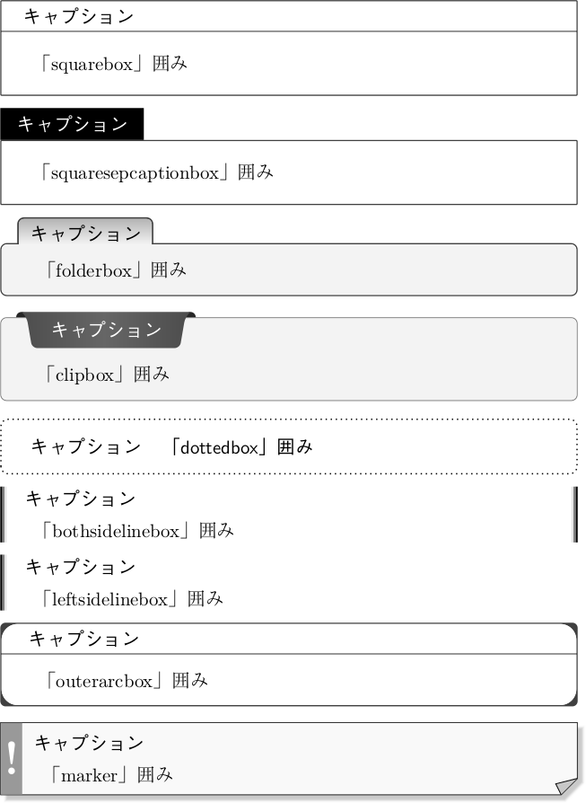
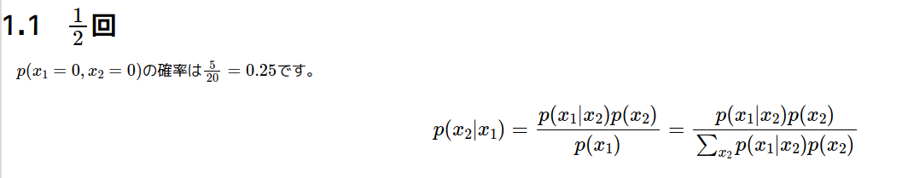
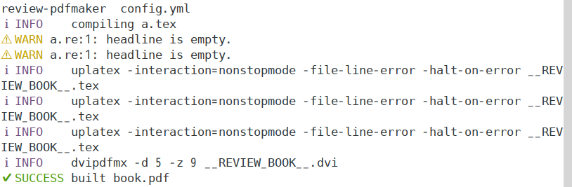

2021/2/28 by @kmuto

# Re:VIEW 5.1 での変更点

Re:VIEW 5.1 において 5.0 から変更した点について解説します。

----

2021年2月28日に、Re:VIEW 5 系のマイナーバージョンアップである「[Re:VIEW 5.1.0](https://github.com/kmuto/review/releases/tag/v5.1.0)」をリリースしました。

今回のバージョン 5.1 は、5.0 で発見された不具合の修正と、新機能を数点導入しています。

----

## 既知の問題

現時点では報告はありません。

---

## インストール

新規インストールの場合

```
$ gem install review
```

更新の場合

```
$ gem update review
```

----

## 既存プロジェクトのバージョンアップ追従

既存のプロジェクトを 5.1 に更新するには、Re:VIEW 5.1 をインストール後、プロジェクトフォルダ内で `review-update` コマンドを実行してください。

```
$ review-update
** review-update はプロジェクトを 5.1.0 に更新します **
config.yml: 'review_version' を '5.0' に更新しますか? [y]/n 
プロジェクト/sty/review-base.sty は Re:VIEW バージョンのもの (/var/lib/gems/2.5.0/gems/review-5.1.0/templates/latex/review-jsbook/review-base.sty) で置き換えら
れます。本当に進めますか? [y]/n 
プロジェクト/sty/review-jsbook.cls は Re:VIEW バージョンのもの (/var/lib/gems/2.5.0/gems/review-5.1.0/templates/latex/review-jsbook/review-jsbook.cls) で置き換えられます。本当に進めますか? [y]/n 
完了しました。
```

　

続いて、リリースノートをベースに、新規に導入した機能や変更点について理由を挙げながら解説します。

## 新機能
### CSS 組版ソフトウェア Vivliostyle CLI を呼び出す Rake ルールを追加しました

ブラウザを使った CSS 組版ソフトウェア Vivliostyle のコマンドライン UI である [Vivliostyle CLI](https://github.com/vivliostyle/vivliostyle-cli) が公開されましたが、少し試してみたところわりと簡単にこれで Re:VIEW から PDF を作るルールを書けることがわかったので、Rakefile のデフォルトルールに追加してみました。

Vivliostyle CLI をインストールした環境 (`npm install -g @vivliostyle/cli`) で、`rake vivliostyle:build` または `rake vivliostyle` で PDF を作成、`rake vivliostyle:preview` でブラウザのプレビューが開きます。

仕組みとしては、rake epub で EPUB ファイルをまず作り、それから Vivliostyle CLI を呼び出して PDF 変換します。

rake 実行時に、以下の環境変数で Vivliostyle CLI の制御ができるようにしています。

 * `REVIEW_VSCLI`: `vivliostyle` のコマンドパス。パスの通ったところに vivliostyle-cli を展開していないときにはこれで絶対パスを指定するとよいでしょう（デフォルトは `vivliostyle`）。
 * `REVIEW_VSCLI_USESANDBOX`: サンドボックスを使うことを強制するオプション。`REVIEW_VSCLI_USESANDBOX=true` など何か値が入っていればサンドボックスを使うようになります。デフォルトは空、つまりサンドボックスを使わない (`--no-sandbox`) モードにしています。危ないのかもしれませんが、Re:VIEW を使っている時点でどっちにしろシェルを使えて何でもできるわけですし、Chrome をすでに動かしている状態で `--no-sandbox` なしだと意味がとてもわかりづらいエラーになるので、デフォルトでサンドボックスなしにしました。
 * `REVIEW_VSCLI_PDF`: 出力 PDF 名。デフォルトは TeX PDFと同じく、環境変数 `REVIEW_BOOK` の値または `book` に、`.pdf` を付けたファイル名です。
 * `REVIEW_VSCLI_OPTIONS`: Vivliostyle CLI に渡すほかのオプション。デフォルトは空です。`-s` で紙サイズを指定、press-ready npm モジュールをインストールしている環境では `-p` で印刷所入稿可能な PDF/X-1a にする、といったいろいろなオプションが Vivliostyle CLI で用意されています。詳細については Vivliostyle CLI のドキュメントを参照してください。

style.css の表紙画像の設定があまり適していないようで、サンプルファイルそのままだと表紙は一部だけの表示になってしまいますね。実際に利用するシーンでは、Vivliostyle テーマなどを流用して CSS ファイルを用意するのがよさそうです。

### PDFMaker: `config.yml` に `boxsetting` パラメータを新設し、column・note・memo・tip・info・warning・important・caution・notice の囲み飾りを事前定義のものや独自に作成したものから選択およびカスタマイズできるようにしました

PDFMaker における各飾りの変更は LaTeX がわかっていればもともとさほど難しくはないことではあったのですが、今回カスタマイズのインターフェイスをもうちょっとまじめに取り組んでみました。



pdfmaker セクションの下位セクションとして boxsetting を用意し、ここで各囲みを設定できます。

```
pdfmaker:
   …
  boxsetting:
    note:
      style: squarebox
```

boxsetting の下位で column・note・memo・tip・info・warning・important・caution・notice のそれぞれを設定できます。style は定義済みまたはカスタムで作成した囲み飾りの名前です。

 * `squarebox`: シンプルな矩形囲み。
 * `squaresepcaptionbox`: キャプション部分を分離した矩形囲み。
 * `folderbox`: キャプションがフォルダのような形状の囲み。
 * `clipbox`: キャプションがクリップ留めのような形状の囲み。
 * `dottedbox`: ドットで囲んだ囲み。
 * `bothsidelinebox`: 左右両端に線が付いた囲み（上下に線はなし）。
 * `leftsidelinebox`: 左に線が付いた囲み（上下・右に線はなし）。
 * `outerarcbox`: 四隅を黒く塗った囲み。
 * `marker`: 「!」マーク付きのページ風の囲み。

設定方法や装飾など、いろいろと悩むことがあったのですが、まぁ妥当かなというところに落ち着いたと思います。当初は ascolorbox をそのまま使えばよいかと考えていたのですが、タイトルなしにしたときに崩れたりエラーになる、パラメータがあまり一貫していない、そもそも上流でもう保守されていない模様といった問題があり、簡単に流用できそうなものだけ使わせていただく程度に留めました。

実装としては tcolorbox スタイルをそのまま利用しており、新設の sty/review-tcbox.sty で定義しています。このファイルを直接書き換えなくても、簡単な設定範囲であれば tcolorbox のオプション形式でデフォルトから上書きしたり新たに挙動を追加したりすることができます。`options` はキャプションなしの囲みに対するオプション、`options_with_caption` はキャプションありの囲みに対するオプション（指定しなかった場合は `options` と同じものが適用）です。

```
pdfmaker:
   …
  boxsetting:
    note:
      style: squarebox
      options: "colback=black!5!white"
      options_with_caption: "colbacktitle=black!25!white"
```

パラメータについては sty/review-tcbox.sty に少し説明を記載しているので、参照してみてください。

提供したものからのカスタマイズには LaTeX および tcolorbox の知識 (や制限・注意事項) が必要なことは変わりません。一番に重要なことは執筆ですから、カスタマイズにあまり深入りしないようにしましょう。知識が不足しているがどうしてもカスタマイズが必要、ということであれば詳しい人に有償か無償かはともかく依頼することをお勧めします。

もっと良いものを作れるぜ！ という方はぜひ追加コードを PR ください。

### 挿入箇所を示す `@<ins>`、削除箇所を示す `@<del>` の2つのインライン命令を追加しました

実は HTML に合わせて昔から実装は存在したのですが、ドキュメントに明記していなかったのと、一部のビルダで対応していなかったのを、この機に対応させました。

### EPUBMaker, WebMaker: 数式表現手法として MathJax をサポートし、数式表現手法を `math_format` パラメータで選択するようにしました

Web の世界で TeX 数式を表現する方法として、JavaScript を利用した MathJax が準標準となっている感があります。

`math_format: mathjax` パラメータを設定すると、EPUBMaker, WebMaker において数式部分を MathJax を使った形になるようにしました。

配布用の EPUB では外部ファイルの読み込みを要するので EPUB 検査を通らないこと、またほとんどの EPUB リーダーでは JavaScript を実行できないので意味が薄いです。しかし、EPUB をベースにした CSS 組版では強力な数式表現手段となるでしょう。



従来の画像化には、`math_format: imgmath` を、MathML を使いたいときは `math_format: mathml` を指定します。

旧来の `imgmath` パラメータは obsolete となります（ただし、互換性を維持するため `math_format: imgmath` になるよう内部処理します）。

## 非互換の変更
### EPUBMaker: `urnid` パラメータのデフォルト値のプレフィクスを、`urn:uid` から `urn:uuid` に変更しました

実は実装の最初からどうも間違っていたようです。とはいえ、urn:uid も urn:uuid もまともに EPUB リーダーで使われていた感じはなさそうですし、流通用には isbn のほうを使うから顕在化もしないし……。壮大な仕様というのはえてしてこういうものでしょうか。

### PDFMaker: 長い脚注がページ分断されないようにしました

review-jsbook, review-jlreq はともに、ある程度長い脚注でうまく紙面収めができないと判断したときには脚注を分断して収めようとします。とはいえ、論文ではなく普通の書籍だと「下アキが大きい紙面になる」vs「脚注がページ分断される」の選択を迫られたときには前者のほうを選ぶのが一般的な気がするので、デフォルトをアキが大きくなってでも脚注を分断しないほうに倒しました。

具体的にはクラスファイルのほうで

```
\interfootnotelinepenalty\@M
```

を設定しています。紙面収めの綺麗さを優先してページ分断を許容したいときには、review-custom.sty に以下を指定して戻してやればよいでしょう。

```
\interfootnotelinepenalty=100
```

## バグ修正
### `contentdir` を設定しているときに WebMaker, review-vol, review-index がエラーになるのを修正しました

[pandoc2review による Markdown ファイルの併用](../printing/pandoc2review.html) での実装をしているときに発見したバグです（pandoc2review、自分でいうのも何ですが神ツールですね、これは）。

### WebMaker: `images/html` 図版フォルダが見つけられないのを修正しました

こちらはご指摘いただいて直しました。ありがとうございます。

### PDFMaker: 用語リストの見出しで chapterlink がおかしな結果になるのを修正しました

これもご指摘いただきました。description 環境はいろいろ特殊で厄介です。

### PDFMaker: 索引に `{`, `}`, `|` が含まれているときにエラーや奇妙な文字に変換されるのを修正しました

これもあわせてご指摘いただいたものですね。内部処理コードがどんどん mendex 特化していくのがちょっと気になるところではあるのですが、現状 mendex 以上の索引ツールがないのも事実であります。

### review-vol: 不正な見出しがあったときに妥当なエラーメッセージを出力するようにしました
### review-vol, review-index が不正なファイルを受け取ったときのエラー処理を修正しました

どちらも特定ケースにおいて内部エラーで捕捉できずバックトレースになってしまうことがあるのを修正しました。

### PDFMaker: `after_makeindex` フックを LaTeX コンパイル後ではなく `mendex` 実行後に実行するように修正しました

これじゃ意味ないじゃーんという実行順序になっていたのを直しました。

### PDFMaker: `//image` のキャプションが空だったときに内部エラーではなく図番号が出力されるように修正しました

Re:VIEW 5 での実装変更で想定漏れしていました。

## EPUBMaker: author などの静的ファイルを指示したときに、ファイルが存在しないと内部エラーを起こしていたのを修正しました

自分で使っていると、ファイルを用意してから config.yml をいじる、という順序なのでこういうのは気付きにくいですね。検査とコピーをメソッド化して、必ず確認するようにしました。

## 機能強化
### tty-logger gem パッケージがインストールされている場合、Re:VIEW の各 Maker コマンドの進行状態をアイコンおよびカラーで示すようにしました

Vivliostyle CLI の出力のステータスの色分けがうらやましかったので、Re:VIEW でもちょっと実装を入れてみました。良いね！



あくまでもログ出力のヘッダ色付けをするだけで、くるくる回ったりはしませんが。以前にtahahashimさんにロガーを分離していただいていたおかげで、実装は容易でした。tty-logger gem は `gem install review` のときに一緒にインストールされるはずですが、入らなかったら `gem install tty-logger` でインストールしてください（この gem がなければ普通に以前と同じ出力になります）。

### PDFMaker: クラスファイルで `\RequirePackage{plautopatch}` を最初に評価するようにしました

[日本語LaTeXの新常識2021](https://qiita.com/wtsnjp/items/76557b1598445a1fc9da) によると plautopatch を取り込むのがトレンドらしいので、review-jsbook, review-jlreq クラスファイルの冒頭で読み込むようにしてみました。

### MARKDOWNBuilder: `@<hd>` をサポートしました

MARKDOWNBuilder でサポートしていなかったのに対処しました。とはいえ、Markdown 自体では表現の幅に限界があるので、他章参照とかは厳しいです。

### Re:VIEW ドキュメントファイルに不正なエスケープシーケンス文字が含まれているときにエラーを出すようにしました

^H などの隠れ制御文字は LaTeX でわかりにくいエラーになるので、ファイルの評価時にこのチェックを入れるようにしました。

### `=` の数が6を超える見出し扱いの行があるときにエラーを出すようにしました

原稿で区切りのつもりで使われた「`========`」のような行が意図しない形で内部エラーになるので、異常見出しっぽくなりそうだったら捕捉してエラーを出すようにしました。

なお、実際リテラルにこれを使いたい、というときには、先頭にスペースを入れる（トリミングされるので問題ない）、`@<embed>{=}=======` のように先頭をembedにするといった方法が考えられます。

## ドキュメント
### 画像探索の際に各 Maker が参照するサブフォルダ名について記載しました

そういえばビルダについては記載しているけど Maker のはちゃんと説明入れていないね、ということで記載しました。

## その他
### EPUBMaker: EPUB ライブラリ一式を `lib/epubmaker` から `lib/review/epubmaker` に移動し、リファクタリングしました

これまで「ほかのソフトウェアでも使えるように」と内部的に分離していた EPUB ライブラリですが、もう Re:VIEW くらいしか使っておらんだろうということで併合しました。内部的にはかなり大掛かりな修正です。takahashim さんありがとうございました！

### EPUBMaker: テストを追加しました

EPUBMaker のテストがいろいろ足りていなかったのをこの機会に増強しました。

### PDFMaker: いくつかの処理をリファクタリングしました
### IDGXMLMaker: いくつかの処理をリファクタリングしました
### MakerHelper: いくつかの処理をリファクタリングしました
### ライブラリの相対パスの参照方法をリファクタリングしました
### `ReVIEW::LineInput` クラスをリファタクタリングしました

恒例のリファクタリングで見通し改善を図っています。

### 数式画像生成処理を `ReVIEW::ImgMath` クラスにまとめました

ビルダによってちょっとバラバラだった部分をクラスで共通化しました。

### テンプレート処理を `ReVIEW::Template.generate` メソッドに統一しました

PDFMaker, EPUBMaker で分かれていたテンプレート処理を統一しました。

### GitHub Actions で TeX コンパイルのテストも行うようにしました

もともと TeX コンパイルテスト自体はテストユニットとして持っており、手元環境ではテスト実行していたのですが、Actions のほうにも TeXLive 入りの環境を用意してテストするようにしました。

### Rubocop 1.10 に対応しました

恒例の Rubocop 先生対応です。

### サンプル syntax-book の重複 ID を修正しました

サンプルで重複 ID の警告がうるさいので、サンプルを修正しました。

### Copyright を2021年に更新しました

Re:VIEW の原形が作られたのは2002年なので、来年はいよいよ20周年ですね。

### Ruby 3.0 でのテストを実行するようにしました

現物はまだ使っていないのですが、とりあえずテストベースでは何も問題は起きていないようです。

### 不安定な Pygments のテストを抑制しました

Actions の環境でどうにもカラーハイライタの Pygments（Python プログラム）の挙動が安定せず、うまくいったり空になったりで変なので、テストから外しました。コード自体はあまり手を付けない箇所なので、そう壊れるところはないですし。

### WebTocPrinter: テストのエラーを修正しました

ライブラリファイルを1つ明示的に読み込むようにしました。

### テストのターゲットを指定しやすいようにしました

テストユニットも増えてきたので、`rake test[target]` でテスト時に指定しやすいようにしました。

## 終わりに

今回の Re:VIEW 5.1 では 5.0 で積み残していた EPUB ライブラリの移行のほか、いろいろと気になっていた部分に手を付けてみました。Vivliostyle CLI を使った CSS 組版、囲み装りの選択機能など、いろいろと皆さんのチャレンジ、カスタマイズしがいのありそうなリリースになったと思います。

次のバージョン予定としては lib/review の中が多すぎるようになってきたのでフォルダ構成を変更したり、EPUB ライブラリをさらにバラして EPUBMaker に統合したりといったまたちょっと大掛りなことをする見込みで、メジャーバージョンアップとなるかもしれません。

Enjoy!
