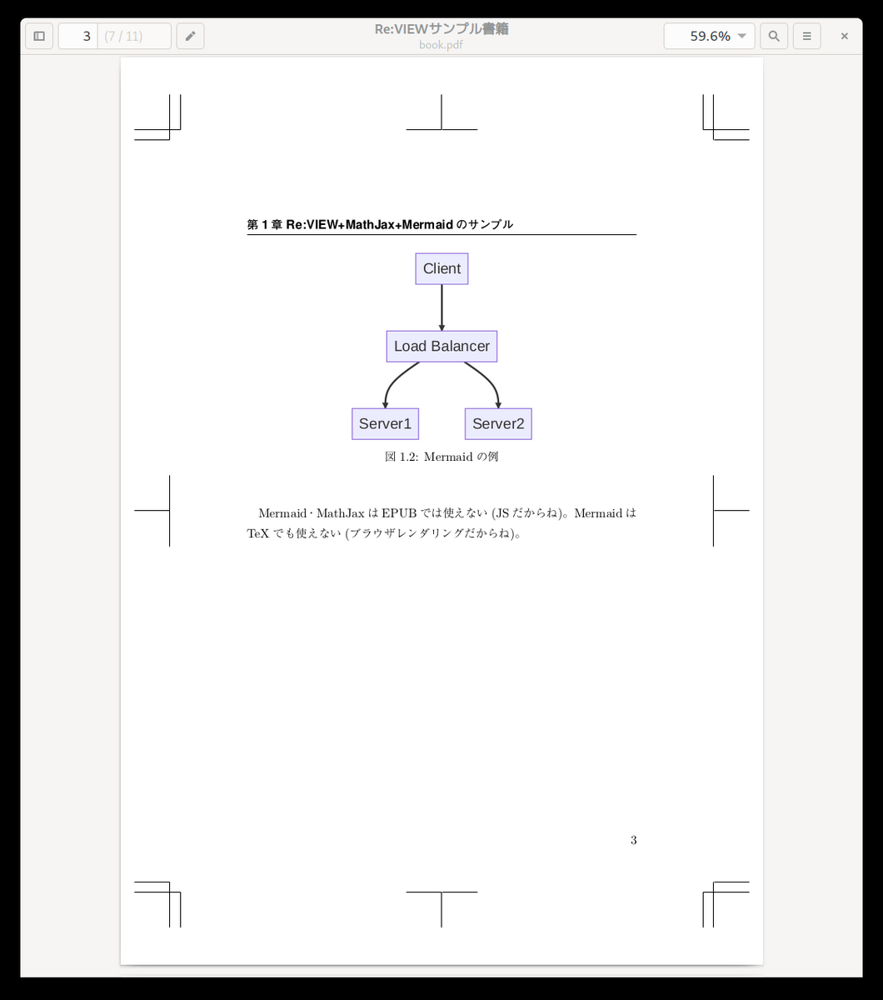

2023/6/29 by @kmuto

# Re:VIEW 5.8 での変更点

Re:VIEW 5.8 において 5.7 から変更した点について解説します。

----

2023年6月29日に、Re:VIEW 5 系のマイナーバージョンアップ「[Re:VIEW 5.8.0](https://github.com/kmuto/review/releases/tag/v5.8.0)」をリリースしました。

今回も修正メインの小幅なリリース……ではあるのですが、このトレンドに乗るしかない、というMermaid対応を別のライブラリと組み合わせて実現したのがトピックです。

----

## 既知の問題

現時点ではありません。

---

## インストール

新規インストールの場合

```
$ gem install review
```

更新の場合

```
$ gem update review
```

----

## 既存プロジェクトのバージョンアップ追従

既存のプロジェクトを 5.8 に更新するには、Re:VIEW 5.8 をインストール後、プロジェクトフォルダ内で `review-update` コマンドを実行してください。

```
$ review-update
** review-update はプロジェクトを 5.8.0 に更新します **
config.yml: 'review_version' を '5.0' に更新しますか? [y]/n 
プロジェクト/sty/review-base.sty は Re:VIEW バージョンのもの (/var/lib/gems/2.7.0/gems/review-5.8.0/templates/latex/review-jsbook/review-base.sty) で置き換えら
れます。本当に進めますか? [y]/n 
プロジェクト/sty/review-jsbook.cls は Re:VIEW バージョンのもの (/var/lib/gems/2.7.0/gems/review-5.8.0/templates/latex/review-jsbook/review-jsbook.cls) で置き換えられます。本当に進めますか? [y]/n 
完了しました。
```

　

続いて、リリースノートをベースに、変更点について理由を挙げながら解説します。

## 新機能
### `//graph` 命令でMermaid記法によるグラフ記述ができるようになりました

Webブラウザ上で動作するJavaScriptベースの図形描画ツール「Mermaid」に対応しました。EPUBやLaTeXではJavaScriptが動かないので、外部ライブラリからWebブラウザを内部で呼び出して画像化するという力技です。

このために[playwright-runner](https://github.com/kmuto/playwright-runner)というgemを自作しました。

現時点ではLinux以外の動作は確認していません。

doc/format.ja.mdにもありますが、ここでその手順を示します。

1. プロジェクトに次のように `package.json` を作成します（既存のファイルがあるときには、`dependencies` に `"playwright"〜` の行を追加します）。
   ```
   {
     "name": "book",
     "dependencies": {
       "playwright": "^1.32.2"
     }
   }
   ```
2. Playwrightライブラリをインストールします。`npm` がない場合は、[Node.js](https://nodejs.org/) の環境をセットアップしてください。
   ```
   npm install
   ```
3. PlaywrightライブラリをRubyから呼び出すモジュールである [playwright-runner](https://github.com/kmuto/playwright-runner) をインストールします。
   ```
   gem install playwright-runner
   ```
4. (オプション) EPUBにはSVG形式を作成する必要がありますが、SVGに変換するには、[poppler](https://gitlab.freedesktop.org/poppler/poppler) に含まれる `pdftocairo` コマンドが必要です。Debianおよびその派生物では以下のようにしてインストールできます。
   ```
   apt install poppler-utils
   ```
5. (オプション) デフォルトでは図の周囲に大きめの余白ができてしまいます。これを詰めるには、TeXLiveに含まれる `pdfcrop` コマンドが必要です。Debianおよびその派生物では以下のようにしてインストールできます。
   ```
   apt install texlive-extra-utils
   ```

プロジェクトの `config.yml` を適宜調整します。デフォルト値は以下のとおりです。

```
playwright_options:
  playwright_path: "./node_modules/.bin/playwright"
  selfcrop: true
  pdfcrop_path: "pdfcrop"
  pdftocairo_path: "pdftocairo"
```

- `playwright_path`: `playwright`コマンドのパスを相対パスまたは絶対パスで指定する
- `selfcrop`: `playwright-runner` の画像切り出しを使う。`pdfcrop` が不要になるが、周囲に余白が生じる。`pdfcrop` を使うときには `false` に設定する
- `pdfcrop_path`: `pdfcrop` コマンドのパス。`selfcrop` が `true` のときには無視される
- `pdftocairo_path`: `pdftocairo` コマンドのパス

Re:VIEW側の記法としては `//graph[ID][mermaid][キャプション]` または `//graph[ID][mermaid]` となりますが、このIDに基づき、`images/html/ID.svg`（EPUBの場合）や `images/latex/ID.pdf`（LaTeX PDFの場合）が生成されます。



完了待ちのロジックに謎なところが多く、たまに真っ白な画像ファイルができてしまうことがありますが、Mermaidで図を描きたいという方はぜひお試しいただいて感想をください。

## バグ修正
### EPUBMaker: 自動生成される部の内容に`<title>`が入らないのを修正しました

catalog.ymlで部をreファイルではなく見出し文字列で指定した場合、EPUBMakerが自動で部のためのHTMLファイルを作成します。このときに`<title>`情報が空になっていたのを修正し、部の見出し文字列が入るようにしました。

## 機能強化
### PDFMaker: `@<href>`命令で長いURLを記述したときに、ページをはみ出さずに折り返すようにしました

長いURLを入れたときに従来はページからはみ出すことがありましたが、提供のスタイルを調整し、単語単位ではなくページ幅で折り返すようになりました。

こちらはmunepiさんに修正をいただきました、いつもありがとうございます！

## 終わりに

Re:VIEWを業務に組み込む目論見はまだできていないのですが、開発駆動力のアップはしたいですね。開発会議が必要〜〜。

Enjoy!
