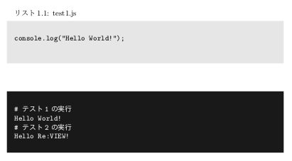

2018/12/15 by @kmuto

# コードリストブロック内でファイルの取り込みやコマンド実行を動的に行う

list や cmd などのコードリストブロック内で、Re:VIEW 変換時にファイルを読み込んだり実行結果を取り込んだりするようにしてみます。

----

Re:VIEW には、別ファイルの内容を取り込んだり外部コマンドの実行結果を取り込んだりする「preproc」という機能がもともと用意されています。

- [review-preproc ユーザガイド](https://github.com/kmuto/review/blob/master/doc/preproc.ja.md)

ただ、これは Re:VIEW 変換（review-pdfmaker, review-epubmaker, review-compile など）時に動的に行われるものではなく、その名のとおりプリプロセスとして re ファイルを書き換えるものです。

より動的に、Re:VIEW 変換をしたタイミングで別のファイルを読み込む、外部コマンドの実行結果を取り込むことを実現するために、review-ext.rb でコードリスト処理に割り込む例を示します。

## 注意
何かを動的に読み込む・実行するということは、制作環境を束縛することになります。たとえば商業出版物の原稿にこの機能を利用してしまうと、その原稿を受け取った編集者ほか制作関係者も執筆環境と同一の環境を用意しないと一貫性を取れなくなってしまいます。

あくまでも本人あるいはグループで閉じた環境で利用する程度に留めたほうがよいでしょう。

## 方針
説明を簡潔にするために、以下のような方針とします。

- LaTeX ビルダ（pdfmaker）と HTML ビルダ（epubmaker/webmaker）のみに対処
- コードハイライト（highlight パラメータ）機能を使わない前提
- LaTeX ビルダではすべてのコードリストブロックに対処するが、HTML ビルダでは listnum, emlistnum は対処しない（これらの実装が現時点でイマイチなため（★#1231））

コードリストブロック内で使える擬似命令は次のような記法とします。

- `!!load ファイルパス`：指定のファイルの内容を取り込む。文字エンコーディングは UTF-8、改行コードは re ファイルと同一であること
- `!!exec コマンドライン...`：指定のコマンドラインを実行し、標準出力を取り込む。出力の文字エンコーディングは UTF-8、改行コードは re ファイルと同一であること

たとえば次のように書きます。

```
//list[test1][test1.js]{
!!load samples/test1.js
//}

//cmd{
# テスト1の実行
!!exec node samples/test1.js
# テスト2の実行
!!exec node samples/test2.js
//}
```

`!!load` または `!!exec` から始まっていない行は普通のコードリストとしてそのまま出力されます。

# review-ext.rb の作成
LaTeX ビルダでは `common_code_block` メソッドにコードリストブロックのコード部処理が集約されているので、この処理に割り込むだけで済みます。内容はエスケープ済みの文字列配列になっているので、一度アンエスケープして擬似命令を探し、またエスケープするというだけです。

HTML ビルダでは `HTMLUtils` モジュールの `highlight` メソッドがコード部処理です。同様にアンエスケープして擬似命令を探し、またエスケープに戻します。

```
module ReVIEW
  # list系環境内で
  #
  #  !!load 内容を取り込みたいファイルパス
  #  !!exec 標準出力を取り込みたい実行命令
  #
  # というディレクティブを使えるようにする
  module LATEXBuilderOverride
    def common_code_block(id, lines, command, caption, _lang)
      lines2 = []
      lines.each do |l|
        if l =~ /\A!!(load|exec)\s+/
          method = $1
          arg = unescape($'.chomp)
          if method == 'load'
            error "no such file: #{arg}" unless File.exist?(arg)
            lines2 += File.readlines(arg).map {|s| escape(s) }
          else # exec
            out, status = Open3.capture2e(arg)
            error "failed to run command: #{arg}\n#{out}" unless status.success?
            lines2 += out.split("\n").map {|s| escape(s) }
          end
        else
          lines2.push(l)
        end
      end

      super(id, lines2, command, caption, _lang)
    end
  end

  class LATEXBuilder
    prepend LATEXBuilderOverride
  end

  module HTMLUtilsOverride
    # XXX:listnum, emlistnum はだいぶ変えないとダメ

    def highlight(ops)
      lines2 = []
      ops[:body].split("\n").each do |l|
        if l =~ /\A!!(load|exec)\s+/
          method = $1
          arg = unescape($'.chomp)
          if method == 'load'
            error "no such file: #{arg}" unless File.exist?(arg)
            lines2 += File.readlines(arg).map {|s| escape(s) }
          else # exec
            out, status = Open3.capture2e(arg)
            error "failed to run command: #{arg}\n#{out}" unless status.success?
            lines2 += out.split("\n").map {|s| escape(s) }
          end
        else
          lines2.push(l)
        end
      end

      ops[:body] = lines2.join("\n")
      super(ops)
    end
  end

  class HTMLBuilder
    prepend HTMLUtilsOverride
  end
end
```

`samples/test1.js`、`samples/test2.js` を用意して、先の例を実行してみます。



うまくできましたね。

LaTeX ビルダでハイライト有効の場合に対応するには、`common_code_block_lst` メソッドに割り込む必要があります。練習問題として挑戦してみるとよいでしょう。
