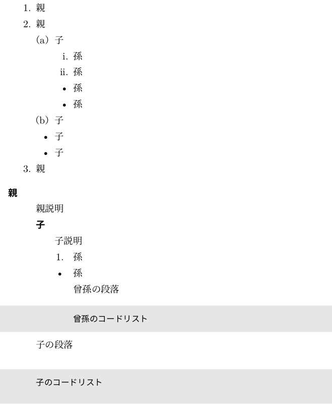
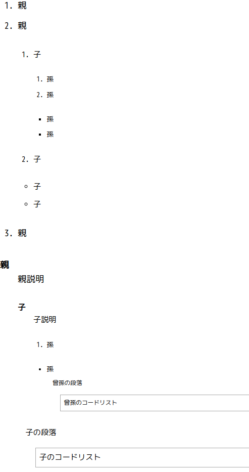

2020/1/5, 2020/10/29 by @kmuto

# 複雑な箇条書きの入れ子に対応する

数字箇条書きの入れ子や、箇条書き内に図表やコードリストを入れるなど、複雑な入れ子に対処します。

----

## Re:VIEW 5 以降の話

箇条書きの途中で `//beginchild`・`//endchild` で入れ子にしたい範囲を囲むことで、入れ子箇条書きを構成できます。よって、以降の話については特に読み進める必要はありませんが、記法と手段としてはおおむね類似しているので、参考にはなるかもしれません。

## Re:VIEW 4 以前の話

Re:VIEW の箇条書き命令にはいわゆるナカグロ箇条書き（`*`）、番号箇条書き（`1.`〜）、説明箇条書き（`:`）がありますが、`**`、`***` を指定できるナカグロ箇条書き以外は、その中に子の箇条書きを入れることができません。ナカグロ箇条書きにおいても、その中に番号箇条書きを子として持つということはできませんし、図表やコードリスト、複数の段落といったものを子に抱えることもできません。

Re:VIEW の記法を壊さずに、入れ子を綺麗に表現するというのは困難です。とはいえ、実際の執筆や翻訳においてはどうしてもこのような表現が必要になることもあります。

ここでは入れ子構造のヒントを人間が指定することで、入れ子表現を可能にする手法を示します。

＃現状ではだいぶ汚いのと、命令を誤って記述したときに特に TeX の場合は不明瞭なエラーしか出せないという問題があり、Re:VIEW の公式の機能としてはまだ導入しづらい状態です。

## child 命令の導入

人間がヒントを与えるために、`//child` という単一ブロック命令を導入します。この命令の書式は以下のとおりです。

 * `//child[ul]` 〜 `//child[/ul]`：この範囲は、直前のナカグロ箇条書きの子となる
 * `//child[ol]` 〜 `//child[/ol]`：この範囲は、直前の番号箇条書きの子となる
 * `//child[dl]` 〜 `//child[/dl]`：この範囲は、直前の説明箇条書きの子となる

HTML タグと同じ名前なので、これ自体は混乱はないでしょう。

Re:VIEW 原稿に入れると以下のようになります。対応関係さえできていれば、入れ子を重ねても問題ありません（ただ、箇条書きの入れ子の深さの限界についてはブラウザや LaTeX など処理系に依存します）。

```
 1. 親
 2. 親

//child[ol]

 1. 子

//child[ol]

 1. 孫
 2. 孫

 * 孫
 * 孫

//child[/ol]

 2. 子

 * 子
 * 子

//child[/ol]

 3. 親

 : 親
	親説明


//child[dl]

 : 子
	子説明

//child[dl]

 1. 孫

 * 孫

//child[ul]

曾孫の段落

//emlist{
曾孫のコードリスト
//}

//child[/ul]

//child[/dl]

子の段落

//emlist{
子のコードリスト
//}

//child[/dl]
```

いろいろと入れ子にしているのでややこしいですが、構造は次のようになっています。

```
1.      親
2.      親
        1.      子
                1.      孫
                2.      孫
                ●      孫
                ●      孫
        2.      子
        ●      子
        ●      子
3.      親

親
        親説明
        子
                子説明
                1.      孫
                ●      孫
                        曾孫の段落
                        曾孫のコードリスト
        子の段落
        子のコードリスト
```

## child 命令の実装

いつものように、実装はプロジェクトフォルダ内の `review-ext.rb` に記述します。

```
module ReVIEW
  module BuilderOverride
    Compiler.defsingle :child, 1

    def child(tag)
      @children ||= []
      puts "♬→#{tag}←♬"
      if tag.start_with?('/')
        if @children.empty?
          error "#{tag} is shown but there isn't any opened //child"
        elsif @children[-1] != tag.sub('/', '')
          error "#{tag} is shown but previous '#{@children[-1]}' is not closed yet"
        else
          @children.pop
        end
      else
        unless %w(dl ol ul).include?(tag)
          error "#{tag} is invalid value for //child (dl, ol, or ul)"
        end
        @children.push(tag)
      end
    end
  end

  class Builder
    prepend BuilderOverride
  end

  module LATEXBuilderOverride
    def solve_nest(s)
      s = s.
            gsub("\\end{description}\n\n♬→dl←♬\n", "\n").
            gsub('♬→/dl←♬', '\\end{description}←END♬').
            gsub("\\end{itemize}\n\n♬→ul←♬\n", "\n").
            gsub('♬→/ul←♬', '\\end{itemize}←END♬').
            gsub("\\end{enumerate}\n\n♬→ol←♬\n", "\n").
            gsub('♬→/ol←♬', '\\end{enumerate}←END♬').
            gsub("\\end{description}←END♬\n\n\\begin{description}", '').
            gsub("\\end{itemize}←END♬\n\n\\begin{itemize}", '').
            gsub("\\end{enumerate}←END♬\n\n\\begin{enumerate}", '').
            gsub('←END♬', '')

      if s =~ /♬→(.+?)←♬/
        error "Last //child[#{$1}] isn't closed yet."
      end

      s
    end

    def result
      solve_nest(super)
    end
  end

  class LATEXBuilder
    prepend LATEXBuilderOverride
  end

  module HTMLBuilderOverride
    def solve_nest(s)
      s = s.
            gsub("</dd>\n</dl>\n♬→dl←♬", '').
            gsub('♬→/dl←♬', "</dd>\n</dl>←END♬").
            gsub("</li>\n</ul>\n♬→ul←♬", '').
            gsub('♬→/ul←♬', "</li>\n</ul>←END♬").
            gsub("</li>\n</ol>\n♬→ol←♬", '').
            gsub('♬→/ol←♬', "</li>\n</ol>←END♬").
            gsub("</dl>←END♬\n<dl>", '').
            gsub("</ul>←END♬\n<ul>", '').
            gsub("</ol>←END♬\n<ol>", '').
            gsub('←END♬', '')

      if s =~ /♬→(.+?)←♬/
        error "Last //child[#{$1}] isn't closed yet."
      end

      s
    end

    def result
      solve_nest(super)
    end
  end

  class HTMLBuilder
    prepend HTMLBuilderOverride
  end

  module IDGXMLBuilderOverride
    def solve_nest(s)
      s = s.
            gsub("</dd></dl>♬→dl←♬", '').
            gsub('♬→/dl←♬', "</dd></dl>←END♬").
            gsub("</li></ul>♬→ul←♬", '').
            gsub('♬→/ul←♬', "</li></ul>←END♬").
            gsub("</li></ol>♬→ol←♬", '').
            gsub('♬→/ol←♬', "</li></ol>←END♬").
            gsub("</dl>←END♬<dl>", '').
            gsub("</ul>←END♬<ul>", '').
            gsub("</ol>←END♬<ol>", '').
            gsub('←END♬', '')

      if s =~ /♬→(.+?)←♬/
        error "Last //child[#{$1}] isn't closed yet."
      end

      s
    end

    def result
      solve_nest(super)
    end
  end

  class IDGXMLBuilder
    prepend IDGXMLBuilderOverride
  end

  module PLAINTEXTBuilderOverride
    def solve_nest(s)
      lines = []
      @children = []
      s.split("\n").each do |l|
        if l =~ /\A♬→(dl|ul|ol)←♬/
          @children.push($1)
          lines.push('♬→END←♬')
        elsif l =~ /\A♬→\/(dl|ul|ol)←♬/
          @children.pop
          lines.push('♬→END←♬')
        else
          lines.push("\t" * @children.size + l)
        end
      end

      s = lines.join("\n").gsub(/\n*♬→END←♬\n*/, "\n")

      if s =~ /♬→(.+?)←♬/
        error "Last //child[#{$1}] isn't closed yet."
      end

      s
    end

    def result
      solve_nest(super)
    end
  end

  class PLAINTEXTBuilder
    prepend PLAINTEXTBuilderOverride
  end
end
```

LaTeX、HTML（EPUB）、IDGXML、装飾テキストおよびプレインテキストいずれにも対応します。

実際に LaTeX PDF を作ってみると以下のように期待の結果が得られます（コードリストの見た目に使っているデフォルトの網掛けはインデントに対応していないため、中の文字が妥当にインデントされていることのほうに注目してください）。



HTML は以下のようになります。



## 実装の説明

見てのとおり、child ブロック命令の内容を「♬→指定文字列←♬」に置き換えておき、後は各ビルダの最終出力前に、次のように置換していくだけです（「♬」は単に地の文に登場しなさそうな文字というだけで、他の文字でも構いません）。

 1. 本物の箇条書きの閉じ＋開き♬ があったら、本物の箇条書き閉じを消す
 2. 閉じ♬ があったら、箇条書き閉じ＋END♬ を入れる
 3. 箇条書き閉じ＋END♬の後、同じ名前の本物の箇条書き開き があったら、箇条書きの閉じ・開きともに消す（継続と見なす）
 4. END♬ を消す
 5. まだ♬が残っていたら何かおかしい。開き漏れはブロック命令側で対処済みなので、おそらく閉じ漏れと見てエラー

箇条書きを閉じる際、もしその次の箇条書きが同じ種類であれば、継続と見なす、というのがちょっとした細工といったところでしょうか。
